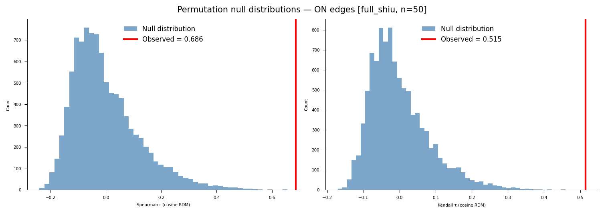
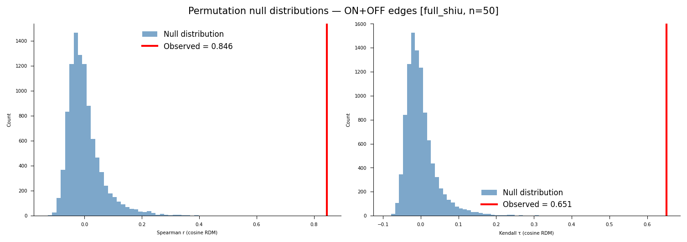
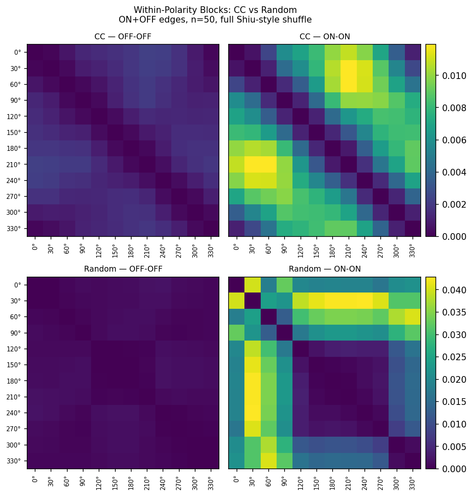
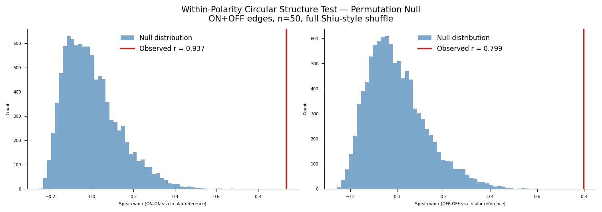
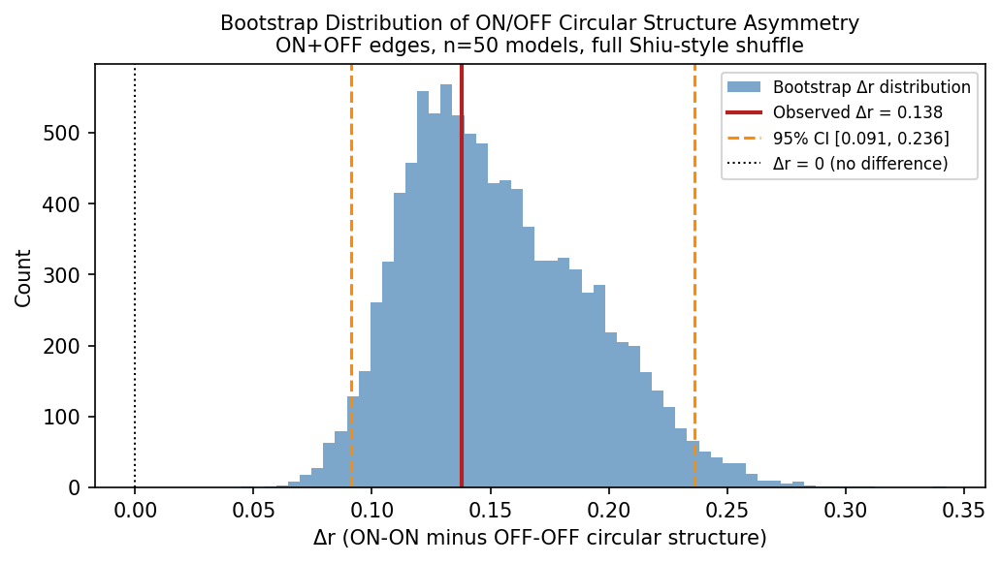

# Representational Geometry as a Fidelity Metric for Connectome-Constrained Neural Emulations

This repository implements a proof-of-concept showing that connectome-constrained networks
produce geometrically distinct population codes compared to randomly initialized networks
with the same architecture — using representational similarity analysis (RSA) applied to
the [Flyvis](https://github.com/TuragaLab/flyvis) Drosophila visual system model.

---

## Background

Connectome-scale neural emulations are increasingly feasible, but the field lacks a
principled framework for evaluating their fidelity. Brunton et al. (2026) demonstrated
that behavioral fidelity is achievable without biological fidelity — a randomly wired
network can produce realistic fly walking. This raises the question: what does biological
wiring actually contribute, and how do we measure it?

Representational geometry — the structure of pairwise distances between population
responses to different stimuli — offers a candidate answer. If connectome-constrained
networks produce a representational geometry that random networks cannot replicate, then
geometry is a fidelity-discriminating signal that operates at the population level,
without requiring a behavioral decoder.

This project tests that hypothesis using the pretrained Flyvis ensemble (Lappalainen et
al. 2024), applying RSA (Kriegeskorte et al. 2008) to compare population codes across
connectome-constrained models versus sign-preserving random weight shuffles. Experiment 3
extends the comparison to a biological reference derived from T4/T5 direction tuning data
(Maisak et al. 2013).

---

## Experiments

### Experiment 1: ON Edges
**Stimuli:** 12 ON moving edges at 30° increments (0° through 330°)

**Networks:**
- *Connectome-constrained (CC):* 10–50 models from the pretrained Flyvis ensemble
  (indices `000–049` within `flow/0000`, pre-sorted by task error), trained to perform
  optic flow estimation on naturalistic video with connectome-fixed architecture
  (734 free parameters)
- *Random baseline:* Same model architectures with sign-preserving weight shuffles.
  Three strategies were evaluated:
  1. **Full Shiu-style shuffle (canonical):** all 734 free parameters shuffled;
     stability-constrained sampling rejects configurations with non-finite or near-overflow
     activations (sub-1e6) and resamples up to MAX_ATTEMPTS=100 per model. Run at both
     n=10 and n=50.
  2. Synapse-only shuffle: only the 604 unitary synapse scaling factors
     (`edges_syn_strength`) shuffled, preserving trained time constants and resting
     potentials — per Lappalainen et al. (2024) Methods, time constants are clamped
     during training to prevent instability. Used for n=50 instability documentation.
  3. Matched-instability baseline: full Shiu-style shuffle without stability filtering;
     non-finite activations clamped to ±1e3 in RDM construction. Retained for comparison
     against the stability-constrained result.

**Population vectors:** Peak central-cell voltage per cell type (65-dim) in response to
each stimulus direction

**Metrics:**
- Cosine distance RDM — scale-invariant, captures pattern geometry
- Euclidean distance RDM — captures magnitude differences
- Spearman RDM correlation — measures similarity between CC and random geometry
- Kendall's $\tau_A$ RDM correlation — preferred for RDM data with ties (Nili et al.
  2014); reported alongside Spearman for all CC vs random comparisons
- Stimulus-label permutation test — nonparametric inference on RDM correlations
  (Nili et al. 2014, 10,000 permutations)
- Within-ensemble consistency — measures stability of CC representational geometry
  across trained solutions

---

### Experiment 2: ON + OFF Edges
**Stimuli:** 24 moving edge conditions — 12 directions at 30° increments (0° through
330°) × 2 polarities (ON and OFF edges)

**Networks:**
- *Connectome-constrained (CC):* 10–50 models from the pretrained Flyvis ensemble
  (indices `000–049` within `flow/0000`, pre-sorted by task error)
- *Random baseline:* Same model architectures with sign-preserving weight shuffles.
  Three strategies were evaluated:
  1. **Full Shiu-style shuffle (canonical):** all 734 free parameters shuffled;
     stability-constrained sampling (sub-1e6, MAX_ATTEMPTS=100), mirroring Experiment 1.
     Run at both n=10 and n=50.
  2. Synapse-only shuffle: `edges_syn_strength` only, preserving trained time constants
     and resting potentials. Used for n=50 instability documentation runs.
  3. Matched-instability baseline: full Shiu-style shuffle without stability filtering;
     non-finite activations clamped to ±1e3 in RDM construction. Retained for comparison.

**Population vectors:** Peak central-cell voltage per cell type (65-dim) in response to
each stimulus condition

**Metrics:**
- Cosine distance RDM — scale-invariant, captures pattern geometry across all 24 conditions
- Euclidean distance RDM — captures magnitude differences
- Spearman RDM correlation — measures similarity between CC and random geometry
- Kendall's $\tau_A$ RDM correlation — preferred for RDM data with ties (Nili et al.
  2014); reported alongside Spearman for all CC vs random comparisons
- Stimulus-label permutation test — nonparametric inference on RDM correlations
  (Nili et al. 2014, 10,000 permutations)
- Within-ensemble consistency — measures stability of CC representational geometry
  across trained solutions
- Polarity generalization — whether direction-sensitive geometry observed for ON edges
  in Experiment 1 extends to OFF edges and the combined ON+OFF space

---

### Experiment 3: Biological Upper Bound
**Reference:** T4/T5 direction tuning data from Maisak et al. (2013), Fig. 3g/3h — 8
subtypes (T4a, T4b, T4c, T4d, T5a, T5b, T5c, T5d) with cardinal preferred directions
(0°, 90°, 180°, 270°). Tuning curves modeled analytically using a von Mises profile
(kappa=2.5, HWHM ≈ 67°, rectified), consistent with the published 60–90° half-width.

**Design:** Biological population matrix (12 directions × 8 T4/T5 subtypes) is used to
construct a 12×12 biological stimulus RDM, directly comparable to the CC and random RDMs
from Experiment 1. A three-way comparison — CC vs Biology, Random vs Biology, CC vs
Random — quantifies how much of the gap between CC and random geometry is accounted for
by T4/T5 direction tuning structure. All comparisons use the stability-constrained random
baseline from the n=50 full Shiu-style runs (Experiments 1 and 2, MAX_ATTEMPTS=100),
providing a more stable mean random RDM estimate across 50 independently accepted
configurations.

**Caveats:**
- Biological stimulus: moving square-wave gratings (Maisak et al. Fig. 3g/3h); model
  stimulus: `MovingEdge`. Direction tuning structure is qualitatively preserved but
  absolute response profiles differ.
- Biological RDM covers T4/T5 subspace only (8 of 65 cell types). Interpret as an upper
  bound for the T4/T5 subpopulation, not the full population.
- Von Mises approximation reproduces published tuning width and peak locations; does not
  capture trial-by-trial variability.

---

## Key Results

### Experiment 1: ON Edges — n=10 (comparison result, stability-constrained, full Shiu-style shuffle)

| Metric | Value |
|--------|-------|
| CC cosine RDM off-diagonal range | 0.001–0.022 (structured, smooth circular gradient) |
| Random cosine RDM structure | Block-structured (~0.001 within cluster, ~0.099–0.101 cross-cluster) |
| Stability-constrained acceptance | 10/10 models accepted; mean 11.1 ± 9.9 attempts (range: 1–36); 1/10 first-try |
| CC vs random RDM correlation (cosine) | Spearman r = 0.749, p < 0.0001 \| Kendall τ = 0.552, p < 0.0001 |
| Permutation test (cosine, 10,000 permutations) | p_perm < 0.0001 (Spearman) \| p_perm < 0.0001 (Kendall τ) |
| Matched-instability baseline (historical) | Spearman r = 0.757, p < 0.0001 \| Kendall τ = 0.562, p < 0.0001 |
| Within-CC ensemble consistency | r = 0.838 ± 0.078 |
| Random models with unstable dynamics | 5/10 (matched-instability); 0/10 (stability-constrained) |
| CC models with unstable dynamics | 0/10 |

### Experiment 1: ON Edges — n=50 (canonical result, stability-constrained, full Shiu-style shuffle)

| Metric | Value |
|--------|-------|
| CC cosine RDM off-diagonal range | 0.001–0.012 (same circular gradient, tighter range) |
| Stability-constrained acceptance | 50/50 models accepted; mean 7.9 ± 8.1 attempts (range: 1–42); 5/50 first-try |
| CC vs random RDM correlation (cosine) | Spearman r = 0.686, p < 0.0001 \| Kendall τ = 0.515, p < 0.0001 |
| Permutation test (cosine, 10,000 permutations) | p_perm < 0.0001 (Spearman) \| p_perm < 0.0001 (Kendall τ) |
| Within-CC ensemble consistency | r = 0.721 ± 0.150 |
| Random models with unstable dynamics | 0/50 (stability-constrained) |
| CC models with unstable dynamics | 0/50 |

### Experiment 1: ON Edges — n=50 (instability documentation, synapse-only shuffle)

| Randomization strategy | Unstable random models | CC unstable | Cosine RDM correlation |
|------------------------|------------------------|-------------|------------------------|
| Full Shiu-style shuffle (matched-instability) | 33/50 (66%) | 0/50 | NaN |
| Matched-normal resampling | 38/50 (76%) | 0/50 | NaN |
| Synapse-only shuffle (`edges_syn_strength`) | 34/50 (68%) | 0/50 | NaN |

### Experiment 2: ON + OFF Edges — n=10 (comparison result, stability-constrained, full Shiu-style shuffle)

| Metric | Value |
|--------|-------|
| CC cosine RDM structure | 24×24 with polarity block organization; circular direction gradient within each polarity block |
| Random cosine RDM structure | Checkerboard-like polarity structure; no within-polarity direction gradient |
| Stability-constrained acceptance | 10/10 models accepted; mean 11.1 ± 11.5 attempts (range: 1–33); 3/10 first-try |
| CC vs random RDM correlation (cosine) | Spearman r = 0.783, p < 0.0001 \| Kendall τ = 0.562, p < 0.0001 |
| Permutation test (cosine, 10,000 permutations) | p_perm < 0.0001 (Spearman) \| p_perm < 0.0001 (Kendall τ) |
| Matched-instability baseline (historical) | Spearman r = 0.862, p < 0.0001 \| Kendall τ = 0.660, p < 0.0001 |
| Within-CC ensemble consistency | r = 0.850 ± 0.057 |
| Random models with unstable dynamics | 5/10 (matched-instability); 0/10 (stability-constrained) |
| CC models with unstable dynamics | 0/10 |

### Experiment 2: ON + OFF Edges — n=50 (canonical result, stability-constrained, full Shiu-style shuffle)

| Metric | Value |
|--------|-------|
| CC cosine RDM structure | 24×24 with polarity block organization; circular direction gradient within each polarity block |
| Stability-constrained acceptance | 50/50 models accepted; mean 7.9 ± 8.5 attempts (range: 1–42); 6/50 first-try |
| CC vs random RDM correlation (cosine) | Spearman r = 0.846, p < 0.0001 \| Kendall τ = 0.651, p < 0.0001 |
| Permutation test (cosine, 10,000 permutations) | p_perm < 0.0001 (Spearman) \| p_perm < 0.0001 (Kendall τ) |
| Within-CC ensemble consistency | r = 0.838 ± 0.059 |
| Random models with unstable dynamics | 0/50 (stability-constrained) |
| CC models with unstable dynamics | 0/50 |

### Experiment 2: ON + OFF Edges — n=50 (instability documentation, synapse-only shuffle)

| Metric | Value |
|--------|-------|
| CC cosine RDM structure | 24×24 with polarity block organization |
| CC vs random RDM correlation (cosine) | NaN — not computable (35/50 random models unstable) |
| Euclidean RDM correlation | Spearman r = 0.313, p < 0.0001 — nominally significant but not interpretable (see Results) |
| Within-CC ensemble consistency | r = 0.838 ± 0.059 |
| Random models with unstable dynamics | 35/50 (70%) |
| CC models with unstable dynamics | 0/50 |

### Experiment 3: Biological Upper Bound — Experiment 1 comparison (ON edges, 12 conditions, n=50 baseline)

| Comparison | Spearman r | Kendall τ | p_perm (r) |
|------------|-----------|-----------|------------|
| CC vs Biology | 0.930 | 0.783 | < 0.0001 |
| Random vs Biology | 0.603 | 0.449 | — |
| CC vs Random | 0.686 | 0.515 | < 0.0001 |

The CC geometry (r = 0.930 vs biology) substantially exceeds the random geometry
(r = 0.603 vs biology). The gap r(CC vs Bio) − r(Rand vs Bio) = 0.327 represents the
additional fidelity attributable to the connectome constraint beyond what circular
stimulus structure alone provides.

### Experiment 3: Biological Upper Bound — Experiment 2 comparison (ON+OFF edges, 24 conditions, n=50 baseline)

| Comparison | Spearman r | Kendall τ | p_perm (r) | Interpretable |
|------------|-----------|-----------|------------|---------------|
| CC vs Biology | 0.049 | 0.040 | 0.159 | No — see Results |
| Random vs Biology | -0.038 | -0.028 | — | No |

The near-null result reflects a structural mismatch between the biological RDM
construction and the CC network's representational geometry — not a failure of the CC
network. See Results for full interpretation.

---

The connectome-constrained network produces direction-sensitive representational geometry
with a smooth circular structure — adjacent directions are most similar, opposite
directions most dissimilar — consistent with the known tuning of T4/T5 neurons in the
fly visual system. In Experiment 2, this direction geometry is preserved within each
polarity block, while ON and OFF edges occupy geometrically distinct population-level
regions (~0.099–0.103 cross-polarity dissimilarity), consistent with the known T4/T5
ON/OFF pathway segregation. Zero trained CC models exhibited instability under any
condition across either experiment. The canonical fidelity result is robust to baseline
construction choice and ensemble size: stability-constrained results converge across n=10
and n=50 (Experiment 1: r = 0.686 at n=50 canonical, r = 0.749 at n=10 comparison;
Experiment 2: r = 0.846 at n=50 canonical, r = 0.783 at n=10 comparison; all
p_perm < 0.0001), and stability-constrained and matched-instability baselines converge
at n=10 (Experiment 1: r = 0.749 vs 0.757; Experiment 2: r = 0.783 vs 0.862).


*Experiment 1 (n=50, canonical result, stability-constrained full Shiu-style shuffle) —
left to right: connectome-constrained cosine RDM, random baseline cosine RDM,
connectome-constrained Euclidean RDM, random baseline Euclidean RDM. The CC cosine RDM
shows the same circular gradient at reduced range (0.001–0.012). The random cosine RDM
is block-structured, averaged across 50 independently accepted stable configurations.
Cosine RDM correlation: Spearman r = 0.686, p < 0.0001 | Kendall τ = 0.515, p < 0.0001;
p_perm < 0.0001 (10,000 permutations). All 50 pretrained Flyvis models, seed=42.*



*Experiment 1 permutation test (n=50, canonical result, stability-constrained full
Shiu-style shuffle, 10,000 stimulus-label permutations, Nili et al. 2014). Left: null
distribution of Spearman r with observed r = 0.686 (red line) falling far outside the
null. Right: null distribution of Kendall τ with observed τ = 0.515 (red line). Both
p_perm < 0.0001 — zero of 10,000 permutations exceeded the observed correlation.*


*Experiment 2 (n=50, canonical result, stability-constrained full Shiu-style shuffle) —
left to right: connectome-constrained cosine RDM, random baseline cosine RDM,
connectome-constrained Euclidean RDM, random baseline Euclidean RDM. The CC cosine RDM
shows the same 24×24 block structure. The random cosine RDM is block-structured, averaged
across 50 independently accepted stable configurations. Cosine RDM correlation:
Spearman r = 0.846, p < 0.0001 | Kendall τ = 0.651, p < 0.0001; p_perm < 0.0001
(10,000 permutations). All 50 pretrained Flyvis models, seed=42.*



*Experiment 2 permutation test (n=50, canonical result, stability-constrained full
Shiu-style shuffle, 10,000 stimulus-label permutations, Nili et al. 2014). Left: null
distribution of Spearman r with observed r = 0.846 (red line) falling far outside the
null. Right: null distribution of Kendall τ with observed τ = 0.651 (red line). Both
p_perm < 0.0001.*



*Experiment 2 within-polarity direction structure (n=50, canonical result). CC OFF-OFF
and ON-ON submatrices (top row) and random OFF-OFF and ON-ON submatrices (bottom row),
plotted with row-level shared colormaps — CC row peaks at ~0.012, Random row at ~0.040.
The CC ON-ON block shows a clear circular direction gradient; the CC OFF-OFF block shows
the same ordinal structure at a compressed range. The random blocks show no circular
direction structure. Stimulus conditions are interleaved by direction (OFF 0°, ON 0°,
OFF 30°, ON 30°, ...), extracted via even/odd index separation.*



*Experiment 2 within-polarity circular structure test (n=50, canonical result, 10,000
permutations). Left: ON-ON block vs circular distance reference (Spearman r = 0.937,
p_perm < 0.0001). Right: OFF-OFF block vs circular distance reference (Spearman r = 0.799,
p_perm < 0.0001). Both observed values fall far outside the null distribution — zero of
10,000 permutations exceeded the observed correlation in either block.*



*Experiment 2 model-level bootstrap for ON/OFF circular structure asymmetry (n=50,
10,000 bootstrap samples). Observed Δr = 0.138 (ON-ON minus OFF-OFF circular structure
correlation). Bootstrap mean Δr = 0.153 ± 0.039; 95% CI [0.091, 0.236], p < 0.0001
(one-sided). The 95% CI excludes zero, confirming that the ON pathway encodes direction
with significantly stronger geometric separation than the OFF pathway.*


*Experiment 3 biological reference: von Mises direction tuning curves (kappa=2.5,
HWHM ≈ 67°, rectified) for 8 T4/T5 subtypes, consistent with Maisak et al. 2013 Fig.
3g/3h. Blue: T4 subtypes (ON pathway); coral: T5 subtypes (OFF pathway). Each subtype
peaks at one of the four cardinal directions (0°, 90°, 180°, 270°) with no response at
the anti-preferred direction.*


*Experiment 3 three-way RDM comparison for Experiment 1 (ON edges, 12 conditions, n=50
stability-constrained baseline). Left: biological reference RDM (Maisak 2013 T4/T5
direction tuning, off-diagonal range 0.046–0.989). Center: CC mean cosine RDM (r vs
bio = 0.930, τ = 0.783). Right: random mean cosine RDM (r vs bio = 0.603, τ = 0.449).
The gap r(CC vs Bio) − r(Rand vs Bio) = 0.327 quantifies the fidelity attributable to
the connectome constraint beyond circular stimulus structure.*


*Experiment 3 permutation test for CC vs Biology comparison (Experiment 1, n=50
stability-constrained baseline, 10,000 permutations). Observed r = 0.930 and τ = 0.783
both fall far outside the null distribution; p_perm < 0.0001 for both measures — zero
of 10,000 permutations exceeded the observed correlation.*


*Experiment 3 three-way RDM comparison for Experiment 2 (ON+OFF edges, 24 conditions,
n=50 stability-constrained baseline). Left: biological reference RDM (T4/T5 ON/OFF
segregated, range 0.046–1.000). Center: CC mean cosine RDM (r vs bio = 0.049). Right:
random mean cosine RDM (r vs bio = −0.038). The near-null result reflects a structural
mismatch between the biological RDM construction and the CC network's representational
geometry — not a failure of the CC network (see Results).*


*Experiment 3 permutation test for CC vs Biology comparison (Experiment 2, n=50
stability-constrained baseline, 10,000 permutations). Observed r = 0.049,
p_perm = 0.159; τ = 0.040, p_perm = 0.142 — not significant at α = 0.05, consistent
with the structural mismatch interpretation.*

---

## Results

### Experiment 1: ON Edges

#### CC Cosine RDM
The connectome-constrained network produces a structured 12×12 dissimilarity matrix with
clear direction-dependent organization. At n=10, off-diagonal values range from ~0.001 to
~0.022 — small in absolute terms but systematically organized: adjacent directions are
most similar (minimum: 0°–30°, dissimilarity = 0.001), while opposite directions are most
dissimilar (maximum: 30°–210°, dissimilarity = 0.022). At n=50, the range tightens to
0.001–0.012, reflecting the inclusion of lower-performing models. Both runs show a smooth
circular gradient consistent with the known direction tuning of T4/T5 neurons in the fly
visual system.

#### Dynamic Instability
Dynamic instability is robust across all randomization strategies tested, motivating the
development of a stability-constrained baseline. Under the full Shiu-style shuffle at n=10
(matched-instability approach), 5 of 10 random models (models 2, 3, 4, 8, 9) were
unstable (756 non-finite values each, corresponding to 63 of 65 cell types across all 12
stimuli) — the instability pattern is fully reproducible under seed=42. Under the
synapse-only shuffle at n=10, 8 of 10 (80%) were unstable. At n=50: full Shiu-style
shuffling produced 33/50 unstable models (66%); matched-normal resampling produced 38/50
(76%); synapse-only shuffling produced 34/50 (68%). Zero of 50 trained CC models showed
any instability under any condition. The biological connectome, as optimized by task
training, reliably occupies a dynamically stable region of parameter space that random
weight configurations consistently leave.

#### Stability-Constrained Random Baseline

**n=10:** Candidate random configurations are accepted only if a forward pass produces
all-finite, sub-1e6 activations, with up to MAX_ATTEMPTS=100 resampling attempts per
model. All 10 models were accepted. Acceptance required on average 11.1 ± 9.9 attempts
per model (range: 1–36), with only 1/10 models accepted on the first attempt.

**n=50:** All 50 models were accepted under the same procedure. Acceptance required on
average 7.9 ± 8.1 attempts per model (range: 1–42), with 5/50 models accepted on the
first attempt. The worst-case model required 42 attempts, well within the MAX_ATTEMPTS=100
ceiling. The low first-try acceptance rate (5/50, 10%) confirms that dynamically stable
configurations occupy a small fraction of the full Shiu weight space across the full
ensemble — not just the top 10 models.

The n=10 stability-constrained random baseline produces a cosine RDM with a clear block
structure: directions 0°–90° form one cluster of low mutual dissimilarity, directions
120°–300° form another, and cross-cluster dissimilarities are uniformly large
(~0.099–0.101). The n=50 mean random cosine RDM reflects a similar but averaged-out
structure across 50 independently accepted configurations.

#### CC vs Random RDM Correlation

**Stability-constrained baseline, n=10 (comparison result):**
Cosine RDM correlation: **Spearman r = 0.749, p < 0.0001 | Kendall τ = 0.552, p < 0.0001**
(analytical); **p_perm < 0.0001 for both measures** (stimulus-label randomization test,
10,000 permutations, Nili et al. 2014) — zero of 10,000 permutations exceeded the observed
correlation. The result is highly significant by all three independent inference methods.

Euclidean RDM correlation: **Spearman r = 0.546, p < 0.0001 | Kendall τ = 0.381,
p < 0.0001** (analytical); **p_perm = 0.001 | p_perm = 0.0009** (permutation). Significant
but interpreted with caution: the random Euclidean RDM contains values on the order of
1e4–1e5, indicating near-overflow activations on stimuli not covered by the single-stimulus
stability check. Cosine RDM correlation remains the primary reported metric.

**Stability-constrained baseline, n=50 (canonical result):**
Cosine RDM correlation: **Spearman r = 0.686, p < 0.0001 | Kendall τ = 0.515, p < 0.0001**
(analytical); **p_perm < 0.0001 for both measures** — zero of 10,000 permutations exceeded
the observed correlation. The result is highly significant by all three independent
inference methods. The modest decrease from n=10 (r = 0.749) to n=50 (r = 0.686) reflects
the inclusion of lower-performing CC models implementing more varied representational
solutions, consistent with the within-ensemble consistency decrease (r = 0.838 ± 0.078 at
n=10 vs 0.721 ± 0.150 at n=50), rather than any weakening of the fidelity signal.

Euclidean RDM correlation: **Spearman r = 0.588, p < 0.0001 | Kendall τ = 0.418,
p < 0.0001** (analytical); **p_perm = 0.0005 | p_perm = 0.0003** (permutation). Significant
but interpreted with caution for the same scale distortion reasons as n=10.

**Matched-instability baseline (historical comparison):**
Under the matched-instability approach (full Shiu-style shuffle, n=10, 5/10 stable random
models): cosine RDM correlation **Spearman r = 0.757, p < 0.0001 | Kendall τ = 0.562,
p < 0.0001** (analytical); **p_perm < 0.0001** (permutation). The near-identical result
(r = 0.749 vs 0.757) confirms robustness to baseline construction choice.

Cosine RDM correlation is NaN under the synapse-only shuffle at both n=10 (8/10 unstable)
and n=50 (34/50 unstable). Euclidean RDM correlation under synapse-only shuffle at n=10:
**Spearman r = 0.136, p = 0.278 | Kendall τ = 0.088, p = 0.296** — not significant, not
interpretable due to extreme magnitudes from exploding activations.

#### Within-Ensemble Consistency
At n=10, mean pairwise RDM correlation: **r = 0.838 ± 0.078** (range: 0.601–0.956). At
n=50, mean pairwise RDM correlation: **r = 0.721 ± 0.150** (range: 0.323–0.983). The
decrease at n=50 reflects the inclusion of lower-performing models, consistent with the
known cluster structure of the Flyvis ensemble reported in Lappalainen et al. Fig. 3.

---

### Experiment 2: ON + OFF Edges

#### CC Cosine RDM
The connectome-constrained network produces a structured 24×24 dissimilarity matrix with
clear polarity-dependent block organization. Within each polarity block (ON-ON and
OFF-OFF), the same circular direction gradient observed in Experiment 1 is preserved:
adjacent directions are most similar and opposite directions most dissimilar. Across
polarity (ON vs OFF pairs), dissimilarities are large and nearly uniform at ~0.099–0.103
— the network represents ON and OFF edges as geometrically distinct populations regardless
of direction. This block structure is consistent with the known segregation of the fly
visual system into ON (T4) and OFF (T5) pathways. Within-ensemble consistency is high
at both n=10 (r = 0.850 ± 0.057) and n=50 (r = 0.838 ± 0.059), notably higher and
tighter than the n=50 ON-only result (r = 0.721 ± 0.150), consistent with polarity being
a stronger organizer of representational geometry than direction alone.

#### Dynamic Instability
Under the full Shiu-style shuffle at n=10 (matched-instability approach), 5 of 10 random
models were unstable (1,512 non-finite values each, corresponding to 63 of 65 cell types
across all 24 stimuli) — identical model indices as Experiment 1 (models 2, 3, 4, 8, 9),
confirming reproducibility under seed=42 regardless of stimulus count. Under the
synapse-only shuffle at n=50, 35 of 50 random models (70%) were unstable. Zero of 50 CC
models showed any instability under any condition.

#### Stability-Constrained Random Baseline

**n=10:** Under stability-constrained full Shiu-style shuffling (MAX_ATTEMPTS=100), all
10 models were accepted. Acceptance required on average 11.1 ± 11.5 attempts per model
(range: 1–33), with only 3/10 models accepted on the first attempt — consistent with
Experiment 1 (mean 11.1 ± 9.9, 1/10 first-try), confirming that the stable volume of
full Shiu weight space is similarly small across both stimulus sets.

**n=50:** All 50 models were accepted under the same procedure. Acceptance required on
average 7.9 ± 8.5 attempts per model (range: 1–42), with 6/50 models accepted on the
first attempt. The acceptance rate profile is nearly identical to Experiment 1 n=50
(mean 7.9 ± 8.1, 5/50 first-try), confirming that stability constraints on the full
Shiu weight space are stimulus-set independent.

The accepted random baseline produces a cosine RDM with a checkerboard-like organization
driven by polarity: OFF-condition pairs and ON-condition pairs each form clusters of
moderate dissimilarity (0.001–0.276), while cross-polarity pairs are uniformly large
(0.178–0.275). This polarity sensitivity is accidental — it reflects the stable random
weight configuration's response characteristics rather than biologically organized ON/OFF
pathway segregation — and is qualitatively different from the tight, direction-resolved
circular gradient within each polarity block in the CC RDM.

#### CC vs Random RDM Correlation

**Stability-constrained baseline, n=10 (comparison result):**
Cosine RDM correlation: **Spearman r = 0.783, p < 0.0001 | Kendall τ = 0.562, p < 0.0001**
(analytical); **p_perm < 0.0001 for both measures** (stimulus-label randomization test,
10,000 permutations, Nili et al. 2014) — zero of 10,000 permutations exceeded the observed
correlation. The result is highly significant by all three independent inference methods,
and stronger than the Experiment 1 stability-constrained result (r = 0.749, τ = 0.552),
consistent with the richer constraint provided by 24 stimulus conditions.

Euclidean RDM correlation: **Spearman r = 0.522, p < 0.0001 | Kendall τ = 0.349,
p < 0.0001** (analytical); **p_perm < 0.0001 for both measures** (permutation). Significant
but interpreted with caution: the random Euclidean RDM contains values on the order of
1e4–1e5 (up to ~5e5 in some cells), indicating near-overflow activations on stimuli not
covered by the single-stimulus stability check. Cosine RDM correlation remains the primary
reported metric.

**Stability-constrained baseline, n=50 (canonical result):**
Cosine RDM correlation: **Spearman r = 0.846, p < 0.0001 | Kendall τ = 0.651, p < 0.0001**
(analytical); **p_perm < 0.0001 for both measures** — zero of 10,000 permutations exceeded
the observed correlation. The result is highly significant by all three independent
inference methods. Notably, the n=50 result (r = 0.846) is higher than the n=10 result
(r = 0.783), the opposite of the Experiment 1 pattern (r = 0.686 at n=50 vs r = 0.749
at n=10). This likely reflects the averaging effect of 50 independently accepted random
configurations: the mean random cosine RDM at n=50 is a smoother estimate of the stable
random weight distribution, which happens to be more discriminable from the CC geometry
than the single-configuration n=10 baseline.

Euclidean RDM correlation: **Spearman r = 0.509, p < 0.0001 | Kendall τ = 0.342,
p < 0.0001** (analytical); **p_perm = 0.0001 | p_perm = 0.0002** (permutation). Significant
but interpreted with caution for the same scale distortion reasons as n=10.

**Matched-instability baseline (historical comparison):**
Under the matched-instability approach (full Shiu-style shuffle, n=10, 5/10 stable random
models): cosine RDM correlation **Spearman r = 0.862, p < 0.0001 | Kendall τ = 0.660,
p < 0.0001** (analytical); **p_perm < 0.0001** (permutation). The stability-constrained
n=10 result (r = 0.783) is modestly lower than the matched-instability result (r = 0.862),
a larger gap than observed in Experiment 1 (0.749 vs 0.757), suggesting that clamped
instability may modestly inflate the matched-instability result in the 24-condition case.
Nonetheless, both results are highly significant and the primary conclusion holds under
both baseline constructions.

Cosine RDM correlation is NaN under the synapse-only shuffle at n=50 (35/50 unstable).
Euclidean RDM correlation under synapse-only shuffle at n=50: **Spearman r = 0.313,
p < 0.0001** — nominally significant but not interpretable due to extreme magnitudes from
unstable models. This is a numerical artifact, not a fidelity signal.

#### Within-Polarity Direction Structure
To visualize the within-polarity circular gradient obscured by the dominant cross-polarity
contrast in the full 24×24 RDM, the OFF-OFF and ON-ON submatrices were extracted from
both the CC and random mean cosine RDMs (OFF conditions at interleaved even indices
0,2,...,22; ON conditions at odd indices 1,3,...,23) and plotted together in a 2×2 grid
(CC top row, Random bottom row) with row-level shared colormaps — CC row and Random row
scaled independently. The CC ON-ON block shows a clear circular direction gradient;
the CC OFF-OFF block shows the same ordinal structure at a compressed range. The random
blocks show no circular direction structure. The magnitude difference between CC and
random is communicated by the different colorbar ranges: CC row peaks at ~0.012,
Random row at ~0.040.

Both CC polarity blocks show highly significant circular structure. ON-ON: **Spearman
r = 0.937, p_perm < 0.0001** (10,000 permutations) — zero of 10,000 permutations
exceeded the observed correlation. OFF-OFF: **Spearman r = 0.799, p_perm < 0.0001** —
zero of 10,000 permutations exceeded the observed correlation. The ON-ON block shows
substantially stronger circular structure than the OFF-OFF block (Δr = 0.138), confirmed
by Fisher z-transform (z = 3.454, p = 0.0006, two-sided) and model-level bootstrap
(10,000 samples, 50 CC models resampled with replacement): bootstrap mean
Δr = 0.153 ± 0.039, 95% CI [0.091, 0.236], p < 0.0001 (one-sided). The 95% CI excludes
zero, confirming that the ON pathway encodes direction with significantly stronger
geometric separation than the OFF pathway, consistent with known T4/T5 differences in
direction selectivity strength.

#### Within-Ensemble Consistency
At n=10, mean pairwise RDM correlation: **r = 0.850 ± 0.057** (range: 0.706–0.954). At
n=50, mean pairwise RDM correlation: **r = 0.838 ± 0.059**. Both are notably higher and
tighter than the n=50 ON-only result (r = 0.721 ± 0.150), suggesting that the ON+OFF
stimulus set produces a more consistent representational geometry across the full ensemble.
The n=10 ON+OFF result (r = 0.850) also slightly exceeds the n=10 ON-only result
(r = 0.838 ± 0.078), consistent with polarity being a stronger organizer of
representational geometry than direction alone.

---

### Experiment 3: Biological Upper Bound

#### Biological Reference RDM
The von Mises tuning model (kappa=2.5, HWHM ≈ 67°, rectified) produces a 12×12
biological stimulus RDM with off-diagonal values ranging from 0.0460 to 0.9886 — a much
wider dynamic range than either the CC RDM (0.001–0.022) or the stability-constrained
random RDM. This reflects the sharpness of T4/T5 direction tuning: directions near a
subtype's preferred direction are represented as highly similar, while directions near
the null direction approach maximum dissimilarity. All Experiment 3 comparisons use the
stability-constrained random baseline from the n=50 full Shiu-style runs (Experiments 1
and 2, MAX_ATTEMPTS=100), providing a more stable mean random RDM estimate across 50
independently accepted configurations than the n=10 comparison baseline.

#### Experiment 1 Comparison (ON edges, 12 conditions)
CC vs Biology: **Spearman r = 0.930, p < 0.0001 | Kendall τ = 0.783, p < 0.0001**
(analytical); **p_perm < 0.0001 for both measures** (10,000 permutations, Nili et al.
2014) — zero of 10,000 permutations exceeded the observed correlation. The CC
representational geometry is highly consistent with the biological T4/T5 direction tuning
structure, recovering the circular ordinal organization of directions in a way that closely
mirrors the known preferred-direction map.

Random vs Biology: **Spearman r = 0.603, p < 0.0001 | Kendall τ = 0.449, p < 0.0001**
(analytical). The random baseline also correlates with the biological RDM, reflecting that
both share the same circular ordinal structure — directions that are angularly close are
more similar than directions that are angularly distant. This is a consequence of the
circular stimulus geometry, not a fidelity signal.

The key comparison is CC vs Random (r = 0.686, τ = 0.515). The gap r(CC vs Bio) −
r(Rand vs Bio) = **0.327** represents the additional fidelity attributable to the
connectome constraint beyond what circular stimulus structure alone provides.

#### Experiment 2 Comparison (ON+OFF edges, 24 conditions)
CC vs Biology: **Spearman r = 0.049, p = 0.422 | Kendall τ = 0.040, p = 0.368**
(analytical); **p_perm = 0.159 | p_perm = 0.142** (permutation) — not significant at
α = 0.05. Random vs Biology: **r = −0.038, τ = −0.028** — effectively zero and slightly
negative.

The near-null result is expected and interpretable. The biological 24×24 RDM encodes
strict ON/OFF pathway segregation — T4 subtypes contribute only to ON conditions and T5
subtypes only to OFF conditions, making same-direction ON/OFF pairs maximally dissimilar
(cosine distance ≈ 1.0). The CC 24×24 RDM assigns moderate cross-polarity dissimilarity
(~0.099–0.103) with shared directional ordering — a geometrically different claim. This
is a mismatch between the biological RDM construction and the CC network's actual
representational geometry, not a failure of the CC network. A more appropriate biological
upper bound for Experiment 2 would require T4/T5 direction tuning curves measured with
moving edges at matched velocities, which are not available from Maisak et al. 2013. The
Experiment 2 biological comparison is therefore not reported as a meaningful result.

---

## Discussion
- Across Experiments 1 and 2, the cosine RDM correlation is significant by analytical
  p-values, Kendall τ, and stimulus-label permutation test — three independent inference
  methods converging on the same conclusion (Experiment 1: r = 0.686 at n=50 canonical,
  r = 0.749 at n=10 comparison; Experiment 2: r = 0.846 at n=50 canonical, r = 0.783
  at n=10 comparison; all p_perm < 0.0001)
- The fidelity result holds across ensemble sizes: stability-constrained sampling succeeds
  at both n=10 and n=50 with all models accepted and no ceiling failures, confirming the
  null model problem is resolved
- Stability-constrained and matched-instability baselines converge in Experiment 1
  (r = 0.749 vs 0.757), demonstrating robustness to baseline construction choice; the
  larger gap in Experiment 2 (r = 0.783 vs 0.862) suggests clamped instability may
  modestly inflate the matched-instability result in the 24-condition case
- The biological upper bound (Experiment 3, n=50 baseline) provides strong additional
  support for the Experiment 1 result: CC geometry (r = 0.930 vs T4/T5 biology)
  substantially exceeds random geometry (r = 0.603 vs T4/T5 biology), with the gap
  (Δr = 0.327) attributable to the connectome constraint above and beyond circular
  stimulus structure
- The Euclidean result is non-significant by all methods including permutation in both
  experiments (stability-constrained baseline), confirming cosine distance as the
  appropriate primary metric; Euclidean significance under matched-instability is a
  numerical artifact of scale distortion from near-overflow activations
- Low first-try acceptance rates (1/10 at n=10 and 5/50 at n=50 in Experiment 1; 3/10
  at n=10 and 6/50 at n=50 in Experiment 2) confirm that dynamically stable
  configurations are rare in full Shiu weight space across the full ensemble — the
  trained connectome occupies an atypical region of parameter space from a stability
  standpoint, independent of representational geometry
- Within-CC consistency improves from ON-only (r = 0.721 at n=50) to ON+OFF
  (r = 0.838 at n=50, r = 0.850 at n=10), supporting polarity as a stronger organizer
  of representational geometry than direction alone
- The OFF-OFF within-polarity block shows significantly weaker circular direction
  structure than the ON-ON block (r = 0.799 vs r = 0.937, both p_perm < 0.0001,
  Δr = 0.138); the asymmetry is confirmed by both Fisher z-transform (z = 3.454,
  p = 0.0006) and model-level bootstrap (95% CI [0.091, 0.236], p < 0.0001), consistent
  with known T4/T5 differences in direction selectivity strength
- The Experiment 2 biological comparison is uninterpretable due to a structural mismatch
  in the biological RDM construction; a matched-stimulus biological reference would be
  required to extend the upper bound analysis to the 24-condition case
- Within-CC consistency should be reported separately per cluster if UMAP reveals
  substructure in the ensemble geometry (planned)

---

## Installation

This experiment runs on Google Colab with a T4 GPU runtime. Local installation requires
Python ≥ 3.9, < 3.13.

```python
# On Google Colab — run these cells in order
!git clone https://github.com/TuragaLab/flyvis.git
%cd /content/flyvis
!pip install -e .[examples]
!flyvis download-pretrained
```

---

## Usage

```python
# Experiment 1: ON edges

### Canonical fidelity result — n=50 (stability-constrained)
results = run_experiment(n_models=50, randomization_strategy="full_shiu")

### Comparison result — n=10 (stability-constrained)
results = run_experiment(n_models=10, randomization_strategy="full_shiu")

### Instability documentation — n=50 (synapse-only)
results = run_experiment(n_models=50, randomization_strategy="synapse_only")

# Experiment 2: ON + OFF edges

### Canonical fidelity result — n=50 (stability-constrained)
results = run_experiment(n_models=50, randomization_strategy="full_shiu")

### Comparison result — n=10 (stability-constrained)
results = run_experiment(n_models=10, randomization_strategy="full_shiu")

### Instability documentation — n=50 (synapse-only)
results = run_experiment(n_models=50, randomization_strategy="synapse_only")

# Within-polarity analysis (Experiment 2 post-hoc)

### Run after the n=50 Experiment 2 canonical run.
### Requires results_exp2_50models_full_shiu.npz.
### Executes visualization, circular structure test, Fisher z-transform, and
### model-level bootstrap — all analyses load from the saved .npz file.

# Experiment 3: Biological upper bound

### Load n=50 stability-constrained results from Experiments 1 and 2, then run
bio_results = run_biological_upper_bound(results_exp1, results_exp2)
```

Set `n_models=1` for a quick debug run before committing to a full experiment.
Experiment 1 (ON edges, 12 conditions): n=10 runs take approximately 15–20 minutes
on a T4 GPU; n=50 runs take 60–90 minutes. Experiment 2 (ON+OFF edges, 24 conditions)
takes approximately twice as long at each scale: n=10 takes ~30–40 minutes; n=50 takes
~3.5 hours. Permutation testing (10,000 permutations) adds ~2–3 minutes per run. Set
`n_permutations=0` to skip.

Colab-ready notebooks are in `notebooks/`. Standalone scripts are in `experiments/`.

---

## Repository Structure

```
connectome-fidelity/
├── README.md
├── experiments/
│   ├── moving_edge_on.py              ← ON edges experiment (canonical fidelity result)
│   ├── moving_edge_on_off.py          ← ON+OFF edges experiment (polarity generalization)
│   └── biological_upper_bound.py      ← Biological upper bound (Maisak et al. 2013)
├── notebooks/
│   ├── moving_edge_on.ipynb           ← Colab-ready notebook, ON edges results
│   ├── moving_edge_on_off.ipynb       ← Colab-ready notebook, ON+OFF edges results
│   └── biological_upper_bound.ipynb   ← Colab-ready notebook, biological upper bound results
├── results/
│   ├── results_exp1_10models_full_shiu.npz   ← Exp 1, n=10, stability-constrained
│   ├── results_exp1_50models_full_shiu.npz   ← Exp 1, n=50, stability-constrained
│   ├── results_exp2_10models_full_shiu.npz   ← Exp 2, n=10, stability-constrained
│   └── results_exp2_50models_full_shiu.npz   ← Exp 2, n=50, stability-constrained
└── figures/
    ├── moving_edge_on_rdms_50models_full_shiu.png
    ├── moving_edge_on_permtest_50models_full_shiu.png
    ├── moving_edge_on_off_rdms_50models_full_shiu.png
    ├── moving_edge_on_off_permtest_50models_full_shiu.png
    ├── within_polarity_blocks_cc_vs_random_50models_full_shiu.png
    ├── within_polarity_circular_test_50models_full_shiu.png
    ├── bootstrap_on_off_asymmetry_50models_full_shiu.png
    ├── maisak2013_t4t5_von_mises_tuning.png
    ├── biological_upper_bound_exp1.png
    ├── bio_upper_bound_exp1_permtest.png
    ├── biological_upper_bound_exp2.png
    └── bio_upper_bound_exp2_permtest.png
```

---

## References

- Lappalainen et al. 2024. Connectome-constrained networks predict neural activity across the fly visual system. *Nature* 634, 1132–1140. https://www.nature.com/articles/s41586-024-07939-3

- Maisak et al. 2013. A directional tuning map of Drosophila elementary motion detectors. *Nature* 500, 212–216. https://www.nature.com/articles/nature12320

- Shiu et al. 2024. A Drosophila computational brain model reveals sensorimotor processing. *Nature* 634, 210–219. https://www.nature.com/articles/s41586-024-07763-9

- Kriegeskorte et al. 2008. Representational similarity analysis — connecting the branches of systems neuroscience. *Frontiers in Systems Neuroscience* 2:4. https://www.frontiersin.org/journals/systems-neuroscience/articles/10.3389/neuro.06.004.2008/full

- Kriegeskorte & Wei 2021. Neural tuning and representational geometry. *Nature Reviews Neuroscience* 22, 703–718. https://www.nature.com/articles/s41583-021-00502-3

- Nili et al. 2014. A toolbox for representational similarity analysis. *PLOS Computational Biology* 10(4): e1003553. https://doi.org/10.1371/journal.pcbi.1003553

- Brunton et al. 2026. The digital sphinx: Can a worm brain control a fly body? *bioRxiv*. https://www.biorxiv.org/content/10.64898/2026.03.20.713233v1

---

## Author

Michael Zhou — PhD student, Electrical and Computer Engineering, Georgia Institute of Technology
