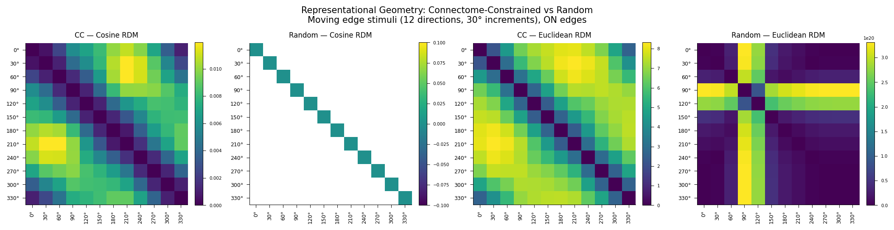

# Representational Geometry as a Fidelity Metric for Connectome-Constrained Neural Emulations

This repository implements a proof-of-concept showing that connectome-constrained networks
produce geometrically distinct population codes compared to randomly initialized networks
with the same architecture — using representational similarity analysis (RSA) applied to
the [Flyvis](https://github.com/TuragaLab/flyvis) Drosophila visual system model.

---

## Background

Connectome-scale neural emulations are increasingly feasible, but the field lacks a principled framework for evaluating their fidelity. Brunton et al. (2026) demonstrated that behavioral fidelity is achievable without biological fidelity — a randomly wired network can produce realistic fly walking. This raises the question: what does biological wiring actually contribute, and how do we measure it?

Representational geometry — the structure of pairwise distances between population responses to different stimuli — offers a candidate answer. If connectome-constrained networks produce a representational geometry that random networks cannot replicate, then geometry is a fidelity-discriminating signal that operates at the population level, without requiring a behavioral decoder.

This project tests that hypothesis using the pretrained Flyvis ensemble (Lappalainen et al. 2024), applying RSA (Kriegeskorte et al. 2008) to compare population codes across connectome-constrained models versus sign-preserving random weight shuffles.

---

## Experiment

**Stimuli:** 12 ON moving edges at 30° increments (0° through 330°)

**Networks:**
- *Connectome-constrained (CC):* All 50 models in the pretrained Flyvis ensemble (indices `000–049` within `flow/0000`, pre-sorted by task error in directory naming), trained to perform optic flow estimation on naturalistic video with connectome-fixed architecture (734 free parameters)
- *Random baseline:* Same 50 model architectures with only the 604 unitary synapse scaling factors (`edges_syn_strength`) shuffled while preserving E/I sign structure, trained time constants, and resting potentials — per Lappalainen et al. (2024) Methods, time constants are clamped during training to prevent instability; preserving them produces a dynamically stable Shiu-style control. Two additional strategies were also tested: full Shiu-style shuffling of all free parameters, and matched-normal resampling of all free parameters (see Results).

**Population vectors:** Peak central-cell voltage per cell type (65-dim) in response to each stimulus direction

**Metrics:**
- Cosine distance RDM — scale-invariant, captures pattern geometry
- Euclidean distance RDM — captures magnitude differences
- Spearman RDM correlation — measures similarity between CC and random geometry
- Within-ensemble consistency — measures stability of CC representational geometry across trained solutions

---

## Key Results

### n=10 (top 10 models, primary fidelity result)

| Metric | Value |
|--------|-------|
| CC cosine RDM off-diagonal range | 0.001 – 0.022 (structured) |
| Random cosine RDM off-diagonal range | ~0.200 (uniform — no direction selectivity) |
| CC vs random RDM correlation (cosine) | r = 0.757, p < 0.0001 |
| Within-CC ensemble consistency | r = 0.838 ± 0.078 |
| Random models with unstable dynamics | 5 / 10 |
| CC models with unstable dynamics | 0 / 10 |

### n=50 (full ensemble) — instability across randomization strategies

| Randomization strategy | Unstable random models | CC unstable | Cosine RDM correlation |
|------------------------|------------------------|-------------|------------------------|
| Full Shiu-style shuffle | 33 / 50 (66%) | 0 / 50 | NaN |
| Matched-normal resampling | 38 / 50 (76%) | 0 / 50 | NaN |
| Synapse-only shuffle (`edges_syn_strength`) | 34 / 50 (68%) | 0 / 50 | NaN |

The connectome-constrained network produces direction-sensitive representational geometry with a smooth circular structure — adjacent directions are most similar, opposite directions most dissimilar — consistent with the known tuning of T4/T5 neurons in the fly visual system. Zero trained CC models exhibited instability at either n=10 or n=50 under any randomization strategy, while 66–76% of random models collapsed at n=50 across all three strategies, confirming that the biological connectome reliably occupies a dynamically stable region of parameter space that random weight configurations consistently leave.



*Left to right: connectome-constrained cosine RDM, random baseline cosine RDM, connectome-constrained Euclidean RDM, random baseline Euclidean RDM (n=50 run, synapse-only shuffle of `edges_syn_strength`). The CC cosine RDM shows structured, direction-dependent dissimilarity with a smooth circular gradient (range 0.001–0.012). The random cosine RDM is entirely NaN due to numerical overflow from unstable models (34/50) and is not renderable. The random Euclidean RDM is dominated by exploding activations in unstable models and is not interpretable. Stimuli: 12 ON moving edges at 30° increments. All 50 pretrained Flyvis models, seed=42.*

---

## Results

### CC Cosine RDM
The connectome-constrained network produces a structured 12×12 dissimilarity matrix with clear direction-dependent organization. At n=10, off-diagonal values range from ~0.001 to ~0.022 — small in absolute terms but systematically organized: adjacent directions are most similar (minimum: 0°–30°, dissimilarity = 0.001), while opposite directions are most dissimilar (maximum: 30°–210°, dissimilarity = 0.022). At n=50, the range tightens to 0.001–0.012, reflecting the inclusion of lower-performing models. Both runs show a smooth circular gradient consistent with the known direction tuning of T4/T5 neurons in the fly visual system.

### Random Cosine RDM
At n=10, the random baseline produces a nearly uniform matrix with all off-diagonal values at ~0.200 — the random network cannot distinguish motion directions, with directional variation confined to the fourth decimal place. At n=50, across all three randomization strategies tested — (1) Shiu-style shuffling of all free parameters, (2) matched-normal resampling of all free parameters, and (3) Shiu-style shuffling of synaptic weights only (`edges_syn_strength`) while preserving trained time constants and resting potentials — the mean random cosine RDM collapses to NaN due to numerical overflow from unstable models. Instability is a fundamental property of random weight configurations in this architecture, not an artifact of any particular randomization strategy.

### Dynamic Instability
Dynamic instability is robust across all three randomization strategies. At n=10, 5 of 10 random models (models 2, 3, 4, 8, 9) produced exploding activations (756 non-finite values each, corresponding to 63 of 65 cell types across all 12 stimuli). At n=50: full Shiu-style shuffling produced 33/50 unstable models (66%); matched-normal resampling produced 38/50 (76%); synapse-only shuffling of `edges_syn_strength` while preserving trained `nodes_time_const` and `nodes_bias` produced 34/50 (68%). The persistence of instability even when trained dynamical parameters are preserved confirms that randomizing synaptic weights alone is sufficient to destabilize dynamics. 0 of 50 trained CC models showed any instability under any condition. The biological connectome, as optimized by task training, reliably occupies a dynamically stable region of parameter space that random weight configurations consistently leave.

### CC vs Random RDM Correlation
At n=10, cosine RDM correlation: **r = 0.757, p < 0.0001** — highly significant. This moderate positive correlation indicates that the CC and random cosine RDMs share directional ordering — both assign smaller dissimilarities to adjacent directions and larger dissimilarities to opposing ones — but differ substantially in the depth and resolution of that structure. The CC network encodes direction with fine-grained, graded dissimilarities spanning a 20-fold range (0.001–0.022), while the random baseline collapses that structure to a nearly uniform ~0.200 with no functionally meaningful variation.

At n=50, cosine RDM correlation: **NaN** under all three randomization strategies — not computable due to numerical overflow in the mean random cosine RDM. The n=10 result remains the primary fidelity metric.

Euclidean RDM correlation: **r = 0.021, p = 0.865** (full Shiu-style shuffle); **r = 0.241, p = 0.052** (matched-normal resampling); **r = −0.145, p = 0.247** (synapse-only shuffle) — none significant, and not interpretable due to extreme magnitudes (~10²¹–10²⁷) from exploding activations in unstable random models.

**Interpretive note:** The n=50 random baseline is dominated by dynamically unstable models under all three randomization strategies and is not suitable for RDM correlation analysis. The meaningful fidelity signal at n=50 is the within-ensemble consistency of CC models and the instability rate of random models, not the CC vs random RDM correlation. The n=10 result (r = 0.757, p < 0.0001) remains the primary fidelity metric, computed against a random baseline with only 5/10 unstable models.

### Within-Ensemble Consistency
At n=10, mean pairwise RDM correlation: **r = 0.838 ± 0.078** (range: 0.601–0.956). At n=50, mean pairwise RDM correlation: **r = 0.721 ± 0.150** (range: 0.323–0.983). The decrease in mean and increase in variance at n=50 reflects the inclusion of lower-performing models implementing more varied solutions, consistent with the known cluster structure of the Flyvis ensemble reported in Lappalainen et al. Fig. 3.

### Next Steps
- Dynamic instability persists across all three randomization strategies (full shuffle: 66%; matched-normal: 76%; synapse-only shuffle: 68%), indicating that the trained parameter configuration as a whole — not any individual parameter type — is what keeps the biological connectome in a stable dynamical regime; a fully stable random baseline may require a different approach such as adversarial stability-constrained sampling
- Include OFF edges (intensity = 0) alongside ON edges to test whether the directional geometry generalizes across polarity
- Euclidean metric is not suitable when random baselines are dynamically unstable; cosine distance is the appropriate primary metric for this comparison
- Within-CC consistency could be reported separately per cluster if UMAP reveals substructure in the ensemble geometry (planned)
- Consider Kendall's τ_A as an alternative to Spearman for RDM comparison, as it is more robust to ties

---

## Installation

This experiment runs on Google Colab with a T4 GPU runtime. Local installation requires Python ≥ 3.9, < 3.13.

```python
# On Google Colab — run these cells in order
!git clone https://github.com/TuragaLab/flyvis.git
%cd /content/flyvis
!pip install -e .[examples]
!flyvis download-pretrained
```

---

## Usage

```python
# Run proof of concept (n_models=1 for debugging, n_models=50 for full run)
results = run_experiment(n_models=50)
```

The full experiment takes approximately 60–90 minutes on a T4 GPU.

The Colab-ready notebook is at `notebooks/moving_edge_poc.ipynb`.
The standalone script is at `experiments/moving_edge_poc.py`.

---

## Repository Structure

```
connectome-fidelity/
├── README.md
├── experiments/
│   ├── moving_edge_on.py           ← ON edges experiment (primary fidelity result)
│   └── moving_edge_on_off.py       ← ON+OFF edges experiment (polarity generalization)
├── notebooks/
│   ├── moving_edge_on.ipynb        ← Colab-ready notebook, ON edges results
│   └── moving_edge_on_off.ipynb    ← Colab-ready notebook, ON+OFF edges results
└── figures/
    ├── moving_edge_on_rdms.png     ← ON edges RDM figure
    └── moving_edge_on_off_rdms.png ← ON+OFF edges RDM figure (forthcoming)
```

---

## References

- Lappalainen et al. 2024. Connectome-constrained networks predict neural activity across the fly visual system. *Nature* 634, 1132–1140. https://www.nature.com/articles/s41586-024-07939-3

- Shiu et al. 2024. A Drosophila computational brain model reveals sensorimotor processing. *Nature* 634, 210–219. https://www.nature.com/articles/s41586-024-07763-9

- Kriegeskorte et al. 2008. Representational similarity analysis — connecting the branches of systems neuroscience. *Frontiers in Systems Neuroscience* 2:4. https://www.frontiersin.org/journals/systems-neuroscience/articles/10.3389/neuro.06.004.2008/full

- Kriegeskorte & Wei 2021. Neural tuning and representational geometry. *Nature Reviews Neuroscience* 22, 703–718. https://www.nature.com/articles/s41583-021-00502-3

- Brunton et al. 2026. The digital sphinx: Can a worm brain control a fly body? *bioRxiv*. https://www.biorxiv.org/content/10.64898/2026.03.20.713233v1

---

## Author

Michael Zhou — PhD student, Electrical and Computer Engineering, Georgia Institute of Technology
