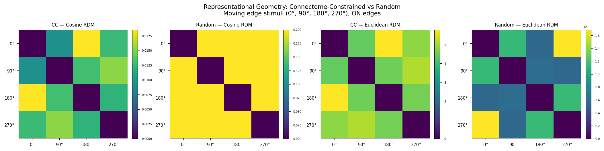

# Representational Geometry as a Fidelity Metric for Connectome-Constrained Neural Emulations

This repository implements a proof-of-concept showing that connectome-constrained networks
produce geometrically distinct population codes compared to randomly initialized networks
with the same architecture — using representational similarity analysis (RSA) applied to
the [Flyvis](https://github.com/TuragaLab/flyvis) Drosophila visual system model.

---

## Background

Connectome-scale neural emulations are increasingly feasible, but the field lacks a principled framework for evaluating their fidelity. Brunton et al. (2026) demonstrated that behavioral fidelity is achievable without biological fidelity — a randomly wired network can produce realistic fly walking. This raises the question: what does biological wiring actually contribute, and how do we measure it?

Representational geometry — the structure of pairwise distances between population responses to different stimuli — offers a candidate answer. If connectome-constrained networks produce a representational geometry that random networks cannot replicate, then geometry is a fidelity-discriminating signal that operates at the population level, without requiring a behavioral decoder.

This project tests that hypothesis using the pretrained Flyvis ensemble (Lappalainen et al. 2024), applying RSA (Kriegeskorte et al. 2008) to compare population codes across 10 connectome-constrained models versus 10 sign-preserving random weight shuffles.

---

## Experiment

**Stimuli:** 12 ON moving edges at 30° increments (0° through 330°)

**Networks:**
- *Connectome-constrained (CC):* Top 10 pretrained Flyvis models (indices 000–009, pre-sorted by task error in directory naming), trained to perform optic flow estimation on naturalistic video with connectome-fixed architecture (734 free parameters)
- *Random baseline:* Same 10 model architectures with weight magnitudes shuffled while preserving E/I sign structure (Shiu-style control)

**Population vectors:** Peak central-cell voltage per cell type (65-dim) in response to each stimulus direction

**Metrics:**
- Cosine distance RDM — scale-invariant, captures pattern geometry
- Euclidean distance RDM — captures magnitude differences
- Spearman RDM correlation — measures similarity between CC and random geometry
- Within-ensemble consistency — measures stability of CC representational geometry across trained solutions

---

## Key Results (seed=42, n_models=10)

| Metric | Value |
|--------|-------|
| CC cosine RDM off-diagonal range | 0.001 – 0.021 (structured) |
| Random cosine RDM off-diagonal range | ~0.200 (uniform — no direction selectivity) |
| CC vs random RDM correlation (cosine) | r = 0.757, p < 0.0001 |
| Within-CC ensemble consistency | r = 0.838 ± 0.078 |
| Random models with unstable dynamics | 5 / 10 |
| CC models with unstable dynamics | 0 / 10 |

The connectome-constrained network produces direction-sensitive representational geometry with a smooth circular structure — adjacent directions are most similar, opposite directions most dissimilar — consistent with the known tuning of T4/T5 neurons in the fly visual system. The random baseline produces either a uniform RDM (no direction sensitivity) or dynamic collapse (exploding activations). Zero trained models exhibited instability, suggesting the biological connectome reliably occupies a dynamically stable region of parameter space that random weight shuffles frequently leave.



*Left to right: connectome-constrained cosine RDM, random baseline cosine RDM, connectome-constrained Euclidean RDM, random baseline Euclidean RDM. The CC cosine RDM shows structured, direction-dependent dissimilarity with a smooth circular gradient (range 0.001–0.021). The random cosine RDM is nearly uniform (~0.200 off-diagonal), indicating no direction selectivity. The random Euclidean RDM is dominated by exploding activations in unstable models (5/10) and is not interpretable. Stimuli: 12 ON moving edges at 30° increments. Top 10 pretrained Flyvis models, seed=42.*

---

## Installation

This experiment runs on Google Colab with a GPU runtime. Local installation requires Python ≥ 3.9, < 3.13.

```python
# On Google Colab — run these cells in order
!git clone https://github.com/TuragaLab/flyvis.git
%cd /content/flyvis
!pip install -e .[examples]
!flyvis download-pretrained
```

---

## Usage

```python
# Run proof of concept (n_models=1 for debugging, n_models=10 for full run)
results = run_experiment(n_models=10)
```

The full experiment takes approximately 20–25 minutes on a T4 GPU.

The Colab-ready notebook is at `notebooks/moving_edge_poc.ipynb`.
The standalone script is at `experiments/moving_edge_poc.py`.

---

## Repository Structure

```
connectome-fidelity/
├── README.md
├── experiments/
│   └── moving_edge_poc.py        ← standalone experiment script
├── notebooks/
│   └── moving_edge_poc.ipynb     ← Colab-ready notebook with results
└── figures/
    └── moving_edge_poc_rdms.png  ← output figure
```

---

## References

- Lappalainen et al. 2024. Connectome-constrained networks predict neural activity across the fly visual system. *Nature* 634, 1132–1140. https://www.nature.com/articles/s41586-024-07939-3

- Kriegeskorte et al. 2008. Representational similarity analysis — connecting the branches of systems neuroscience. *Frontiers in Systems Neuroscience* 2:4. https://www.frontiersin.org/journals/systems-neuroscience/articles/10.3389/neuro.06.004.2008/full

- Kriegeskorte & Wei 2021. Neural tuning and representational geometry. *Nature Reviews Neuroscience* 22, 703–718. https://www.nature.com/articles/s41583-021-00502-3

- Brunton et al. 2026. The digital sphinx: Can a worm brain control a fly body? *bioRxiv*. https://www.biorxiv.org/content/10.64898/2026.03.20.713233v1

---

## Author

Michael Zhou — PhD student, Electrical and Computer Engineering, Georgia Institute of Technology
