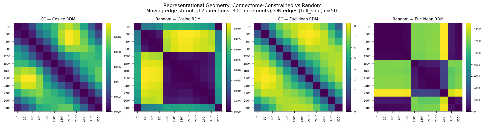
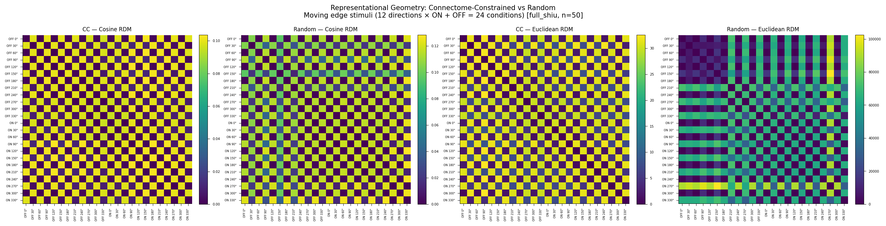
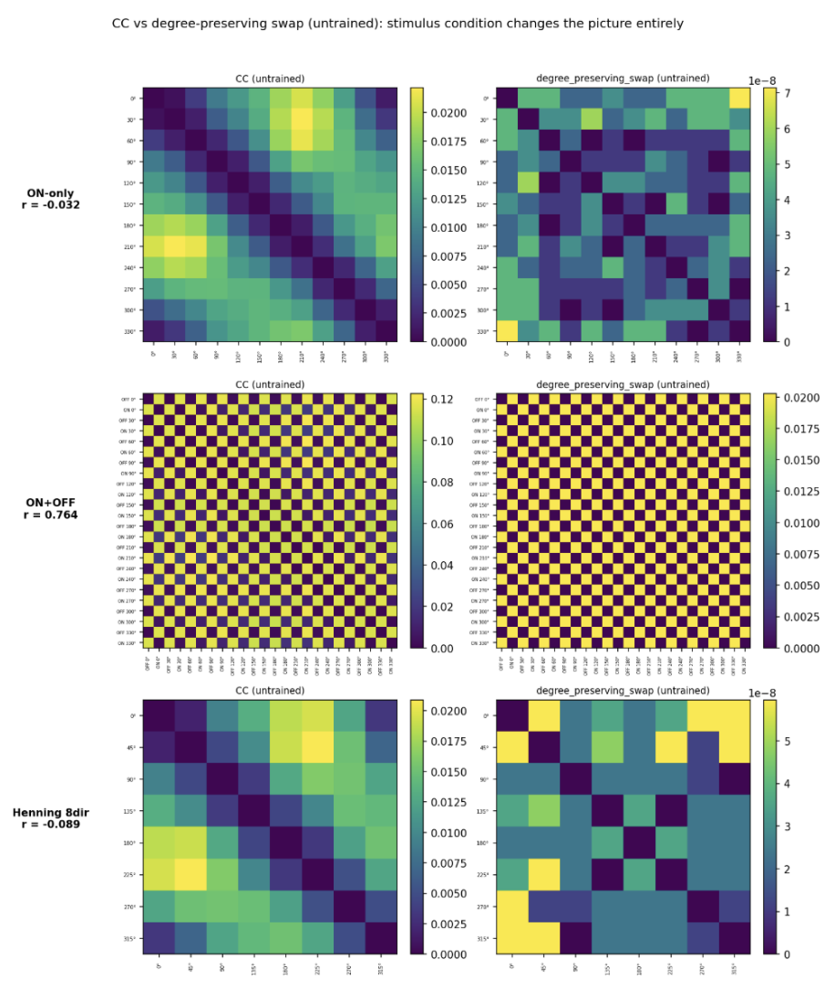
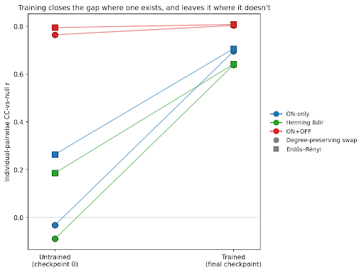
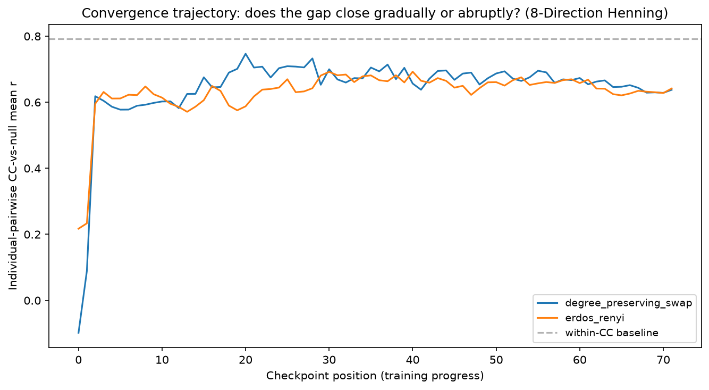
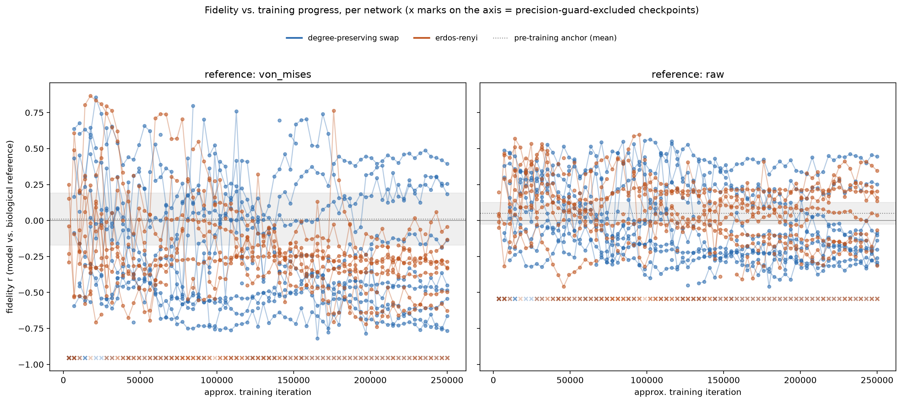
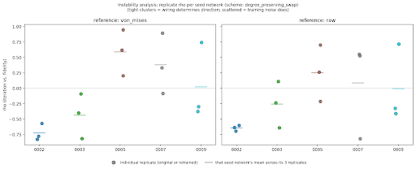
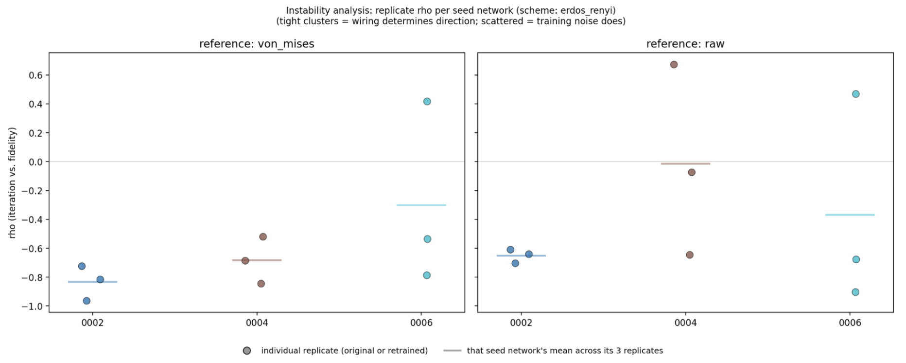

Representational Geometry as a Fidelity Metric for Connectome-Constrained Neural Emulations: Evidence from Drosophila and Mouse Visual Systems

Author: Michael Zhou
Current Advisor: Prof. Jennifer Hasler

## Background

Brunton et al. (2026) demonstrated that a connectome, taken from one species (C. elegans) and used to control the body of another (Drosophila), can produce realistic behavior even when only a downstream interface is trained. The connectome's own synaptic weights and cellular parameters were never optimized; behavior emerged entirely from training the decoder mapping its outputs to the target body. The authors note this role could be fulfilled equally well by a randomly connected network, since all the learning happens in the decoder, this shows behavioral fidelity is achievable without biological fidelity: a model can look right without its underlying structure being correct. That raises a direct question: if behavior alone can't verify fidelity, what can?

This project tests one candidate, representational geometry, asking whether the structure of a population's response patterns can distinguish a real connectome from a random one, in a way behavior alone cannot.

## Fly Connectome

To test this, I used Flyvis (Lappalainen et al. 2024), a connectome-constrained model of the Drosophila visual system. Its architecture is built directly from the reconstructed fly connectome: which cell types connect to which, and through which edges, is fixed by the reconstruction itself. What training optimizes is the strength of those connections, the synaptic weights, via gradient descent on an optic-flow estimation task. Comparing real wiring against random alternatives, matched in scale but not structure, and training each the same way, gives a direct test of what the connectome's structure itself contributes, independent of what training does to the weights sitting on top of it.

Representational geometry, following Kriegeskorte et al. 2008, captures this at the population level: present a set of stimuli, record the population response to each, and compare the full pattern of pairwise distances between responses rather than any single unit's activity. If connectome-constrained wiring produces a distinct geometry that random wiring cannot replicate, that geometry is a candidate fidelity signal, measurable without any behavioral readout at all.

Five experiments test this, building on each other:

- Experiment 1 — connectome-constrained vs. random wiring, ON-edge motion stimuli
- Experiment 2 — the same comparison, extended to ON+OFF edges
- Experiment 3 — both conditions compared against real T4/T5 direction-tuning data (Maisak et al. 2013)
- Experiment 4 — the same comparison, before any training at all
- Experiment 5 — real vs. trained random wiring, the literal test Brunton's finding raises

### 1. Can geometry tell real wiring from random wiring?

Using the pretrained Flyvis ensemble (Lappalainen et al. 2024), I compared connectome-constrained (CC) networks against random wiring baselines, testing whether population-level representational geometry differs between them. Random baselines here are untrained, sign-preserving connectivity shuffles, not independently trained-from-scratch networks, a distinction that matters later.

Across two stimulus conditions, the ensemble-mean RDM correlation between CC and random is r = 0.686 (ON edges only, n=50, p < 0.0001) and r = 0.846 (ON+OFF edges, n=50, p < 0.0001). Taken alone, these numbers are ambiguous, both are numerically high, and could be misread as evidence of similarity rather than difference. The correct comparison is relative, not absolute: how similar CC models are to each other versus to random. Directly testing this, using every individual model pair rather than the two ensemble-mean RDMs, real CC networks are significantly more similar to each other than to random wiring, on both stimulus sets (ON: within-CC r = 0.721 vs. CC-vs-random r = 0.404, Mann-Whitney p = 1.7×10⁻³⁰⁴; ON+OFF: within-CC r = 0.838 vs. CC-vs-random r = 0.754, p = 1.2×10⁻¹⁴¹). Averaging models together before correlating, as the ensemble-mean statistic does, smooths out individual-model noise and understates this gap considerably; the individual-pairwise comparison is the one that actually supports the claim.

This weight-shuffled baseline is only one kind of random wiring, and not the one items 3-5 actually build on. Degree-preserving swap and Erdős–Rényi, the two null schemes used throughout the rest of this work, randomize the connectome's topology directly rather than shuffling a trained network's weight values in place. Worth checking directly whether "distinguishable before training" holds for these specific schemes too, using the same individual-pairwise methodology, rather than assuming it carries over.

**Table 0.** Individual-pairwise CC-vs-null comparison (n=10 models each, checkpoint 0, untrained), across three stimulus conditions.

| Stimulus set | Within-CC | Scheme | CC-vs-null r | Mann-Whitney p |
|---|---|---|---|---|
| ON-only (12 dir) | 0.838 ± 0.078 | Degree-preserving swap | −0.032 ± 0.109 | 3.50×10⁻²² |
| ON-only (12 dir) | 0.838 ± 0.078 | Erdős–Rényi | 0.264 ± 0.149 | 3.50×10⁻²² |
| ON+OFF (24 cond.) | 0.850 ± 0.057 | Degree-preserving swap | 0.764 ± 0.040 | 1.33×10⁻¹³ |
| ON+OFF (24 cond.) | 0.850 ± 0.057 | Erdős–Rényi | 0.794 ± 0.048 | 8.72×10⁻⁸ |
| Henning 8-direction | 0.792 ± 0.101 | Degree-preserving swap | −0.089 ± 0.139 | 3.49×10⁻²² |
| Henning 8-direction | 0.792 ± 0.101 | Erdős–Rényi | 0.186 ± 0.149 | 3.80×10⁻²² |

Every comparison reaches significance, real wiring is distinguishable from both null schemes, untrained, across all three stimulus sets. But the size of that gap varies considerably and follows a consistent pattern: ON-only and the independent Henning 8-direction set agree closely with each other, both show degree-preserving swap essentially uncorrelated with real wiring and Erdős–Rényi showing a modest but real relationship. ON+OFF stands apart from both, showing a much smaller gap for both null schemes, still significant, but a qualitatively different picture.

**Table 0a.** Within-polarity decomposition, ON+OFF, individual-pairwise CC-vs-null, untrained.

| Scheme | Comparison | CC-vs-null r | Mann-Whitney p |
|---|---|---|---|
| Degree-preserving swap | Full ON+OFF (24 cond.) | 0.762 ± 0.039 | 5.09×10⁻¹⁴ |
| Degree-preserving swap | ON-ON sub-block only | −0.040 ± 0.117 | 3.49×10⁻²² |
| Degree-preserving swap | OFF-OFF sub-block only | −0.010 ± 0.135 | 4.13×10⁻²² |
| Erdős–Rényi | Full ON+OFF (24 cond.) | 0.793 ± 0.048 | 9.79×10⁻⁸ |
| Erdős–Rényi | ON-ON sub-block only | 0.259 ± 0.149 | 3.50×10⁻²² |
| Erdős–Rényi | OFF-OFF sub-block only | 0.319 ± 0.190 | 3.93×10⁻¹⁴ |

This turns out to have a specific, identifiable cause. ON+OFF's 24-condition RDM contains a component ON-only and Henning structurally cannot have: whether a stimulus is ON- or OFF-polarity, a coarse distinction plausibly reproduced by any network, real or random. Decomposing the ON+OFF RDM into its ON-ON and OFF-OFF sub-blocks and discarding the cross-polarity terms (Table 0a), both null schemes' apparent convergence disappears, landing almost exactly on the independently-run pure ON-only result from Table 0. The apparent convergence in the full ON+OFF comparison was real, but it was measuring shared ON/OFF-discrimination ability, not a genuine loss of fine-grained direction-tuning distinctiveness. ON+OFF is not a different result from ON-only and Henning, it is the same result diluted by a confound.

One further asymmetry surfaced by this decomposition, not yet explained: the real CC ensemble's own within-CC consistency is itself lower on OFF-only structure (r = 0.634) than on ON-only structure (r = 0.838), independent of any null-scheme comparison. Worth flagging as a separate, standalone observation rather than folding into the wiring-distinguishability question.

Answer: Yes, geometry distinguishes real from random wiring when untrained, for both topology-randomizing null schemes items 3-5 depend on, not just the original weight-shuffled baseline. ON+OFF's smaller gap isn't a real exception, it reflects dilution by shared ON/OFF-discrimination structure, and disappears once within-polarity structure is isolated. Whether this distinction survives once random wiring is actually trained, the same question item 3 asks through a biology-mediated method, is addressed there directly, using this same individual-pairwise approach as a second, independent method.

**Figure 1.** Representational dissimilarity matrices for connectome-constrained (CC) and random-wiring networks under cosine and Euclidean distance, Experiment 1 (12 directions, ON edges only, n=50 models). CC networks show smooth, graded dissimilarity consistent with continuous direction tuning; random networks instead show a qualitatively different block structure, splitting responses into two large clusters rather than a graded direction-tuned pattern.

*(⚠️ filename above is identical to Figure 1's, likely a copy-paste error, since this figure's caption describes different content, ON+OFF/24 conditions vs. Figure 1's ON-only/12 conditions. Confirm the correct filename before this renders as intended.)*

**Figure 2.** Representational dissimilarity matrices for connectome-constrained (CC) and random-wiring networks, shown under cosine distance (left two panels) and Euclidean distance (right two panels), across 24 stimulus conditions (12 directions × ON/OFF polarity, n=50 models). CC networks show a sharp, regular checkerboard pattern reflecting consistent ON/OFF discrimination across all directions; random networks show this structure only weakly (cosine) or not at all (Euclidean). Note the Euclidean color scales differ substantially between CC and random panels (0-30 vs. 0-100,000) and are not directly comparable in raw magnitude.

**Figure 3.** Representational dissimilarity matrices for CC (left) and untrained degree-preserving-swap wiring (right), across three independently-built stimulus conditions. ON-only (top; 12 directions, individual-pairwise r = −0.032) and the Henning 8-direction set (bottom; 8 directions, r = −0.089) each show CC and null wiring as essentially unrelated. ON+OFF (middle; 12 directions × 2 polarities, r = 0.764) shows a much smaller gap, real wiring and null wiring look considerably more alike once OFF-polarity stimuli are included. Since ON-only and Henning were built independently and agree closely with each other, ON+OFF is the condition that stands apart, not the other way around.

### 2. Is the biological reference actually measuring direction tuning?

The original biological reference was built from Maisak et al. (2013). On closer inspection, it turned out to be dominated by circular stimulus structure rather than real direction-tuning signal. Maisak's own data shows T5 cells largely fail to respond to moving ON-edge stimuli specifically; on an ON-only stimulus set, this collapses the eight T4/T5 subtypes to four T4 curves, all the same width, at even 90° spacing, a shape whose pairwise distances are almost entirely explained by angular position alone (r = 0.978 against a pure circular-distance model). Raw correlations against this reference were measuring circular organization, not direction-tuning fidelity. After partialling out the circular structure, the signal that remained was no longer significant at n=50.

This invalidated Experiment 3 and broke the first version of Experiment 5, which depended on the same reference.

**Figure 4.** Idealized von Mises tuning curves for T4 (blue) and T5 (orange) subtypes, reconstructed from Maisak et al. (2013), Fig. 3g-h. T5a–d are assigned identical preferred directions and tuning shapes to T4a–d (T5a/T4a both PD=180°, T5b/T4b both PD=0°, T5c/T4c both PD=90°, T5d/T4d both PD=270°), leaving only four distinct tuning curves across eight nominal subtypes, evenly spaced at 90° intervals.

It led directly to finding and validating the Henning dataset (Henning, Ramos-Traslosheros, Gür & Silies 2022) as a replacement: real per-cell T4/T5 direction-tuning data, not idealized summary curves, substantially less circular than Maisak.

**Table 1.** Variance explained by circular structure, by reference.

| Reference | Variance explained by circular structure |
|---|---|
| Henning, raw | 63.5% |
| Henning, von Mises | 82.3% |
| Maisak | 95.6% |

Two independent construction methods (a curve-fitted version and a raw, no-curve-fitting version) both confirm real, reliable non-circular structure, verified via split-half reliability across independent recordings.

A direct test confirms the curve-fitted (von Mises) version carries a real, quantified risk the raw version doesn't: pure synthetic noise, with no genuine tuning at all, was run through both pipelines and correlated against real model geometry.

**Table 2a.** Mean |r| against real model geometry, pure synthetic noise, 200 trials.

| Pipeline | Mean \|r\| |
|---|---|
| Fitted (von Mises) | 0.334 |
| Raw | 0.168 |

The fitting pipeline produces correlations nearly 2x larger in magnitude than raw's, on data containing zero real signal.

A follow-up test on the real data itself adds a reassuring, complementary result: split-half reliability, checking whether random half-samples of the same real cells agree with each other.

**Table 2b.** Split-half reliability, real Henning data, 500 trials.

| Pipeline | Reliability (r) | Std across trials |
|---|---|---|
| Fitted (von Mises) | 0.987 | 0.009 |
| Raw | 0.924 | 0.026 |

Both are far above anything pure noise could produce under either pipeline (Table 2a), the Henning dataset carries substantial, genuine, replicable signal regardless of reconstruction method. The gap between the two methods persists here too, though, and in the same direction: fitted is not just higher but also three times more consistent across resamples, a pattern consistent with the fitting step smoothing over real cell-to-cell heterogeneity that raw data preserves rather than manufacturing structure from nothing. Both versions are used throughout what follows, but where they disagree, raw should be read as the more trustworthy reference.

Answer: No, not entirely. The original reference was measuring circular stimulus structure more than direction tuning. The Henning dataset provides a validated non-circular replacement.

### 3. Does geometry distinguish real wiring from trained random wiring?

With a validated non-circular reference in hand, I tested the specific limitation Brunton names in her own paper: she predicts that training the connectome's synaptic weights "would only deepen" the interpretability problem her untrained-random result already raises, but doesn't test this herself. Does representational geometry distinguish real, trained connectome-constrained (CC) networks from random wiring that has also been trained to task adequacy, not just shuffled and left untrained?

**Method A: Biology-mediated**

Two null schemes were tested: a degree-preserving swap (scrambles specific connections while holding each cell type's total connection count fixed) and Erdős–Rényi (a full scramble, degree not preserved). Both were trained through the complete 250,000-iteration recipe, then evaluated against both Henning references, the same way as CC.

**Table 3.** CC (n=50) vs. each trained-random null scheme (n=10), per-network Mann-Whitney comparison.

| Reference | CC vs. degree-preserving swap | CC vs. Erdős–Rényi |
|---|---|---|
| Henning, von Mises | p = 0.32 | p = 0.027 |
| Henning, raw | p = 0.41 | p = 0.61 |

Against the degree-preserving null, real and random wiring are statistically indistinguishable on both references. Against Erdős-Rényi, the same holds on raw, but not on von Mises, where the difference is significant, and runs in the opposite direction from what a fidelity hypothesis would predict: random wiring shows a stronger relationship with the reference than real wiring does.

A named limitation worth actually checking rather than just flagging: the CC ensemble (n=50) and each trained-random ensemble (n=10) are not matched in size. To test whether this mismatch was driving the significant result above, CC was repeatedly subsampled down to n=10 (10,000 random draws, no new training needed) and the comparison rerun on each draw.

**Table 4.** Same comparison, CC resampled to n=10 for a fair match (median p across 10,000 draws; % of draws reaching p < 0.05 in parentheses).

| Reference | CC vs. degree-preserving swap | CC vs. Erdős–Rényi |
|---|---|---|
| Henning, von Mises | p = 0.47 (0%) | p = 0.09 (30%) |
| Henning, raw | p = 0.52 (0.4%) | p = 0.65 (0.2%) |

The degree-preserving result holds up, genuinely null, not just null by small sample. The Erdős–Rényi result does not survive the fair comparison: median p rises from 0.027 to 0.09, and only 30% of size-matched draws reach significance at all. The original result was, at least in part, an artifact of the sample-size asymmetry, not a robust effect. A second, independent reason for caution: this result only ever appeared on the von Mises reference, never on raw, and von Mises's fitting step is now confirmed to inflate spurious correlation magnitude by nearly 2x on data with no real signal at all. Two separate, independent problems point the same direction here, sample-size mismatch and reference-construction artifact, neither of which is needed to explain the raw reference's null result, but both of which help explain why von Mises alone produced a significant one.

One direction this resampling can't rule out, worth naming rather than leaving implicit: downsampling CC tests whether the reported effect was real, not whether a smaller real effect exists that n=10 simply lacks the power to detect. Erdős-Rényi's resampled p-values ranged from 0.04 to 0.21 across draws, wider than degree-preserving swap's, consistent with limited power at this sample size, not necessarily a hidden effect, but not fully ruled out either. Closing this would require training the null schemes up, not resampling CC down. Concretely: wiring files already exist for both schemes up to n=25 (no new generation needed, training only), so extending each null scheme from n=10 to n=25 is a scoped, costed option, roughly 16 days and $90 of compute on a single GPU, sequential pairs, the only configuration tested to actually work at this pace. Going the full distance to n=50 for an exact match to CC would cost closer to 42 days and $260. Neither has been run; this is flagged as a specific, ready next step if the question warrants it, not attempted here.

Q: Given the resampled Erdős-Rényi p-values sit in a genuinely ambiguous range (0.04-0.21 across draws, consistent with either a real small effect or just limited power at n=10), is the ~16-day, ~$90 n=25 scale-up worth running to resolve this, or would you treat the current result as an honest, reportable null as-is, with the power caveat stated plainly? Curious how you'd weigh that tradeoff given your own experience with hierarchical null-model designs.

**Method B: Direct RDM comparison, no biological reference**

Item 1 already established, using individual-pairwise RDM correlation rather than a biology-mediated statistic, that real and random wiring are distinguishable when untrained (Table 0). The same method, applied now to each null scheme's final, fully-trained checkpoint instead of checkpoint 0, gives a second, independent answer to this section's question.

**Figure 5.** Individual-pairwise CC-vs-null wiring similarity, before and after training, across three stimulus conditions and both null schemes. Each line connects one comparison's untrained value (checkpoint 0) to its trained value (final checkpoint); color indicates stimulus condition, marker shape indicates null scheme. ON-only and Henning 8-direction, the two conditions with essentially no untrained relationship, both converge sharply toward the within-CC baseline once trained. ON+OFF, already substantially converged before training, shows almost no further shift. The pattern holds nearly identically for both null schemes within each stimulus condition, indicating the size of the shift is governed by how much separation existed to begin with, not by which wiring scheme is used.

Training produces real, substantial convergence, but the convergence amount depends entirely on how much separation existed beforehand, not on which null scheme is used. The two conditions that started at near-zero relationship, ON-only and Henning, both converge sharply with training (average shift +0.588). ON+OFF, already partly converged before training even began, barely moves (average shift +0.026, more than 20-fold smaller). Both null schemes behave near-identically within each stimulus condition; this is a property of training interacting with the untrained starting point, not something specific to either wiring scheme.

This compares only the first and last checkpoints, not the trajectory between them, and the follow-up has since been run. Every checkpoint of every network was evaluated for the Henning 8-direction condition (n=10 networks per scheme, 71-72 checkpoints each).

**Figure 6.** Individual-pairwise CC-vs-null mean r across every checkpoint, Henning 8-direction, both null schemes, against the within-CC baseline (dashed). Convergence is abrupt, not gradual: nearly the entire rise from near-zero to ~0.6 happens within the first 2-3 checkpoints. From checkpoint ~10 onward, roughly 86% of the full training run, both schemes plateau in a stable band (0.58-0.75) with no further net movement, well short of the within-CC baseline (~0.79). Both null schemes track each other closely throughout, reinforcing that this is a property of training dynamics generally, not either scheme specifically.

The full trajectory resolves the question cleanly: this is neither gradual convergence nor a non-monotonic process, it's a fast, early jump followed by a long, stable plateau that never fully closes the gap. The checkpoint-0-vs-final comparison used elsewhere in this analysis was not missing a slow developing story, nearly all the signal it captured was already present within the first few percent of training.

**Table 5.** Within-polarity decomposition, ON+OFF, individual-pairwise CC-vs-null, trained.

| Scheme | Comparison | CC-vs-null r | Mann-Whitney p |
|---|---|---|---|
| Degree-preserving swap | ON-ON sub-block only | 0.695 ± 0.130 | 5.87×10⁻¹⁰ |
| Degree-preserving swap | OFF-OFF sub-block only | 0.494 ± 0.175 | 1.22×10⁻⁵ |
| Erdős–Rényi | ON-ON sub-block only | 0.707 ± 0.123 | 1.92×10⁻⁹ |
| Erdős–Rényi | OFF-OFF sub-block only | 0.592 ± 0.165 | 0.087 |

The untrained decomposition (Table 0a, item 1) was rerun on the trained condition too, and the result is not the same story as untrained. The ON-ON sub-block, extracted from the pooled trained data, matches the standalone trained ON-only result almost exactly (degree-preserving swap: 0.695 vs. 0.695; Erdős–Rényi: 0.707 vs. 0.706), confirming the decomposition is behaving consistently. But unlike the untrained case, where isolating within-polarity structure fully restored strong separation, trained OFF-OFF does not: it stays significant for degree-preserving swap, but loses significance entirely for Erdős–Rényi, the first non-significant CC-vs-null result anywhere in this analysis. The untrained confound explanation doesn't contradict this, it's specific to untrained wiring; once training happens, real convergence occurs within each sub-block independently, and for Erdős–Rényi on OFF-polarity structure specifically, that convergence goes all the way to statistical indistinguishability.

Answer: No, largely, and two independent methods now agree. Method A (biology-mediated): once properly size-matched, real and trained-random wiring are statistically indistinguishable from both null schemes, on both references. Method B (direct RDM comparison): training substantially narrows the real-vs-random gap wherever an untrained gap existed, and in one specific case, trained Erdős–Rényi on OFF-polarity structure, closes it completely to statistical indistinguishability, the only comparison across either method where that happens outright. The full trajectory confirms this convergence happens almost immediately at the start of training and then holds steady, not a gradual erosion over the full training run. The two methods converge on the same overall answer through independent routes, adding real weight to the conclusion that training, not wiring identity, is what drives the loss of distinguishability once both are compared fairly.

### 4. Is the negative-trending pattern driven by training, or by wiring?

Item 3 found real wiring and Erdős–Rényi diverging on the von Mises reference, but in the wrong direction for a fidelity story: random wiring showed a stronger relationship with the reference, not a weaker one. That raised a specific follow-up, tested two ways: first, whether this negative-trending pattern is actually about wiring at all, or a property of training itself showing up in any trained population regardless of wiring; second, if it is about training, whether that effect builds up gradually within a single network's own training run, or only shows up as an endpoint difference.

**(a) The pooled check: is this about training, not wiring?**

Every population tested was sorted into trained (CC, degree-preserving swap, Erdős-Rényi) or untrained (weight-shuffled random, never trained at all) and checked for the same negative-trending pattern against the von Mises reference.

**Table 6.** Fraction of networks trending negative against the von Mises reference, trained vs. untrained populations.

| Population | Trained? | n | % negative | Significance |
|---|---|---|---|---|
| CC | Yes | 50 | 78% | p = 0.0001 |
| Erdős-Rényi | Yes | 10 | 100% | p = 0.002 |
| Degree-preserving swap | Yes | 10 | 70% | not significant alone |
| Pooled trained (both null schemes) | Yes | 20 | 85% | p = 0.003 |
| Weight-shuffled random | No | 50 | 54% | not significant (chance) |

The cleanest single comparison here is CC vs. weight-shuffled random, matched in size (n=50 each) and significantly different (Mann-Whitney p = 0.008). The two trained-random null schemes point the same direction, one significant alone (Erdős–Rényi), one not (degree-preserving swap), and reach significance when pooled (n=20, 85% negative, p = 0.003) against the same n=50 untrained group.

Given the pooled comparison's own size mismatch (n=20 vs. n=50), the same resampling check already applied to item 3's Erdős-Rényi result was run here too: the untrained population was repeatedly subsampled down to n=20 (10,000 draws, no new training needed) and the comparison rerun on each draw. Unlike item 3's result, this one holds up robustly: median p = 0.0077 across all draws (IQR 0.0028-0.0193), with 92.7% of size-matched draws reaching p < 0.05. The pooled trained-vs-untrained finding was never actually riding on the size mismatch.

The same overall pattern holds on the raw reference, though no single population reaches significance alone there, the pooled trained-vs-untrained comparison does (p = 0.001–0.004 across both references).

This is now a genuinely solid finding, not a partial one: the matched CC-vs-untrained comparison was already clean on its own, and the null-scheme evidence, once fairly tested, generalizes it robustly beyond CC specifically, not resting on the mismatched sample the way it initially appeared to. It doesn't resolve item 3's Erdős-Rényi puzzle, but it reframes it: wiring didn't cause that result on its own; something about training does, and wiring may be interacting with it rather than driving it.

**(b) The trajectory check: does this build up gradually within a network's own training?**

All 20 trained networks (both null schemes, 10 each) were evaluated at every available checkpoint across their full 250,000-iteration training run, not just at the end, to see whether the negative trend develops gradually.

**Figure 7.** Fidelity vs. training progress for all 20 trained networks, both biological references. X marks on the lower axis indicate checkpoints excluded by a precision guard. Individual trajectories are visibly coherent, not random jitter, but fan out in both directions from near zero with no shared population-level trend.

The answer is yes, but not in the way a single "training pushes fidelity down" story would predict. Individual networks show strong, statistically robust trends over their own training, several reach |ρ| above 0.7-0.9 at p < 0.0001, genuine effects, not noise. But the direction is idiosyncratic per network: within the degree-preserving scheme alone, four networks trend strongly negative while five trend strongly positive, same scheme, same recipe, opposite directions. A sign test across all 20 networks finds no consistent direction (11/20 negative, p = 0.82 von Mises; 13/20 negative, p = 0.26 raw), while a combined significance test is overwhelming on both references (χ² = 260.4, p < 0.0001 von Mises; χ² = 250.3, p < 0.0001 raw), strong evidence that something real happens within nearly every network, just not the same something.

Worth noting explicitly: this is a final-checkpoint snapshot across many networks (part a), not in tension with the within-network trajectory finding here (part b) so much as a different lens on it, a population can show a majority-negative endpoint even while individual trajectories diverge in direction along the way.

Separately: effects are consistently larger in magnitude on the von Mises reference than on raw, across every comparison in items 3-4. A direct test (see item 2) confirms this is at least partly a fitting artifact: pure synthetic noise run through the von Mises pipeline produces correlations nearly 2x larger than the same noise run through raw, on data with no genuine signal at all. Raw should be read as the more trustworthy reference where the two disagree, though how much of this section's own von-Mises-vs-raw gap specifically is that same artifact versus real signal hasn't been separately decomposed.

Answer: (a) Yes, this is about training, not wiring, and this now holds up cleanly across a fair, size-matched comparison, not just a favorable but mismatched one. (b) Yes, individual networks shift strongly over their own training, but in different directions from each other, ruling out a simple shared trend and raising a new question: what determines which direction a given network goes.

### 5. Does wiring identity or training randomness determine that direction?

Item 4 left a specific, unresolved question: individual networks shift strongly over their own training, but in different directions from each other, same scheme, same recipe, opposite outcomes. What determines which direction a given network goes?

Two candidate explanations. First, the specific realization of a network's null wiring, some random draws of a given scheme might land structurally closer to "real-like" than others, and training reveals that pre-existing difference rather than creating it. Second, training-process randomness unrelated to wiring at all, different networks landing in different loss-landscape basins depending on training noise, with wiring incidental to the outcome.

This maps directly onto an established result in the deep learning literature. Frankle, Dziugaite, Roy & Carbin (2020) show that networks trained from the same starting point but with different SGD noise, data order, minibatch composition, can converge to genuinely different, non-interchangeable solutions, different basins in the loss landscape, not noisy variation on one shared answer. They identify a specific "stability point" in training: before it, small perturbations can redirect training into a different basin; after it, the outcome is essentially locked in. Their own method for testing this, retraining from an identical starting point while varying only the training-noise seed, translates directly to this setting: hold a network's wiring fixed, retrain it from scratch with different training-noise seeds, and check whether the resulting fidelity trend reproduces in sign and magnitude.

Eight seed networks were tested: five from item 4's degree-preserving scheme (three negative, two positive), and three from Erdős–Rényi (all negative, the only direction that scheme shows). Networks were ranked by von Mises rho, the lead reference in items 3-4, though its fitting step is now known to inflate spurious correlation (item 2), so this selection carries that same caveat, both references are still evaluated in the actual comparison below, so any discrepancy would be visible. One seed was added specifically to test this: a network raw ranks as its strongest negative trend but von Mises rates as flat. The rest were chosen for having the strongest, most unambiguous original signal in each group, only a strong original trend makes the replicate comparison interpretable, and spanning both directions guards against a direction-specific confound. Each network was retrained twice from identical wiring with different training-noise seeds.

**Figure 8.** Replicate rho per seed network, both references, all five degree-preserving networks. 0002 clusters tightly; 0003 and 0005 show real internal scatter but stay same-signed as their own original.

0007 and 0009 looked like the same pattern at first, an apparent clean sign flip from original to replicates, but they turn out to be three different things once the full trajectory is examined, not just two. 0007's own original trajectory reverses direction mid-training (first-half rho −0.819, second-half +0.736), the near-zero full-trajectory value that got it selected in the first place was never a real "flat" signal, it was two opposing trends canceling out. Checking its replicates' own full trajectories reveals something sharper than a simple mismatch: seed1 also reverses, but in the opposite temporal order, positive first, then negative, the mirror image of the original, while seed2 shows no reversal at all, stable and monotonic throughout. Three qualitatively different dynamics from one wiring, not just three different endpoints.

0009 has no internal-instability explanation the way 0007 does: its original is consistently positive in both halves of its own trajectory (+0.618, then +0.257), no reversal. Yet both retrained replicates show the same distinctive shape, an early swing opposite the original's direction, followed by a partial recovery toward it, closely matched between replicates.

Neither pattern is explained by the aggregate wiring-vs-noise test below. 0007 in particular looks less like scatter and more like a wiring sitting near a genuine bifurcation, capable of distinct dynamical regimes depending on training noise, arguably a closer match to Frankle et al.'s basin-switching framing than the population-level result itself.

**Figure 9.** Replicate rho per seed network, both references, all three Erdős–Rényi networks. 0002 shows the tightest clustering of any network in the entire experiment, especially on raw. 0004 and 0006 each scatter, and in both cases the two references disagree sharply within the same network, von Mises suggesting real clustering where raw shows none.

**Table 7.** Permutation test results, replicate rho as within- vs. between-group scatter.

| Scope | von Mises F | von Mises p | Raw F | Raw p |
|---|---|---|---|---|
| Degree-preserving swap (n=5) | 4.88 | 0.025 | 1.34 | 0.311 |
| Erdős-Rényi (n=3) | 1.53 | 0.218 | 0.93 | 0.492 |
| Pooled, both schemes (n=8) | 4.93 | 0.006 | 1.16 | 0.370 |

Von Mises reaches significance twice, degree-preserving swap alone and the pooled test. Raw, the reference already established as more trustworthy where the two disagree (item 2's synthetic-noise test confirms von Mises inflates spurious correlation nearly 2x on data with zero real signal), does not reach significance in any of the three tests. Every von Mises significant result fails to replicate on raw, consistently, at every level of aggregation.

Answer: on the more trustworthy reference, no significant evidence that wiring realization determines the direction of a network's fidelity trend, in either scheme, alone or combined. That leans toward training-process randomness, though genuine individual heterogeneity, some networks cluster tightly (0002 in both schemes), others scatter or flip entirely, means the test may simply remain underpowered even at n=8 rather than cleanly resolving in favor of either explanation.

Q: Does the direction of a network's fidelity trend depend on the specific realization of its wiring, or on training-process randomness unrelated to wiring at all? Given your background in dynamical systems and stability analysis, does the Frankle et al. framing (same starting point, different SGD noise, distinct basins) seem like a reasonable lens for this, even though it's a different kind of dynamical system than the ones you typically work with, or is there a different mechanism you'd reach for first?

Q: Separately, two individual networks show internal dynamics that don't fit either simple story above. 0009's two retrained replicates independently converge on the same distinctive shape, an early swing away from the original's direction, then a partial recovery toward it. 0007's three trajectories (original and two replicates) show three qualitatively different dynamics from identical wiring: a reversal one way, a reversal the mirror-image other way, and no reversal at all. Do either of these look like recognizable dynamical signatures to you, something closer to a genuine bifurcation or basin-switching structure, or would you want to see something else, the full trajectories rather than just these summary numbers, before reading anything into the shape itself?

## Answer to the Brunton Question

At the population level, whether geometry distinguishes real from random wiring once both are trained depends on which method is used. The biology-mediated comparison finds a clean null: real and trained-random wiring are statistically indistinguishable. The direct RDM comparison finds something more qualified: training narrows the gap substantially, but real wiring stays distinguishable in every case except one, trained Erdős-Rényi on OFF-polarity structure, where it closes completely. Either way, this is a stronger test of Brunton's claim than her own paper provides, since she never trained the connectome itself, but the honest answer is "mostly no, with one clean exception," not an unqualified null.

That the gap narrows so much even where it doesn't fully close isn't because training is inert. Every trained population shows a real, statistically detectable shift in fidelity, regardless of wiring; the one population never trained at all shows no such trend, expected, since there was no training process to generate one, and distinct from item 1's separate finding that untrained real and random wiring are themselves geometrically distinguishable before any training occurs.

Whether that individual-level shift is driven by wiring identity or training randomness has now been tested directly, across all eight seed networks and two null schemes. The honest answer, on the more trustworthy reference, is a consistent null: no significant evidence that wiring identity determines the direction a network's fidelity trend takes.

That leans toward training-process randomness, though genuine heterogeneity across individual networks, some cluster tightly, others scatter or flip entirely, means this may reflect the test remaining underpowered rather than a clean resolution in either direction.

## Mouse Connectome

A parallel line of work applies the same representational-geometry framework to mouse visual cortex, using the MICrONS connectome instead of Flyvis. Under fixed, non-trained simulation, wiring reliably predicts functional geometry: real connectivity matches or exceeds the best-performing null models, and degraded nulls perform worse. Extending this to excitatory/inhibitory structure specifically, only one null scheme, scrambling E/I composition while preserving everything else, reliably breaks the relationship; nulls that scramble degree, space, or cell-type structure instead do not.

Two further attempts to push this toward more biological realism, cell-type-specific weighting and a conductance-based simulation (motivated directly by Kim & Choi's own finding that conductance-based synapses are necessary for cell-type-specific effects), both produced real, negative results and were not pursued further. That specificity across all of this, one null scheme matters, most don't, added realism didn't rescue a weaker signal, is itself informative: the method is sensitive to a particular kind of structural property, not just noise.

The literal trained-wiring test from the fly work, real versus random wiring after both are trained to task adequacy, can't be run on mouse at all: no trainable, connectome-constrained model of mouse V1 currently exists. This is a scoping boundary, not an open question, closing it would mean building a new kind of model, not running an existing one further.

Note: The mouse findings above are static-wiring results, real and informative on their own terms, but they don't independently complete Brunton's training-specific question the way the fly work's Experiment 5 does, since nothing in this pipeline is ever trained, on either the real or null side.

Happy to go deeper on the mouse side separately if useful.

Q: Your work (Kim & Choi 2026, Phys. Rev. E 113: 054406) shows PV self-inhibition specifically, not heterogeneity generally, is what stabilizes long-range SST projections in a spatially structured mean-field model of V1. Does that result transfer to a real, irregular, measured connectome at roughly 1/40th the scale, or would you expect it to break down in ways your framework predicts?

## Logistical Questions

**SfN:** Will you be at SfN in November? It would be great to connect there too, especially if the instability-analysis result and the mouse side have moved further along by then.

**Brunton outreach:** I've actually been corresponding with Bing Wen Brunton since April, her Digital Sphinx finding is the whole motivation for this project. We got close to an actual call in early May but I had to reschedule for medical reasons, and despite a few follow-ups since, we haven't managed to connect live. I sent her the finished preprint in mid-June with no response yet. Would you have any advice on next steps, whether it's worth another follow-up, a different approach, or just patience given how these things go?

**COSYNE:** You've been on the COSYNE program committee for the past three years, do you think this line of work, once the instability-analysis result is in and the mouse side has matured further, would be a good fit for a Cosyne submission? Curious what that community tends to value differently from SfN's broader audience.
