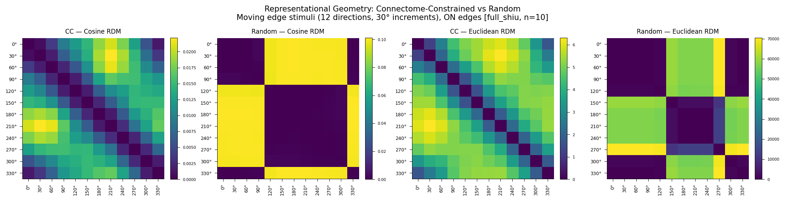
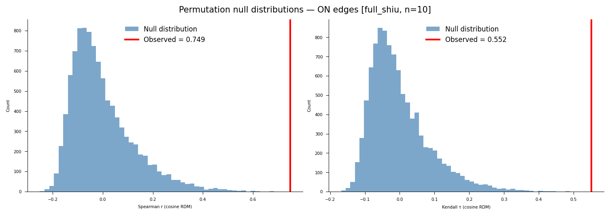
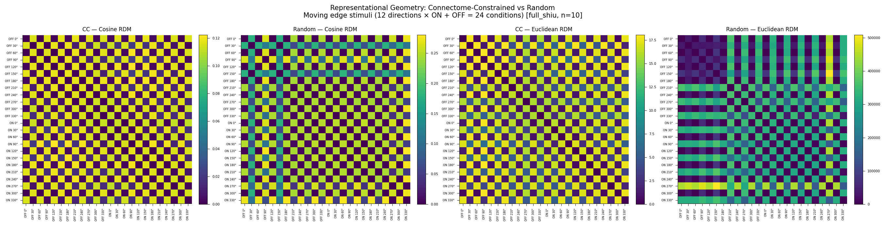
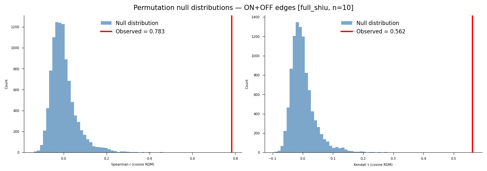
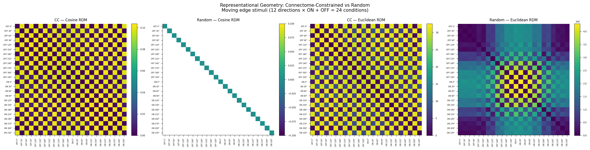
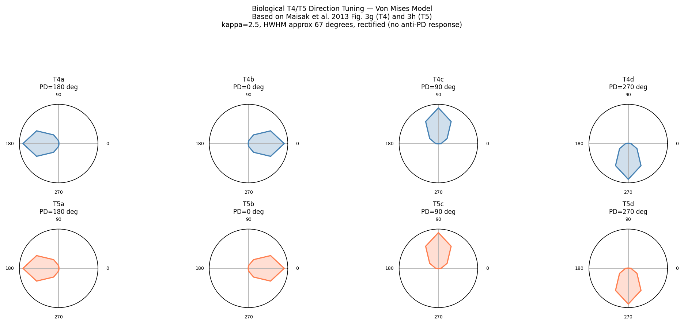
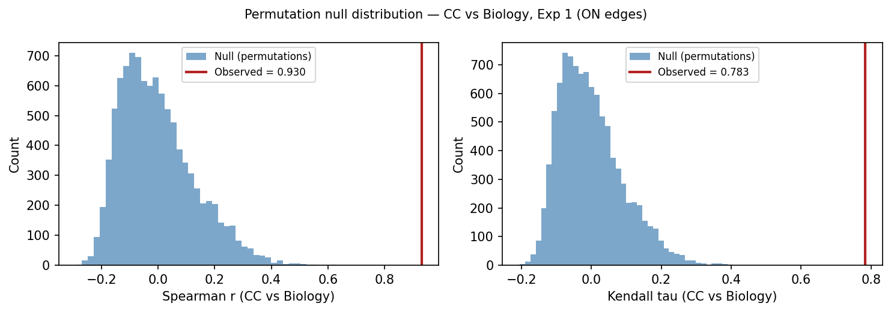
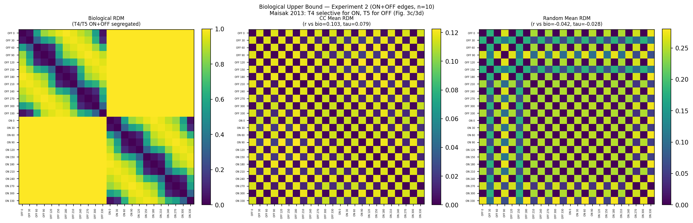
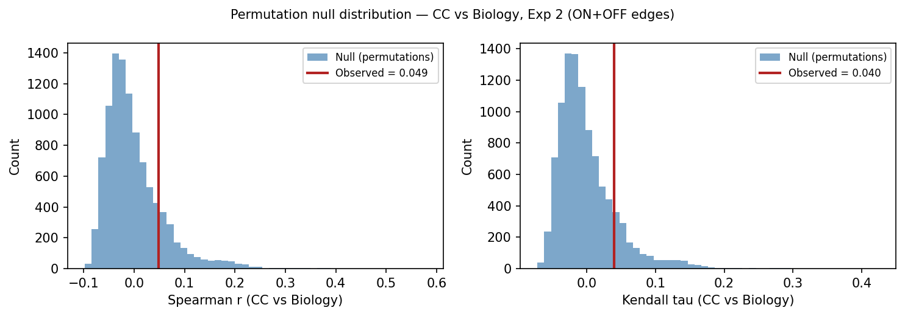

# Representational Geometry as a Fidelity Metric for Connectome-Constrained Neural Emulations

This repository implements a proof-of-concept showing that connectome-constrained networks
produce geometrically distinct population codes compared to randomly initialized networks
with the same architecture — using representational similarity analysis (RSA) applied to
the [Flyvis](https://github.com/TuragaLab/flyvis) Drosophila visual system model.

---

## Background

Connectome-scale neural emulations are increasingly feasible, but the field lacks a principled framework for evaluating their fidelity. Brunton et al. (2026) demonstrated that behavioral fidelity is achievable without biological fidelity — a randomly wired network can produce realistic fly walking. This raises the question: what does biological wiring actually contribute, and how do we measure it?

Representational geometry — the structure of pairwise distances between population responses to different stimuli — offers a candidate answer. If connectome-constrained networks produce a representational geometry that random networks cannot replicate, then geometry is a fidelity-discriminating signal that operates at the population level, without requiring a behavioral decoder.

This project tests that hypothesis using the pretrained Flyvis ensemble (Lappalainen et al. 2024), applying RSA (Kriegeskorte et al. 2008) to compare population codes across connectome-constrained models versus sign-preserving random weight shuffles. Experiment 3 extends the comparison to a biological reference derived from T4/T5 direction tuning data (Maisak et al. 2013).

---

## Experiments

### Experiment 1: ON Edges
**Stimuli:** 12 ON moving edges at 30° increments (0° through 330°)

**Networks:**
- *Connectome-constrained (CC):* All 50 models in the pretrained Flyvis ensemble (indices `000–049` within `flow/0000`, pre-sorted by task error in directory naming), trained to perform optic flow estimation on naturalistic video with connectome-fixed architecture (734 free parameters)
- *Random baseline:* Same 50 model architectures with only the 604 unitary synapse scaling factors (`edges_syn_strength`) shuffled while preserving E/I sign structure, trained time constants, and resting potentials — per Lappalainen et al. (2024) Methods, time constants are clamped during training to prevent instability; preserving them produces a dynamically stable Shiu-style control. Two additional strategies were also tested: full Shiu-style shuffling of all free parameters, and matched-normal resampling of all free parameters (see Results).

**Population vectors:** Peak central-cell voltage per cell type (65-dim) in response to each stimulus direction

**Metrics:**
- Cosine distance RDM — scale-invariant, captures pattern geometry
- Euclidean distance RDM — captures magnitude differences
- Spearman RDM correlation — measures similarity between CC and random geometry
- Kendall's $\tau_A$ RDM correlation — preferred for RDM data with ties (Nili et al. 2014); reported alongside Spearman for all CC vs random comparisons
- Stimulus-label permutation test — nonparametric inference on RDM correlations (Nili et al. 2014, 10,000 permutations)
- Within-ensemble consistency — measures stability of CC representational geometry across trained solutions

---

### Experiment 2: ON + OFF Edges
**Stimuli:** 24 moving edge conditions — 12 directions at 30° increments (0° through 330°) × 2 polarities (ON and OFF edges)

**Networks:** Same as Experiment 1 — all 50 CC models and synapse-only shuffle random baseline

**Population vectors:** Peak central-cell voltage per cell type (65-dim) in response to each stimulus condition

**Metrics:**
- Cosine distance RDM — scale-invariant, captures pattern geometry across all 24 conditions
- Euclidean distance RDM — captures magnitude differences
- Spearman RDM correlation — measures similarity between CC and random geometry
- Kendall's $\tau_A$ RDM correlation — preferred for RDM data with ties (Nili et al. 2014); reported alongside Spearman for all CC vs random comparisons
- Stimulus-label permutation test — nonparametric inference on RDM correlations (Nili et al. 2014, 10,000 permutations)
- Within-ensemble consistency — measures stability of CC representational geometry across trained solutions
- Polarity generalization — whether direction-sensitive geometry observed for ON edges in Experiment 1 extends to OFF edges and the combined ON+OFF space

---

### Experiment 3: Biological Upper Bound
**Reference:** T4/T5 direction tuning data from Maisak et al. (2013), Fig. 3g/3h — 8 subtypes (T4a, T4b, T4c, T4d, T5a, T5b, T5c, T5d) with cardinal preferred directions (0°, 90°, 180°, 270°). Tuning curves modeled analytically using a von Mises profile (kappa=2.5, HWHM ≈ 67°, rectified), consistent with the published 60–90° half-width.

**Design:** Biological population matrix (12 directions × 8 T4/T5 subtypes) is used to construct a 12×12 biological stimulus RDM, directly comparable to the CC and random RDMs from Experiment 1. A three-way comparison — CC vs Biology, Random vs Biology, CC vs Random — quantifies how much of the gap between CC and random geometry is accounted for by T4/T5 direction tuning structure.

**Caveats:**
- Biological stimulus: moving square-wave gratings (Maisak et al. Fig. 3g/3h); model stimulus: `MovingEdge`. Direction tuning structure is qualitatively preserved but absolute response profiles differ.
- Biological RDM covers T4/T5 subspace only (8 of 65 cell types). Interpret as an upper bound for the T4/T5 subpopulation, not the full population.
- Von Mises approximation reproduces published tuning width and peak locations; does not capture trial-by-trial variability.

---

## Key Results

### Experiment 1: ON Edges — n=10 (top 10 models, full Shiu-style shuffle)

| Metric | Value |
|--------|-------|
| CC cosine RDM off-diagonal range | 0.001 – 0.022 (structured) |
| Random cosine RDM off-diagonal range | ~0.400 (uniform — no direction selectivity) |
| CC vs random RDM correlation (cosine) | Spearman r = 0.757, p < 0.0001 \| Kendall τ = 0.562, p < 0.0001 |
| Permutation test (cosine, 10,000 permutations) | p_perm < 0.0001 (Spearman) \| p_perm < 0.0001 (Kendall τ) |
| Within-CC ensemble consistency | r = 0.838 ± 0.078 |
| Random models with unstable dynamics | 5 / 10 |
| CC models with unstable dynamics | 0 / 10 |

### Experiment 1: ON Edges — n=50 (full ensemble, instability across randomization strategies)

| Randomization strategy | Unstable random models | CC unstable | Cosine RDM correlation |
|------------------------|------------------------|-------------|------------------------|
| Full Shiu-style shuffle | 33 / 50 (66%) | 0 / 50 | NaN |
| Matched-normal resampling | 38 / 50 (76%) | 0 / 50 | NaN |
| Synapse-only shuffle (`edges_syn_strength`) | 34 / 50 (68%) | 0 / 50 | NaN |

### Experiment 2: ON + OFF Edges — n=10 (top 10 models, full Shiu-style shuffle)

| Metric | Value |
|--------|-------|
| CC cosine RDM structure | 24×24 with polarity block organization |
| Random cosine RDM off-diagonal range | ~0.400 (within-polarity) / ~0.423 (cross-polarity) — polarity-sensitive but no direction selectivity |
| CC vs random RDM correlation (cosine) | Spearman r = 0.862, p < 0.0001 \| Kendall τ = 0.660, p < 0.0001 |
| Permutation test (cosine, 10,000 permutations) | p_perm < 0.0001 (Spearman) \| p_perm < 0.0001 (Kendall τ) |
| Within-CC ensemble consistency | r = 0.850 ± 0.057 |
| Random models with unstable dynamics | 5 / 10 |
| CC models with unstable dynamics | 0 / 10 |

### Experiment 2: ON + OFF Edges — n=50 (synapse-only shuffle)

| Metric | Value |
|--------|-------|
| CC cosine RDM structure | 24×24 with polarity block organization — ON and OFF edges occupy geometrically distinct regions |
| CC vs random RDM correlation (cosine) | NaN — not computable (35/50 random models unstable) |
| Euclidean RDM correlation | Spearman r = 0.313, p < 0.0001 — nominally significant but not interpretable (see Results) |
| Within-CC ensemble consistency | r = 0.838 ± 0.059 |
| Random models with unstable dynamics | 35 / 50 (70%) |
| CC models with unstable dynamics | 0 / 50 |

### Experiment 3: Biological Upper Bound — Experiment 1 comparison (ON edges, 12 conditions)

| Comparison | Spearman r | Kendall τ | p_perm (r) |
|------------|-----------|-----------|------------|
| CC vs Biology | 0.910 | 0.742 | < 0.0001 |
| Random vs Biology | 0.670 | 0.492 | — |
| CC vs Random | 0.757 | 0.562 | < 0.0001 |

The CC geometry (r = 0.910 vs biology) substantially exceeds the random geometry (r = 0.670 vs biology). The gap r(CC vs Bio) − r(Rand vs Bio) = 0.240 represents the additional fidelity attributable to the connectome constraint beyond what circular stimulus structure alone provides.

### Experiment 3: Biological Upper Bound — Experiment 2 comparison (ON+OFF edges, 24 conditions)

| Comparison | Spearman r | Kendall τ | p_perm (r) | Interpretable |
|------------|-----------|-----------|------------|---------------|
| CC vs Biology | 0.103 | 0.079 | 0.055 | No — see Results |
| Random vs Biology | 0.003 | 0.005 | — | No |

The near-null result reflects a structural mismatch between the biological RDM construction and the CC network's representational geometry — not a failure of the CC network. See Results for full interpretation.

The connectome-constrained network produces direction-sensitive representational geometry with a smooth circular structure — adjacent directions are most similar, opposite directions most dissimilar — consistent with the known tuning of T4/T5 neurons in the fly visual system. In Experiment 2, this direction geometry is preserved within each polarity block, while ON and OFF edges occupy geometrically distinct population-level regions (~0.099–0.103 cross-polarity dissimilarity), consistent with the known T4/T5 ON/OFF pathway segregation. Zero trained CC models exhibited instability under any condition across either experiment.



*Experiment 1 (n=10, full Shiu-style shuffle of all 734 free parameters) — left to right: connectome-constrained cosine RDM, random baseline cosine RDM, connectome-constrained Euclidean RDM, random baseline Euclidean RDM. The CC cosine RDM shows structured, direction-dependent dissimilarity with a smooth circular gradient (range 0.001–0.022). The random cosine RDM is renderable (5/10 stable models) and nearly uniform at ~0.400 — the random network encodes no direction structure. Cosine RDM correlation: Spearman r = 0.757, p < 0.0001 | Kendall τ = 0.562, p < 0.0001; p_perm < 0.0001 (10,000 permutations). Stimuli: 12 ON moving edges at 30° increments. Top 10 pretrained Flyvis models, seed=42.*



*Experiment 1 permutation test (n=10, full Shiu-style shuffle, 10,000 stimulus-label permutations, Nili et al. 2014). Left: null distribution of Spearman r with observed r = 0.757 (red line) falling far outside the null. Right: null distribution of Kendall τ with observed τ = 0.562 (red line). Both p_perm < 0.0001 — zero of 10,000 permutations exceeded the observed correlation.*


*Experiment 1 (n=50, synapse-only shuffle of `edges_syn_strength`) — left to right: connectome-constrained cosine RDM, random baseline cosine RDM, connectome-constrained Euclidean RDM, random baseline Euclidean RDM. The CC cosine RDM shows the same circular gradient at reduced range (0.001–0.012). The random cosine RDM is entirely NaN due to numerical overflow from unstable models (34/50) and is not renderable. Stimuli: 12 ON moving edges at 30° increments. All 50 pretrained Flyvis models, seed=42.*



*Experiment 2 (n=10, full Shiu-style shuffle of all 734 free parameters) — left to right: connectome-constrained cosine RDM, random baseline cosine RDM, connectome-constrained Euclidean RDM, random baseline Euclidean RDM. The CC cosine RDM shows a 24×24 block structure with circular direction gradients within each polarity block and large cross-polarity dissimilarities (~0.099–0.103). The random cosine RDM is renderable (5/10 stable models) and shows polarity block structure at ~0.400–0.423 but no within-polarity direction gradient. Cosine RDM correlation: Spearman r = 0.862, p < 0.0001 | Kendall τ = 0.660, p < 0.0001; p_perm < 0.0001 (10,000 permutations). Stimuli: 24 conditions (12 directions × ON + OFF). Top 10 pretrained Flyvis models, seed=42.*



*Experiment 2 permutation test (n=10, full Shiu-style shuffle, 10,000 stimulus-label permutations, Nili et al. 2014). Left: null distribution of Spearman r with observed r = 0.862 (red line) falling far outside the null — further than Experiment 1, consistent with the richer 24-condition stimulus set. Right: null distribution of Kendall τ with observed τ = 0.660 (red line). Both p_perm < 0.0001.*



*Experiment 2 (n=50, synapse-only shuffle of `edges_syn_strength`) — left to right: connectome-constrained cosine RDM, random baseline cosine RDM, connectome-constrained Euclidean RDM, random baseline Euclidean RDM. The CC cosine RDM shows the same 24×24 block structure. The random cosine RDM is entirely NaN (35/50 unstable). Stimuli: 24 conditions (12 directions × ON + OFF). All 50 pretrained Flyvis models, seed=42.*



*Experiment 3 biological reference: von Mises direction tuning curves (kappa=2.5, HWHM ≈ 67°, rectified) for 8 T4/T5 subtypes, consistent with Maisak et al. 2013 Fig. 3g/3h. Blue: T4 subtypes (ON pathway); coral: T5 subtypes (OFF pathway). Each subtype peaks at one of the four cardinal directions (0°, 90°, 180°, 270°) with no response at the anti-preferred direction.*


*Experiment 3 three-way RDM comparison for Experiment 1 (ON edges, 12 conditions). Left: biological reference RDM (Maisak 2013 T4/T5 direction tuning, off-diagonal range 0.046–0.989). Center: CC mean cosine RDM (r vs bio = 0.910, τ = 0.742). Right: random mean cosine RDM (r vs bio = 0.670, τ = 0.492). The gap r(CC vs Bio) − r(Rand vs Bio) = 0.240 quantifies the fidelity attributable to the connectome constraint beyond circular stimulus structure.*



*Experiment 3 permutation test for CC vs Biology comparison (Experiment 1, 10,000 permutations). Observed r = 0.910 and τ = 0.742 both fall far outside the null distribution; p_perm < 0.0001 for both measures — zero of 10,000 permutations exceeded the observed correlation.*



*Experiment 3 three-way RDM comparison for Experiment 2 (ON+OFF edges, 24 conditions). Left: biological reference RDM (T4/T5 ON/OFF segregated, range 0.046–1.000). Center: CC mean cosine RDM (r vs bio = 0.103). Right: random mean cosine RDM (r vs bio = 0.003). The near-null result reflects a structural mismatch between the biological RDM construction and the CC network's representational geometry — not a failure of the CC network (see Results).*



*Experiment 3 permutation test for CC vs Biology comparison (Experiment 2, 10,000 permutations). Observed r = 0.103, p_perm = 0.055; τ = 0.079, p_perm = 0.051 — not significant at α = 0.05, consistent with the structural mismatch interpretation.*

---

## Results

### Experiment 1: ON Edges

#### CC Cosine RDM
The connectome-constrained network produces a structured 12×12 dissimilarity matrix with clear direction-dependent organization. At n=10, off-diagonal values range from ~0.001 to ~0.022 — small in absolute terms but systematically organized: adjacent directions are most similar (minimum: 0°–30°, dissimilarity = 0.001), while opposite directions are most dissimilar (maximum: 30°–210°, dissimilarity = 0.022). At n=50, the range tightens to 0.001–0.012, reflecting the inclusion of lower-performing models. Both runs show a smooth circular gradient consistent with the known direction tuning of T4/T5 neurons in the fly visual system.

#### Random Cosine RDM
Under the full Shiu-style shuffle at n=10 (5/10 stable random models), the random baseline produces a nearly uniform matrix with all off-diagonal values at ~0.400 — the random network cannot distinguish motion directions, with directional variation confined to the fourth decimal place. Across all three randomization strategies tested at n=50 — (1) Shiu-style shuffling of all free parameters, (2) matched-normal resampling of all free parameters, and (3) Shiu-style shuffling of synaptic weights only (`edges_syn_strength`) while preserving trained time constants and resting potentials — the mean random cosine RDM collapses to NaN due to numerical overflow from unstable models. The same pattern holds at n=10 under the synapse-only shuffle (8/10 unstable). Instability is a fundamental property of random weight configurations in this architecture, not an artifact of any particular randomization strategy or ensemble size.

#### Dynamic Instability
Dynamic instability is robust across all randomization strategies and ensemble sizes. Under the full Shiu-style shuffle at n=10, 5 of 10 random models (models 2, 3, 4, 8, 9) were unstable (756 non-finite values each, corresponding to 63 of 65 cell types across all 12 stimuli) — the instability pattern is fully reproducible under seed=42. Under the synapse-only shuffle at n=10, 8 of 10 (80%) were unstable. At n=50: full Shiu-style shuffling produced 33/50 unstable models (66%); matched-normal resampling produced 38/50 (76%); synapse-only shuffling of `edges_syn_strength` while preserving trained `nodes_time_const` and `nodes_bias` produced 34/50 (68%). The persistence of instability even when trained dynamical parameters are preserved confirms that randomizing synaptic weights alone is sufficient to destabilize dynamics. 0 of 50 trained CC models showed any instability under any condition. The biological connectome, as optimized by task training, reliably occupies a dynamically stable region of parameter space that random weight configurations consistently leave.

#### CC vs Random RDM Correlation
Under the full Shiu-style shuffle at n=10 with 5/10 stable random models, cosine RDM correlation: **Spearman r = 0.757, p < 0.0001 | Kendall τ = 0.562, p < 0.0001** (analytical); **p_perm < 0.0001 for both measures** (stimulus-label randomization test, 10,000 permutations, Nili et al. 2014) — zero of 10,000 permutations exceeded the observed correlation. This result is highly significant by all inference methods, confirmed reproducible under `torch.use_deterministic_algorithms(True)` with seed=42. The CC and random cosine RDMs share directional ordering — both assign smaller dissimilarities to adjacent directions and larger dissimilarities to opposing ones — but differ substantially in depth and resolution: the CC network encodes direction with fine-grained dissimilarities spanning a 20-fold range (0.001–0.022), while the random baseline collapses that structure to a nearly uniform ~0.400 with no functionally meaningful variation.

Cosine RDM correlation is **NaN** under the canonical synapse-only shuffle at both n=10 (8/10 unstable) and n=50 (34/50 unstable) — not computable due to numerical overflow.

Euclidean RDM correlation: **Spearman r = 0.021, p = 0.865** (full Shiu-style shuffle, n=50); **Spearman r = 0.241, p = 0.052** (matched-normal resampling, n=50); **Spearman r = 0.177, p = 0.156 | Kendall τ = 0.122, p = 0.149** (synapse-only shuffle, n=50); **Spearman r = 0.136, p = 0.278 | Kendall τ = 0.088, p = 0.296** (synapse-only shuffle, n=10); **Spearman r = 0.094, p = 0.451 | Kendall τ = 0.056, p = 0.503; p_perm = 0.190 | p_perm = 0.213** (full Shiu-style shuffle, n=10) — none significant by any inference method, and not interpretable due to extreme magnitudes (~10¹⁰–10²¹) from exploding activations in unstable random models.

**Interpretive note:** The cosine RDM correlation result is significant by analytical p-values, Kendall τ, and permutation test — three independent inference methods converging on the same conclusion. The Euclidean result is non-significant by all methods including permutation, providing clean confirmation that it carries no fidelity signal under these conditions.

#### Within-Ensemble Consistency
At n=10, mean pairwise RDM correlation: **r = 0.838 ± 0.078** (range: 0.601–0.956). At n=50, mean pairwise RDM correlation: **r = 0.721 ± 0.150** (range: 0.323–0.983). The decrease in mean and increase in variance at n=50 reflects the inclusion of lower-performing models implementing more varied solutions, consistent with the known cluster structure of the Flyvis ensemble reported in Lappalainen et al. Fig. 3.

---

### Experiment 2: ON + OFF Edges

#### CC Cosine RDM
The connectome-constrained network produces a structured 24×24 dissimilarity matrix with clear polarity-dependent block organization. Within each polarity block (ON-ON and OFF-OFF), the same circular direction gradient observed in Experiment 1 is preserved: adjacent directions are most similar and opposite directions most dissimilar. Across polarity (ON vs OFF pairs), dissimilarities are large and nearly uniform at ~0.099–0.103 — the network represents ON and OFF edges as geometrically distinct populations regardless of direction. This block structure is consistent with the known segregation of the fly visual system into ON (T4) and OFF (T5) pathways.

#### Random Cosine RDM
Under the full Shiu-style shuffle at n=10 (5/10 stable random models), the random baseline produces a 24×24 matrix with values alternating between ~0.400 (within-polarity pairs) and ~0.423 (cross-polarity pairs). The polarity block structure is present but the within-polarity direction gradient is absent — the random network encodes polarity identity but cannot resolve directional structure. Under the synapse-only shuffle at n=50 (35/50 unstable), the mean random cosine RDM collapses to NaN due to numerical overflow.

#### Dynamic Instability
Under the full Shiu-style shuffle at n=10, 5 of 10 random models were unstable (1,512 non-finite values each, corresponding to 63 of 65 cell types across all 24 stimuli) — identical model indices as Experiment 1 (models 2, 3, 4, 8, 9), confirming that the instability pattern is reproducible under seed=42 regardless of stimulus count. Under the synapse-only shuffle at n=50, 35 of 50 random models (70%) were unstable — comparable to the Experiment 1 synapse-only rate (34/50, 68%). One model in the n=50 run produced 378 non-finite values — partial instability affecting a subset of stimuli rather than full collapse. 0 of 50 CC models showed any instability under any condition.

#### CC vs Random RDM Correlation
Under the full Shiu-style shuffle at n=10 with 5/10 stable random models, cosine RDM correlation: **Spearman r = 0.862, p < 0.0001 | Kendall τ = 0.660, p < 0.0001** (analytical); **p_perm < 0.0001 for both measures** (stimulus-label randomization test, 10,000 permutations, Nili et al. 2014) — zero of 10,000 permutations exceeded the observed correlation. This result is highly significant by all inference methods, stronger than the Experiment 1 result (r = 0.757, τ = 0.562), consistent with the richer constraint provided by 24 stimulus conditions. It confirms that representational geometry is a fidelity-discriminating signal that generalizes across polarity, not just direction.

Under the synapse-only shuffle at n=50, cosine RDM correlation: **r = NaN** — not computable due to numerical overflow.

Euclidean RDM correlation: **Spearman r = 0.051, p = 0.400 | Kendall τ = 0.034, p = 0.398; p_perm = 0.164 | p_perm = 0.163** (full Shiu-style shuffle, n=10) — not significant by any inference method; **Spearman r = 0.313, p < 0.0001 | Kendall τ = 0.229, p < 0.0001** (synapse-only shuffle, n=50) — nominally significant but not scientifically interpretable, as the mean random Euclidean RDM is dominated by extreme magnitudes (~10²–10¹¹) from unstable models whose exploding activations create structured variance that incidentally correlates with the CC pattern. This is a numerical artifact, not a fidelity signal.

**Interpretive note:** The cosine RDM correlation result is significant by analytical p-values, Kendall τ, and permutation test — three independent inference methods converging on the same conclusion, consistent with Experiment 1. The Euclidean result is non-significant by all methods including permutation, confirming cosine distance as the appropriate primary metric.

#### Within-Ensemble Consistency
At n=10, mean pairwise RDM correlation: **r = 0.850 ± 0.057**. At n=50, mean pairwise RDM correlation: **r = 0.838 ± 0.059**. Both are notably higher and tighter than the n=50 ON-only result (r = 0.721 ± 0.150), suggesting that the ON+OFF stimulus set produces a more consistent representational geometry — likely because 24 conditions provide a richer constraint on the population code than 12. The n=10 ON+OFF result (r = 0.850) also slightly exceeds the n=10 ON-only result (r = 0.838 ± 0.078), consistent with polarity being a stronger organizer of representational geometry than direction alone.

---

### Experiment 3: Biological Upper Bound

#### Biological Reference RDM
The von Mises tuning model (kappa=2.5, HWHM ≈ 67°, rectified) produces a 12×12 biological stimulus RDM with off-diagonal values ranging from 0.046 to 0.989 — a much wider dynamic range than either the CC RDM (0.001–0.022) or the random RDM (~0.400 uniform). This reflects the sharpness of T4/T5 direction tuning: directions near a subtype's preferred direction are represented as highly similar, while directions near the null direction approach maximum dissimilarity.

#### Experiment 1 Comparison (ON edges, 12 conditions)
CC vs Biology: **Spearman r = 0.910, p < 0.0001 | Kendall τ = 0.742, p < 0.0001** (analytical); **p_perm < 0.0001 for both measures** (10,000 permutations, Nili et al. 2014) — zero of 10,000 permutations exceeded the observed correlation. The CC representational geometry is highly consistent with the biological T4/T5 direction tuning structure, recovering the circular ordinal organization of directions in a way that closely mirrors the known preferred-direction map.

Random vs Biology: **Spearman r = 0.670, p < 0.0001 | Kendall τ = 0.492, p < 0.0001** (analytical). The random baseline also correlates with the biological RDM, reflecting that both share the same circular ordinal structure — directions that are angularly close are more similar than directions that are angularly distant. This is a consequence of the circular stimulus geometry, not a fidelity signal.

The key comparison is CC vs Random (r = 0.757, τ = 0.562). The gap r(CC vs Bio) − r(Rand vs Bio) = **0.240** represents the additional fidelity attributable to the connectome constraint beyond what circular stimulus structure alone provides.

#### Experiment 2 Comparison (ON+OFF edges, 24 conditions)
CC vs Biology: **Spearman r = 0.103, p = 0.087 | Kendall τ = 0.079, p = 0.072** (analytical); **p_perm = 0.055 | p_perm = 0.051** (permutation) — not significant at α = 0.05 by either measure or inference method. Random vs Biology: **r = 0.003, τ = 0.005** — effectively zero.

The near-null result for Experiment 2 is expected and interpretable. The biological 24×24 RDM encodes strict ON/OFF pathway segregation: T4 subtypes contribute only to ON conditions and T5 subtypes only to OFF conditions, making same-direction ON/OFF pairs maximally dissimilar (cosine distance ≈ 1.0, since their population vectors are orthogonal). The CC 24×24 RDM does not have this structure — it assigns moderate cross-polarity dissimilarity (~0.099–0.103) with shared directional ordering, not maximal orthogonality. This is a mismatch between the biological RDM construction and the CC network's actual representational geometry, not a failure of the CC network. A more appropriate biological upper bound for Experiment 2 would require T4/T5 direction tuning curves measured with moving edges at matched velocities, which are not available from Maisak et al. 2013. The Experiment 2 biological comparison is therefore not reported as a meaningful result.

---

## Discussion
- Across Experiments 1 and 2, the cosine RDM correlation is significant by analytical p-values, Kendall τ, and stimulus-label permutation test — three independent inference methods converging on the same conclusion (Experiment 1: r = 0.757, τ = 0.562; Experiment 2: r = 0.862, τ = 0.660; p_perm < 0.0001 in both cases)
- The Euclidean result is non-significant by all methods including permutation in both experiments, confirming cosine distance as the appropriate primary metric
- The biological upper bound (Experiment 3) provides strong additional support for the Experiment 1 result: CC geometry (r = 0.910 vs T4/T5 biology) substantially exceeds random geometry (r = 0.670 vs T4/T5 biology), with the gap (0.240) attributable to the connectome constraint
- The within-ensemble consistency improvement from ON-only (r = 0.721 at n=50) to ON+OFF (r = 0.838 at n=50, r = 0.850 at n=10) supports polarity as a stronger organizer of representational geometry than direction alone
- Dynamic instability persists across all tested randomization strategies and ensemble sizes (66–80%), indicating that the trained parameter configuration as a whole determines dynamic stability; a fully stable random baseline may require adversarial stability-constrained sampling
- Within-CC consistency could be reported separately per cluster if UMAP reveals substructure in the ensemble geometry (planned)
- The Experiment 2 biological comparison is uninterpretable due to a structural mismatch in the biological RDM construction; a matched-stimulus biological reference (moving edges, T4/T5 responses) would be required to extend the upper bound analysis to the 24-condition case

---

## Installation

This experiment runs on Google Colab with a T4 GPU runtime. Local installation requires Python ≥ 3.9, < 3.13.

```python
# On Google Colab — run these cells in order
!git clone https://github.com/TuragaLab/flyvis.git
%cd /content/flyvis
!pip install -e .[examples]
!flyvis download-pretrained
```

---

## Usage

```python
# Experiment 1: ON edges

### Primary fidelity result (includes permutation test)
results = run_experiment(n_models=10, randomization_strategy="full_shiu")

### Instability documentation
results = run_experiment(n_models=50, randomization_strategy="synapse_only")

# Experiment 2: ON + OFF edges

### Primary fidelity result (includes permutation test)
results = run_experiment(n_models=10, randomization_strategy="full_shiu")

### Instability documentation
results = run_experiment(n_models=50, randomization_strategy="synapse_only")

# Experiment 3: Biological upper bound

### Load results from Experiments 1 and 2, then run
bio_results = run_biological_upper_bound(results_exp1, results_exp2)
```

Set `n_models=1` for a quick debug run before committing to a full experiment.
The n=10 runs take approximately 15–20 minutes on a T4 GPU; n=50 runs take 60–90 minutes.
Permutation testing (10,000 permutations) adds ~2–3 minutes per run. Set `n_permutations=0` to skip.

Colab-ready notebooks are in `notebooks/`. Standalone scripts are in `experiments/`.

---

## Repository Structure

```
connectome-fidelity/
├── README.md
├── experiments/
│   ├── moving_edge_on.py              ← ON edges experiment (primary fidelity result)
│   ├── moving_edge_on_off.py          ← ON+OFF edges experiment (polarity generalization)
│   └── biological_upper_bound.py      ← Biological upper bound (Maisak et al. 2013)
├── notebooks/
│   ├── moving_edge_on.ipynb           ← Colab-ready notebook, ON edges results
│   └── moving_edge_on_off.ipynb       ← Colab-ready notebook, ON+OFF edges results
├── results/
│   ├── results_exp1.npz               ← Saved RDMs and statistics from Experiment 1
│   └── results_exp2.npz               ← Saved RDMs and statistics from Experiment 2
└── figures/
    ├── moving_edge_on_rdms_10models_full_shiu.png
    ├── moving_edge_on_permtest_10models_full_shiu.png
    ├── moving_edge_on_rdms_50models_synapse_only.png
    ├── moving_edge_on_off_rdms_10models_full_shiu.png
    ├── moving_edge_on_off_permtest_10models_full_shiu.png
    ├── moving_edge_on_off_rdms_50models_synapse_only.png
    ├── maisak2013_t4t5_von_mises_tuning.png
    ├── biological_upper_bound_exp1.png
    ├── bio_upper_bound_exp1_permtest.png
    ├── biological_upper_bound_exp2.png
    └── bio_upper_bound_exp2_permtest.png
```

---

## References

- Lappalainen et al. 2024. Connectome-constrained networks predict neural activity across the fly visual system. *Nature* 634, 1132–1140. https://www.nature.com/articles/s41586-024-07939-3

- Maisak et al. 2013. A directional tuning map of Drosophila elementary motion detectors. *Nature* 500, 212–216. https://www.nature.com/articles/nature12320

- Shiu et al. 2024. A Drosophila computational brain model reveals sensorimotor processing. *Nature* 634, 210–219. https://www.nature.com/articles/s41586-024-07763-9

- Kriegeskorte et al. 2008. Representational similarity analysis — connecting the branches of systems neuroscience. *Frontiers in Systems Neuroscience* 2:4. https://www.frontiersin.org/journals/systems-neuroscience/articles/10.3389/neuro.06.004.2008/full

- Kriegeskorte & Wei 2021. Neural tuning and representational geometry. *Nature Reviews Neuroscience* 22, 703–718. https://www.nature.com/articles/s41583-021-00502-3

- Nili et al. 2014. A toolbox for representational similarity analysis. *PLOS Computational Biology* 10(4): e1003553. https://doi.org/10.1371/journal.pcbi.1003553

- Brunton et al. 2026. The digital sphinx: Can a worm brain control a fly body? *bioRxiv*. https://www.biorxiv.org/content/10.64898/2026.03.20.713233v1

---

## Author

Michael Zhou — PhD student, Electrical and Computer Engineering, Georgia Institute of Technology
