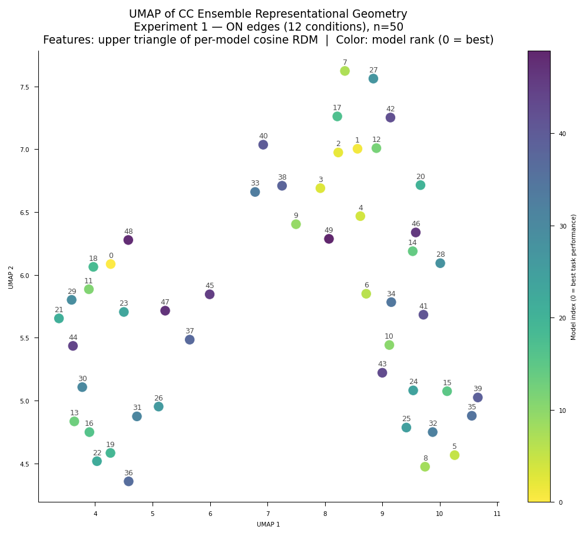
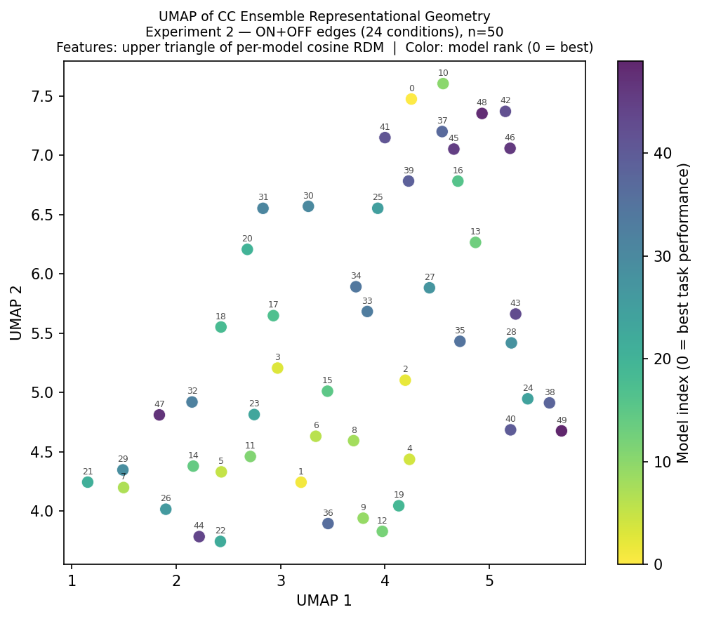
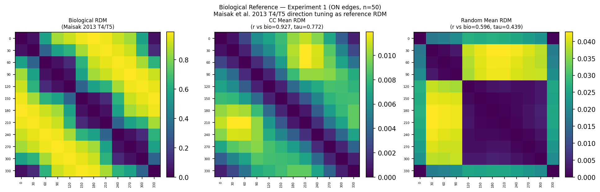
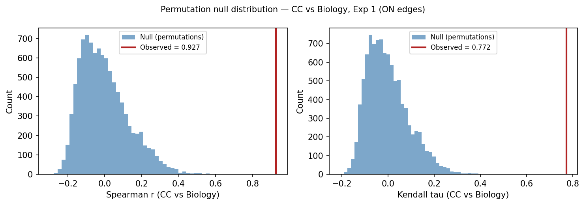

# Representational geometry as a fidelity metric for connectome-constrained networks: evidence from the *Drosophila* visual system

This repository implements a proof-of-concept showing that connectome-constrained networks
produce geometrically distinct population codes compared to randomly initialized networks
with the same architecture — using representational similarity analysis (RSA) applied to
the [Flyvis](https://github.com/TuragaLab/flyvis) Drosophila visual system model.

**Preprint:** [https://doi.org/10.64898/2026.06.10.731214](https://doi.org/10.64898/2026.06.10.731214)

---

## Background

Connectome-scale neural emulations are increasingly feasible, but the field lacks a
principled framework for evaluating their fidelity. Brunton et al. (2026) demonstrated
that behavioral fidelity is achievable without biological fidelity — a randomly wired
network can produce realistic fly walking. This raises the question: what does biological
wiring actually contribute, and how do we measure it?

Representational geometry — the structure of pairwise distances between population
responses to different stimuli — offers a candidate answer. If connectome-constrained
networks produce a representational geometry that random networks cannot replicate, then
geometry is a fidelity-discriminating signal that operates at the population level,
without requiring a behavioral decoder. **The hypothesis this project set out to test:
RSA on representational geometry might provide a fidelity signal that behavioral
benchmarks cannot — specifically, that null models trained to equally good behavior would
still be discriminable from real biological wiring by their population geometry.**
Experiments 1–2 support a related, narrower claim: connectome-constrained geometry is
distinct from *untrained* random wiring. **The literal trained-random test of the
hypothesis as originally stated is Experiment 5, and it does not support it on either
biological reference tested** — both trained-random null schemes collapse to statistical
noise against the original Maisak-derived reference once corrected for a confound shared
with Experiment 3, and the same degree-preserving-vs-degree-breaking contrast remains
unresolved against a second, independently-validated non-circular reference (Henning et
al. 2022) evaluated later (see Experiment 5). That second evaluation does, however,
surface a distinct and unanticipated pattern: every population of Flyvis networks that
was task-trained — the real connectome, both Experiment 5 null schemes — shows a
significant negative correlation with the Henning reference, while the only untrained
population tested (weight-shuffled random) does not; see Experiment 5 for the full
result and its caveats. This makes representational geometry, on the evidence
gathered here, a demonstrated fidelity detector for *untrained* wiring differences,
operating without a behavioral decoder — not yet a demonstrated detector for the
trained-random case Brunton's finding actually makes urgent, though the training-vs-wiring
pattern above is a live, only partially-explored lead in that direction.

This project tests that hypothesis using the pretrained Flyvis ensemble (Lappalainen et
al. 2024), applying RSA (Kriegeskorte et al. 2008) to compare population codes across
connectome-constrained models versus sign-preserving random weight shuffles. Experiment 3
extends the comparison to a biological reference derived from T4/T5 direction tuning data
(Maisak et al. 2013) — which proves confounded with circular distance on the ON-only stimulus set and cannot
measure biological fidelity. Experiment 4 addresses the training confound by testing
whether the geometry signal is present before any task training; it finds that untrained
networks produce no measurable representational geometry at all. Experiment 5 addresses
the trained-random case directly; it inherits the same circularity confound as
Experiment 3 against the original reference, and remains inconclusive on the
degree-preserving-vs-degree-breaking question against a second, non-circular reference,
though that second evaluation surfaces the training-vs-wiring pattern noted above.

**Scope:** This work establishes representational geometry as a fidelity metric for
*untrained* connectome-constrained networks, using five experiments on the pretrained
Flyvis ensemble (Lappalainen et al. 2024). Experiments 1–3 compare trained CC networks
against weight-shuffled random baselines and a T4/T5 biological reference. Experiment 4
tests whether the geometry signal persists before any task training, and
finds that untrained networks' RDMs fall below the numerical resolution of the responses
they derive from — at any perturbation of the free parameters within the regime where the
network remains connectome-constrained (Experiment 4b). Experiment 5 tests the literal
trained-random case (Brunton's actual scenario) against two independent biological
references and does not resolve the degree-preserving-vs-degree-breaking contrast on
either, though the second reference surfaces a separate, unanticipated training-vs-wiring
pattern discussed in that section. Fully answering the
Brunton/Eon fidelity question would additionally require comparing simulation outputs
directly against simultaneously recorded neural activity — a next-project dependency on
raw per-cell-type calcium recordings not currently in the public Flyvis release.

---

## Experiments

### Experiment 1: ON Edges
**Stimuli:** 12 ON moving edges at 30° increments (0° through 330°)

**Networks:**
- *Connectome-constrained (CC):* 10–50 models from the pretrained Flyvis ensemble
  (indices `000–049` within `flow/0000`, pre-sorted by task error), trained to perform
  optic flow estimation on naturalistic video with connectome-fixed architecture
  (the Flyvis connectome, reconstructed from partial electron-microscopy sources;
  734 free parameters)
- *Random baseline:* Same model architectures with sign-preserving weight shuffles.
  Three strategies were evaluated:
  1. **Full Shiu-style shuffle (canonical):** all 734 free parameters shuffled;
     stability-constrained sampling rejects configurations with non-finite or near-overflow
     activations (sub-1e6) and resamples up to MAX_ATTEMPTS=100 per model. Run at both
     n=10 and n=50.
  2. Synapse-only shuffle: only the 604 unitary synapse scaling factors
     (`edges_syn_strength`) shuffled, preserving trained time constants and resting
     potentials — per Lappalainen et al. (2024) Methods, time constants are clamped
     during training to prevent instability. Used for n=50 instability documentation.
  3. Matched-instability baseline: full Shiu-style shuffle without stability filtering;
     non-finite activations clamped to ±1e3 in RDM construction. Retained for comparison
     against the stability-constrained result.

> **Note on naming:** Files and result keys labeled `full_shiu` refer to the
> **full-parameter shuffle** baseline (all 734 free parameters shuffled, sign-preserving).
> The name reflects that this shuffle follows the connectivity-shuffle control of Shiu et
> al. (2024); it does **not** imply the model is Shiu's spiking whole-brain model — this
> work uses the graded-potential Flyvis model (Lappalainen et al. 2024).

**Population vectors:** Peak central-cell voltage per cell type (65-dim) in response to

**Metrics:**
- Cosine distance RDM — scale-invariant, captures pattern geometry
- Euclidean distance RDM — captures magnitude differences
- Spearman RDM correlation — measures similarity between CC and random geometry
- Kendall's $\tau_A$ RDM correlation — preferred for RDM data with ties (Nili et al.
  2014); reported alongside Spearman for all CC vs random comparisons
- Stimulus-label permutation test — nonparametric inference on RDM correlations
  (Nili et al. 2014, 10,000 permutations)
- Within-ensemble consistency — measures stability of CC representational geometry
  across trained solutions
- UMAP of CC ensemble — projects individual model RDMs into 2D to check for cluster
  structure; within-ensemble consistency reported per cluster if substructure is found

---

### Experiment 2: ON + OFF Edges
**Stimuli:** 24 moving edge conditions — 12 directions at 30° increments (0° through
330°) × 2 polarities (ON and OFF edges)

**Networks:**
- *Connectome-constrained (CC):* 10–50 models from the pretrained Flyvis ensemble
  (indices `000–049` within `flow/0000`, pre-sorted by task error)
- *Random baseline:* Same model architectures with sign-preserving weight shuffles.
  Three strategies were evaluated:
  1. **Full Shiu-style shuffle (canonical):** all 734 free parameters shuffled;
     stability-constrained sampling (sub-1e6, MAX_ATTEMPTS=100), mirroring Experiment 1.
     Run at both n=10 and n=50.
  2. Synapse-only shuffle: `edges_syn_strength` only, preserving trained time constants
     and resting potentials. Used for n=50 instability documentation runs.
  3. Matched-instability baseline: full Shiu-style shuffle without stability filtering;
     non-finite activations clamped to ±1e3 in RDM construction. Retained for comparison.

**Population vectors:** Peak central-cell voltage per cell type (65-dim) in response to
each stimulus condition

**Metrics:**
- Cosine distance RDM — scale-invariant, captures pattern geometry across all 24 conditions
- Euclidean distance RDM — captures magnitude differences
- Spearman RDM correlation — measures similarity between CC and random geometry
- Kendall's $\tau_A$ RDM correlation — preferred for RDM data with ties (Nili et al.
  2014); reported alongside Spearman for all CC vs random comparisons
- Stimulus-label permutation test — nonparametric inference on RDM correlations
  (Nili et al. 2014, 10,000 permutations)
- Within-ensemble consistency — measures stability of CC representational geometry
  across trained solutions
- Polarity generalization — whether direction-sensitive geometry observed for ON edges
  in Experiment 1 extends to OFF edges and the combined ON+OFF space
- Within-polarity direction structure — CC and random OFF-OFF and ON-ON
  submatrices plotted together in a 2×2 grid with row-level shared colormaps
  (CC row and Random row scaled independently), making the circular direction
  gradient visible in the CC row while communicating the magnitude difference
  between CC (~0.012) and random (~0.040) via different colorbar ranges;
  circular structure formally tested via permutation test against a circular
  distance reference; ON/OFF asymmetry tested by Fisher z-transform (analytical
  cross-check) and model-level bootstrap (primary inference, 10,000 samples,
  50 CC models resampled with replacement)
- UMAP of CC ensemble — projects individual model RDMs into 2D to check for cluster
  structure; within-ensemble consistency reported per cluster if substructure is found

---

### Experiment 3: Biological Reference
**Reference:** T4/T5 direction tuning data from Maisak et al. (2013), Fig. 3g/3h — 8
subtypes (T4a, T4b, T4c, T4d, T5a, T5b, T5c, T5d) with cardinal preferred directions
(0°, 90°, 180°, 270°). Tuning curves modeled analytically using a von Mises profile
(kappa=2.5, HWHM ≈ 67°, rectified), consistent with the published 60–90° half-width.

**Design:** Biological population matrix (12 directions × 8 T4/T5 subtypes) is used to
construct a 12×12 biological stimulus RDM, directly comparable to the CC and random RDMs
from Experiment 1. A three-way comparison — CC vs Biology, Random vs Biology, CC vs
Random — quantifies how much of the gap between CC and random geometry is accounted for
by T4/T5 direction tuning structure. All comparisons use the stability-constrained random
baseline from the n=50 full Shiu-style runs (Experiments 1 and 2, MAX_ATTEMPTS=100),
providing a more stable mean random RDM estimate across 50 independently accepted
configurations.

**Caveats:**
- Biological stimulus: moving square-wave gratings (Maisak et al. Fig. 3g/3h); model
  stimulus: `MovingEdge`. Direction tuning structure is qualitatively preserved but
  absolute response profiles differ.
- Biological RDM covers T4/T5 subspace only (8 of 65 cell types). Interpret as a biological
  reference for the T4/T5 subpopulation, not the full population.
- Von Mises approximation reproduces published tuning width and peak locations; does not
  capture trial-by-trial variability.

---

### Experiment 4: Untrained Networks
**Stimuli:** 12 ON moving edge directions (0°–330°, 30° increments), speed=19, matching
Experiment 1 exactly.

**Networks:**
- *Untrained CC:* `Network()` with default Flyvis architecture, connectome fixed, free
  parameters (`nodes_bias`, `nodes_time_const`, `edges_syn_strength`) perturbed with
  Gaussian noise (σ = 0.05, 0.005, 0.002 respectively) to generate an ensemble of N=50
  distinct seeds. No checkpoint loaded. `edges_sign` and `edges_syn_count` are fixed by
  the connectome and unchanged throughout.

  **Note on the synapse-strength clamp.** `edges_syn_strength` initializes to
  `0.01 / mean_syn_count` — one scaling factor per (source, target) cell-type pair, 604
  in total, **inverse** to synapse count (verified: Pearson r = 1.0000, max residual
  2.4×10⁻⁷). Factors span 6.9×10⁻⁵ (144 synapses/instance) to 3.7×10⁻² (0.27), and are
  clamped `non_negative` after perturbation.

  Because the densest cell-type connections carry the *smallest* factors, a σ = 0.002
  perturbation drives those below zero first. Across 20 seeds this silences **8.1% of the
  604 cell-type pairs (range 5.6–10.3%, n=50 seeds)**, with silencing probability falling
  monotonically from **40.7% in the lowest-factor decile (11–144 synapses/instance) to 0% in
  the top four deciles (0.27–1.5)** — Mann–Whitney p = 3×10⁻²². Untrained CC networks are
  therefore **sparsified by removal of their highest-synapse-count cell-type connections**,
  not merely perturbed.

  **The bias is a small-σ phenomenon.** As σ grows the noise exceeds even the largest
  scaling factor (3.7×10⁻²) and the clamp becomes a coin flip: at σ = 0.128 every decile is
  silenced at ~48% (decile 1: 40.7→48.9%; decile 10: 0.0→47.0%), the median synapse count of
  silenced pairs falls from 11.4 to 2.0 (population median 1.99), and 48.2% of pairs are
  gone. The manipulation changes character along the sweep: at the prior it removes the
  connectome's densest projections; at the top it deletes half of them at random.

  Task training also zeroes factors (31/604 in the reference model — the clamp is an active
  mechanism, not a dormant rail), but selects a nearly disjoint set (overlap 3; 2.5 expected
  under independence) that is not detectably density-biased (p = 0.080, limited power). The
  bias is specific to the untrained protocol.
- *Untrained Random (syn shuffle):* Same untrained CC networks with `edges_syn_strength`
  shuffled in a sign-preserving manner after perturbation. Absolute values shuffled within
  each sign class, preserving E/I identity. Matches the Shiu-style baseline design from
  Experiments 1–3.
- *Untrained Random (sign shuffle):* Deeper disruption — `edges_sign` randomly reassigned
  across all 604 cell-type pairs, preserving the total E/I count but scrambling which pairs
  are excitatory vs inhibitory.

**Stability constraint:** Candidate networks rejected and resampled if any activation
exceeds ±1×10⁶ or is non-finite. All 50 models accepted in all three conditions with no
rejections (50/50 first-try) — confirming that dynamic instability in trained random
baselines is a property of the trained parameter regime, not the architecture. The check
does not wrap the forward pass in `try/except`: a CUDA error or shape mismatch is not
dynamic instability, and the original implementation would have counted it as such,
silently. (The original also reported "mean attempts 25.5 ± 14.4" in support of the
acceptance claim; that statistic was the mean of the cumulative seed counter 1…50 — a loop
index, not a resampling statistic.)

**Population vectors:** Peak central-cell voltage per cell type (65-dim) extracted via
`LayerActivity.central[ct].squeeze().numpy().max()`, **cast to float64 immediately** and
accumulated in float64 thereafter.

**Metrics:** float64 cosine RDM (chord form, `1 − cos θ = ‖â − b̂‖²/2`);
Euclidean-normalized RDM as a cancellation-free cross-check; **a precision guard** that
compares the RDM's dynamic range against the float32 round-off floor of the responses and
aborts rather than computing statistics on an unresolvable matrix; circularity control
against an explicit circular-distance reference; Spearman r and Kendall τ_A with both
analytical and permutation p-values. The biological reference is computed but not
interpreted as a fidelity measure (see Experiment 3).

---

### Experiment 5: Trained-Random Null-Through-Simulation

**Question:** Brunton et al. (2026) showed that a randomly-wired connectome, given enough
training, can recover realistic behavior. Experiments 1–2 establish that connectome-
constrained (CC) geometry is distinct from *untrained* random wiring. Experiment 5 asks
the harder, Brunton-relevant question directly: is CC geometry still distinguishable from
random wiring *after* that wiring has been trained to task adequacy — the literal
trained-random control.

**Null schemes:**
- *`degree_preserving_swap`:* Maslov–Sneppen double-edge-swap on the real connectome,
  preserving each neuron's exact in/out degree and preserving experimentally-fixed signs;
  only *who* connects to whom is randomized.
- *`erdos_renyi`:* degree-breaking random graph, parameter-budget-matched to the real
  network (same 605 cell-type-pair count) but not degree-matched; fixed signs held
  constant, Dale's law otherwise not enforced. The deliberate floor case — the
  degree-preserving-vs-degree-breaking contrast is the interpretable quantity, not either
  scheme's r alone.

**Protocol:** N=10 independent networks per scheme, each trained through the full
250,000-iteration recipe (matching Experiments 1–2's task and training setup exactly),
then evaluated through the same RSA pipeline against the same biological reference used
in Experiment 3 (Maisak et al. 2013 T4/T5 tuning). Ensemble mean RDM per scheme compared
against the biological RDM via Spearman r.

**Note on scale:** each network requires ~6–8 GPU-hours; the full 20-network ensemble
(both schemes) ran on a single RTX 4090 over approximately 60 hours of wall-clock time,
via `production.py`'s resume-aware, checkpoint-based training/evaluation split.

---

## Key Results

### Experiment 1: ON Edges — n=10 (comparison result, stability-constrained, full Shiu-style shuffle)

| Metric | Value |
|--------|-------|
| CC cosine RDM off-diagonal range | 0.001–0.022 (structured, smooth circular gradient) |
| Random cosine RDM structure | Block-structured (~0.001 within cluster, ~0.099–0.101 cross-cluster) |
| Stability-constrained acceptance | 10/10 models accepted; mean 11.1 ± 9.9 attempts (range: 1–36); 1/10 first-try |
| CC vs random RDM correlation (cosine) | Spearman r = 0.749, p < 0.0001 \| Kendall τ = 0.552, p < 0.0001 |
| Permutation test (cosine, 10,000 permutations) | p_perm < 0.0001 (Spearman) \| p_perm < 0.0001 (Kendall τ) |
| Matched-instability baseline (historical) | Spearman r = 0.757, p < 0.0001 \| Kendall τ = 0.562, p < 0.0001 |
| Within-CC ensemble consistency | r = 0.838 ± 0.078 |
| Random models with unstable dynamics | 5/10 (matched-instability); 0/10 (stability-constrained) |
| CC models with unstable dynamics | 0/10 |

### Experiment 1: ON Edges — n=50 (canonical result, stability-constrained, full Shiu-style shuffle)

| Metric | Value |
|--------|-------|
| CC cosine RDM off-diagonal range | 0.001–0.012 (same circular gradient, tighter range) |
| Stability-constrained acceptance | 50/50 models accepted; mean 7.9 ± 8.1 attempts (range: 1–42); 5/50 first-try |
| CC vs random RDM correlation (cosine) | Spearman r = 0.686, p < 0.0001 \| Kendall τ = 0.515, p < 0.0001 |
| Permutation test (cosine, 10,000 permutations) | p_perm < 0.0001 (Spearman) \| p_perm < 0.0001 (Kendall τ) |
| Within-CC ensemble consistency | r = 0.721 ± 0.150 |
| Random models with unstable dynamics | 0/50 (stability-constrained) |
| CC models with unstable dynamics | 0/50 |

### Experiment 1: ON Edges — n=50 (instability documentation, synapse-only shuffle)

| Randomization strategy | Unstable random models | CC unstable | Cosine RDM correlation |
|------------------------|------------------------|-------------|------------------------|
| Full Shiu-style shuffle (matched-instability) | 33/50 (66%) | 0/50 | NaN |
| Matched-normal resampling | 38/50 (76%) | 0/50 | NaN |
| Synapse-only shuffle (`edges_syn_strength`) | 34/50 (68%) | 0/50 | NaN |

### Experiment 2: ON + OFF Edges — n=10 (comparison result, stability-constrained, full Shiu-style shuffle)

| Metric | Value |
|--------|-------|
| CC cosine RDM structure | 24×24 with polarity block organization; circular direction gradient within each polarity block |
| Random cosine RDM structure | Checkerboard-like polarity structure; no within-polarity direction gradient |
| Stability-constrained acceptance | 10/10 models accepted; mean 11.1 ± 11.5 attempts (range: 1–33); 3/10 first-try |
| CC vs random RDM correlation (cosine) | Spearman r = 0.783, p < 0.0001 \| Kendall τ = 0.562, p < 0.0001 |
| Permutation test (cosine, 10,000 permutations) | p_perm < 0.0001 (Spearman) \| p_perm < 0.0001 (Kendall τ) |
| Matched-instability baseline (historical) | Spearman r = 0.862, p < 0.0001 \| Kendall τ = 0.660, p < 0.0001 |
| Within-CC ensemble consistency | r = 0.850 ± 0.057 |
| Random models with unstable dynamics | 5/10 (matched-instability); 0/10 (stability-constrained) |
| CC models with unstable dynamics | 0/10 |

### Experiment 2: ON + OFF Edges — n=50 (canonical result, stability-constrained, full Shiu-style shuffle)

| Metric | Value |
|--------|-------|
| CC cosine RDM structure | 24×24 with polarity block organization; circular direction gradient within each polarity block |
| Stability-constrained acceptance | 50/50 models accepted; mean 7.9 ± 8.5 attempts (range: 1–42); 6/50 first-try |
| CC vs random RDM correlation (cosine) | Spearman r = 0.846, p < 0.0001 \| Kendall τ = 0.651, p < 0.0001 |
| Permutation test (cosine, 10,000 permutations) | p_perm < 0.0001 (Spearman) \| p_perm < 0.0001 (Kendall τ) |
| Within-CC ensemble consistency | r = 0.838 ± 0.059 |
| Random models with unstable dynamics | 0/50 (stability-constrained) |
| CC models with unstable dynamics | 0/50 |

### Experiment 2: ON + OFF Edges — n=50 (instability documentation, synapse-only shuffle)

| Metric | Value |
|--------|-------|
| CC cosine RDM structure | 24×24 with polarity block organization |
| CC vs random RDM correlation (cosine) | NaN — not computable (35/50 random models unstable) |
| Euclidean RDM correlation | Spearman r = 0.313, p < 0.0001 — nominally significant but not interpretable (see Results) |
| Within-CC ensemble consistency | r = 0.838 ± 0.059 |
| Random models with unstable dynamics | 35/50 (70%) |
| CC models with unstable dynamics | 0/50 |

### Experiment 2: Within-Polarity Direction Structure — n=50 (canonical result)

| Comparison | Spearman r vs circular reference | p_perm |
|------------|----------------------------------|--------|
| ON-ON block | 0.937 | < 0.0001 |
| OFF-OFF block | 0.799 | < 0.0001 |
| ON/OFF asymmetry Δr | 0.138 (bootstrap 95% CI [0.091, 0.236], p < 0.0001) | — |

### Experiment 1: UMAP of CC Ensemble — n=50 (canonical result)

| Metric | Value |
|--------|-------|
| Within-CC consistency | r = 0.721 ± 0.150 (uniform across ensemble) |
| Cluster structure | None — 50 models form a continuous cloud |
| Interpretation | Higher variance reflects a smooth spread in representational fidelity, not the presence of distinct subpopulations |

### Experiment 2: UMAP of CC Ensemble — n=50 (canonical result)

| Metric | Value |
|--------|-------|
| Within-CC consistency | r = 0.838 ± 0.059 (uniform across ensemble) |
| Cluster structure | None — 50 models form a continuous cloud |
| Interpretation | High consistency reflects genuinely coherent geometry, not averaging across qualitatively distinct solutions |

### Experiment 3: Biological Reference — Experiment 1 comparison (ON edges, 12 conditions, n=50 baseline)

**The reference is confounded with circular distance; this comparison cannot measure biological fidelity.**

Experiment 1 uses ON edges exclusively, and Maisak et al. report that T5 cells respond
selectively to OFF edges and "mostly failed to respond to moving ON edges" (Fig. 3c/3d).
On this stimulus set T5 contributes nothing. Because T5a–d were assigned the same
preferred directions and tuning width as T4a–d, they are exact duplicates: the maximum
difference between the T4 and T5 tuning columns is 0.0, and removing T5 entirely changes
the biological RDM by 2.2×10⁻¹⁶. The effective reference is **four cardinal von Mises
curves of identical width**.

A cosine RDM over four same-width curves at 90° spacing is necessarily near-identical to
a pure angular-distance matrix. The reference correlates with min(|i−j|, 12−|i−j|) at
**r = 0.978** (τ_A = 0.915). This is arithmetic, not coincidence. A model that merely
orders directions by angle — with no T4/T5-specific structure — scores ≈ 0.96 against it.

| model | r(circ) | raw r(bio) | r(bio \| circ) | p_perm |
|---|---|---|---|---|
| CC (n=50) | 0.937 | 0.927 | 0.145 | 0.120 |
| Stability-constrained random (n=50) | 0.599 | 0.596 | 0.061 | 0.323 |
| **gap** | **0.338** | **0.330** | 0.084 | — |

For every condition, the raw correlation with the biological reference falls within 0.01
of that network's correlation with the circular reference. **The raw CC-versus-random gap
(0.330) is the circularity gap (0.338).** An earlier version of this work reported it as
Δr = 0.327, "the additional fidelity attributable to the connectome constraint beyond what
circular stimulus structure alone provides." That interpretation is inverted: the gap
*is* the circular structure it claimed to control for.

After partialling out circular structure, the CC residual (0.145) exceeds the random
residual (0.061) in the predicted direction, but neither reaches significance at n = 50
(p_perm = 0.120 and 0.323). With 66 RDM pairs and one degree of freedom expended on the
control, the readout has limited power.

**No biological-fidelity claim is made from this experiment.** The interpretable evidence
is the within-polarity direction-structure test (Experiment 2), which compares each
polarity block against an *explicit* circular reference rather than through a
nearly-circular biological proxy.

### Experiment 3: Biological Reference — Experiment 2 comparison (ON+OFF edges, 24 conditions, n=50 baseline)

| Comparison | Spearman r | Kendall τ | p_perm (r) |
|------------|-----------|-----------|------------|
| CC vs Biology | 0.049 | 0.040 | 0.159 |
| Random vs Biology | −0.038 | −0.028 | — |

**This comparison is not interpretable, and is not reported as a result.**

The biological 24×24 reference encodes strict ON/OFF pathway segregation: T4 subtypes
are assigned zero response to OFF conditions and T5 subtypes zero response to ON
conditions (Maisak et al. Fig. 3c/3d). Same-direction ON/OFF population vectors are
therefore orthogonal by construction (cosine distance ≈ 1.0). The CC network instead
assigns moderate cross-polarity dissimilarity (≈ 0.099–0.103) with shared directional
structure. This is a mismatch between the reference construction and the network's
representational geometry, not a fidelity failure of the network. The observed
correlation falls within the bulk of the permutation null.

A matched 24-condition reference would require T4/T5 direction tuning measured with
moving edges at matched velocity, which Maisak et al. do not report.

*Correction note.* An earlier version of this README reported CC vs Biology r = 0.824 and
Random vs Biology r = 0.752 for this comparison, attributing the near-null r = 0.049 to a
stimulus-ordering mismatch. No code in this repository produces those values;
`biological_reference.ipynb`, executed, prints r = 0.049 with p_perm = 0.159. The
construction-mismatch explanation above is the correct one, and the Δr = 0.072 "CC
advantage" derived from those values does not exist.

The interpretable biological evidence is the within-polarity direction structure.
Correlating each within-polarity block against an *explicit* circular-direction
reference, the CC network shows strong direction structure (ON-ON r = 0.94, OFF-OFF
r = 0.80) while random does not (ON-ON r = 0.38, OFF-OFF r = 0.49). This comparison
names circular structure as the hypothesis rather than smuggling it in through a
nearly-circular biological proxy, and is therefore not subject to the confound above.
The distinctive biological match is carried by fine-grained direction tuning rather than
by the coarse ON/OFF axis that random networks also reproduce. Note that Experiment 1's
raw biological comparison cannot isolate this signal: its reference is 97.8% circular, so
the raw gap it reports is a circularity gap. See Results for full interpretation.

### Experiment 4: Untrained Networks — n=50 per condition

**The experiment terminates at a precision guard. No RSA statistic is reported.**

| quantity | value |
|---|---|
| CC mean RDM off-diagonal span | 1.66×10⁻⁸ |
| response magnitude, max\|v\| | 1.615 |
| float32 round-off floor (ε_f32 × max\|v\|) | 1.93×10⁻⁷ |
| **span / floor** | **0.09×** (threshold ≥ 10×) |
| resolvable | **False** |

The float32 round-off floor of the responses is eleven times larger than the entire
dynamic range of the RDM derived from them. Population vectors are float32 with magnitude
≈ 0.5; `scipy.spatial.distance.cosine` preserves input dtype, so `1 − dot/(‖a‖‖b‖)` places
the quotient within one ULP of 1.0 for the near-identical responses untrained networks
produce, and the subtraction retains no significant digits.

A cancellation-free cross-check confirms this is not a metric artifact. Each population
matrix builds two RDMs — cosine (chord form) and Euclidean-normalized. **Per-model Kendall
τ between the two rank orders is exactly 1.0000 for all 150 models.** Both metrics agree
perfectly; what they agree on is rounding. This test does not depend on the guard's
threshold.

**Retracted.** The following were reported in an earlier version of this experiment and in
the preprint. All are permutation tests on floating-point rounding. None should be cited.

| reported quantity | reported value | status |
|---|---|---|
| CC vs Rand-syn | r = 0.260, p_perm = 0.041 | void |
| CC vs Rand-sign | r = 0.215, p_perm = 0.048 | void |
| CC vs Bio | r = −0.015, p_perm = 0.561 | void |
| Rand-syn vs Bio | r = 0.471, p_perm < 0.0001 | void |
| Rand-sign vs Bio | r = 0.585, p_perm < 0.0001 | void |
| Within-CC consistency | r = 0.006 ± 0.133 | void |

The stored CC mean RDM correlates with a circular-distance reference at −0.046.
Recomputing the identical mean RDM through a float64 path gives +0.463; a second float64
path gives +0.175. The three disagree because there is no correct value to recover.

Two candidate explanations were checked and excluded: the `+1e-10` epsilon in the original
`build_rdm` is inert (`float32(0.53) + 1e-10 == float32(0.53)`), and given float64 inputs
`scipy.cosine` agrees with the chord identity to six significant figures. **The dtype of
the input — not the formula, not the epsilon — destroys the result.**

**What survives.** 0 rejections and 50/50 first-try acceptance in all three conditions.
Untrained networks at the Flyvis prior are uniformly dynamically stable, confirming that
the instability documented in Experiments 1–2 is a property of the trained parameter
regime, not the architecture. This depends only on whether activations remained finite and
bounded, which is a robust check.

*Two corrections.* The original reported "mean attempts 25.5 ± 14.4"; that was the mean of
the cumulative seed counter 1…50, a loop index, not a resampling statistic. And the
original `is_stable` wrapped the forward pass in `try/except Exception: return False`,
which would have counted a CUDA error or shape mismatch as instability, silently.

---

## Experiment 4b: Perturbation-Sensitivity Sweep — n=5 per condition

The original's limitations section proposed larger perturbations as the remedy. Two sweeps
test it, one axis at a time.

**Bias noise destroys the geometry it was meant to reveal.**

| σ (BIAS_NOISE) | CC span | ratio | CC \|resp\| |
|---|---|---|---|
| 0.05 | 1.03×10⁻⁸ | 0.05× | 1.59 |
| 0.2 | 8.71×10⁻⁹ | 0.04× | 1.88 |
| 0.8 | 3.23×10⁻⁹ | 0.01× | 3.13 |
| 3.2 | 2.53×10⁻¹⁰ | 0.00× | 11.08 |

CC's span falls monotonically by a factor of forty while response magnitude rises
sevenfold. `nodes_bias` is a per-node additive constant: a large common offset drives all
twelve population vectors toward the same bias-dominated direction. Cosine distance is
scale-invariant — it does not see that the vectors grew, only that the angle between them
shrank.

**Synapse-strength noise moves in the right direction and still fails.**

| σ (SYN_STRENGTH_NOISE) | CC span | ratio | CC \|resp\| | rejections | edges pruned to 0 |
|---|---|---|---|---|---|
| 0.002 | 1.03×10⁻⁸ | 0.05× | 1.59   | 0  | **8.2%** |
| 0.008 | 4.07×10⁻⁷ | **1.20×** | 2.85   | 0  | 26.6% |
| 0.032 | 3.23×10⁻⁵ | 1.10× | 245.55 | 2  | 43.1% |
| 0.128 | 1.92×10⁻⁷ | 0.00× | 498.03 | 87 | 48.0% |

CC's span rises — the right direction — and the ratio reaches 1.20×, twenty-four times
better than bias noise achieved. Then it stalls, never approaching the threshold, while
response magnitude reaches 498, rejections climb to 87 per 5 acceptances, and nearly half
the synapses are clamped to zero. **By the time the perturbation could clear the guard,
the network is no longer a connectome-constrained network.**

*Pairs-pruned percentages above are from a fixed budget of n=100 independently-drawn seeds
per level (superseding an earlier, less-powered characterization; the two agree to within
one percentage point at every level).*

**The control.** The only condition that ever cleared the guard, in either sweep, is
Rand-sign — E/I identity scrambled. Bias σ=0.8: ratio 15.28×, r(circ) = +0.495,
|resp| = 15.37. Synapse σ=0.032: ratio 27.80×, r(circ) = +0.499, |resp| = 193.40. Two
unrelated axes, the same circularity to three decimals, at response magnitudes an order of
magnitude above CC's. This is saturation geometry from broken E/I balance, not a wiring
prior. Without this control the sweep would have been a mechanism for manufacturing
whichever answer was sought.

**Confirmed directly, not inferred, at σ = 0.128.** Across a fixed budget of 100
independently-drawn seeds, zero Rand-sign configurations passed the stability check at
this level (compare CC's properly measured 5/100 acceptance rate at the same σ). No
geometry statistic is reported for Rand-sign here — it is not merely hard to stabilize,
it is never stable within this budget.

**The baseline was never what it was described as.** `edges_syn_strength` initializes to
`0.01 / mean_syn_count` — **inverse** to synapse count, so the densest cell-type pairs
carry the smallest factors — and is clamped `non_negative` after perturbation. At σ = 0.002
— the Flyvis prior, used by every untrained CC model in this work — **8.1% of the 604
cell-type pairs are silenced (range 5.6–10.3%, n=50 seeds)**, and the selection is strongly
density-biased: 40.7% of the lowest-factor decile (11–144 synapses/instance), 0% of the top
four deciles (Mann–Whitney p = 3×10⁻²²). Untrained CC networks are **sparsified by removal
of their densest cell-type connections**, not merely perturbed. (Training also zeroes 31/604
factors, but a nearly disjoint, not-detectably-biased set.)

**Two diagnostics locate where the regime ends.** The deletion loses its density selectivity
— at σ = 0.128 every decile is silenced at ~48%, because the noise exceeds even the largest
scaling factor and the clamp becomes a coin flip. And the stability-check acceptance rate
collapses: **100%, 100%, 67%, 5%** across the four levels, measured with a fixed budget of
n=100 independently-drawn seeds per level (superseding an earlier n=25/25/40/60-seed
characterization; the two agree to within one percentage point at every level). At
σ = 0.128, 95 of 100 fixed-budget seeds are dynamically unstable; the models the geometry
sweep evaluated there are a 5% tail.

**The stability filter does not bias the silencing estimate.** Verified with a fixed
budget of n=100 independently-drawn seeds per level. At σ = 0.032, accepted and rejected
models are silenced at 42.9% and 43.4% (Mann–Whitney U=976.5, p = 0.346); at σ = 0.128,
48.2% versus 48.0% (U=254.5, p = 0.794, now well-powered at n=5 accepted / 95 rejected).
At the two lowest levels no seed was rejected (0/100 at both). Reported fractions and RDM
spans are therefore **not** conditioned on survival.

**Conclusion.** Untrained connectome-constrained networks have no measurable
representational geometry, along either perturbation axis, across four orders of
magnitude, within the regime where they remain connectome-constrained networks. This does
not yet license "training creates the geometry" — that claim requires a trained-versus-
untrained comparison ruling out the trivial explanation that trained networks have larger,
more varied responses whose RDMs clear the floor for that reason alone.

### CKA Validation — Experiments 1 and 2 (n=50, stability-constrained, full Shiu-style shuffle)

| Experiment | CKA(CC, Random) | p (permutation) | Bootstrap 95% CI |
|------------|----------------|-----------------|------------------|
| Exp 1: ON edges (12 cond.) | 0.502 | 0.0095 | [0.412, 0.781] |
| Exp 2: ON+OFF edges (24 cond.) | 0.647 | < 0.0001 | [0.052, 0.753] |

### Post-hoc Analyses: MDS Visualization and Noise-Whitened RDMs (n=50, both experiments)

| Analysis | Experiment | Result |
|----------|------------|--------|
| MDS embedding (CC) | Exp 1: ON edges | Partially circular arrangement — broad topology correct; 2D projection distorted |
| MDS embedding (CC) | Exp 2: ON+OFF edges | Clear polarity separation; ON and OFF conditions form distinct clusters |
| MDS embedding (Random) | Both experiments | No circular or polarity organization |
| Whitened RDM correlation | Exp 1: ON edges | Spearman r = 0.344, p_perm = 0.0129 \| Kendall τ = 0.269, p_perm = 0.0066 |
| Whitened RDM correlation | Exp 2: ON+OFF edges | Spearman r = 0.728, p_perm < 0.0001 \| Kendall τ = 0.540, p_perm < 0.0001 |
| Whitened within-polarity (ON-ON) | Exp 2 | Spearman r = 0.952, p_perm < 0.0001 |
| Whitened within-polarity (OFF-OFF) | Exp 2 | Spearman r = 0.658, p_perm < 0.0001 |
| Whitened ON/OFF asymmetry | Exp 2 | Δr = 0.294 (ON-ON r = 0.952 vs OFF-OFF r = 0.658) |

---

The connectome-constrained network produces direction-sensitive representational geometry
with a smooth circular structure — adjacent directions are most similar, opposite
directions most dissimilar — consistent with the known tuning of T4/T5 neurons in the
fly visual system. In Experiment 2, this direction geometry is preserved within each
polarity block, while ON and OFF edges occupy geometrically distinct population-level
regions (~0.099–0.103 cross-polarity dissimilarity), consistent with the known T4/T5
ON/OFF pathway segregation. Zero trained CC models exhibited instability under any
condition across either experiment. The canonical fidelity result is robust to baseline
construction choice and ensemble size: stability-constrained results converge across n=10
and n=50 (Experiment 1: r = 0.686 at n=50 canonical, r = 0.749 at n=10 comparison;
Experiment 2: r = 0.846 at n=50 canonical, r = 0.783 at n=10 comparison; all
p_perm < 0.0001), and stability-constrained and matched-instability baselines converge
at n=10 (Experiment 1: r = 0.749 vs 0.757; Experiment 2: r = 0.783 vs 0.862).
Experiment 4 finds no directional signal in untrained networks — not because none exists,
but because none can be measured: the RDM's dynamic range falls an order of magnitude below
the float32 round-off floor of the responses. Two perturbation sweeps (Experiment 4b) show
this holds along both free-parameter axes across four orders of magnitude, within the
regime where the network remains connectome-constrained.


*Experiment 1 (n=50, canonical result, stability-constrained full Shiu-style shuffle) —
left to right: connectome-constrained cosine RDM, random baseline cosine RDM,
connectome-constrained Euclidean RDM, random baseline Euclidean RDM. The CC cosine RDM
shows the same circular gradient at reduced range (0.001–0.012). The random cosine RDM
is block-structured, averaged across 50 independently accepted stable configurations.
Cosine RDM correlation: Spearman r = 0.686, p < 0.0001 | Kendall τ = 0.515, p < 0.0001;
p_perm < 0.0001 (10,000 permutations). All 50 pretrained Flyvis models, seed=42.*


*Experiment 1 permutation test (n=50, canonical result, stability-constrained full
Shiu-style shuffle, 10,000 stimulus-label permutations, Nili et al. 2014). Left: null
distribution of Spearman r with observed r = 0.686 (red line) falling far outside the
null. Right: null distribution of Kendall τ with observed τ = 0.515 (red line). Both
p_perm < 0.0001 — zero of 10,000 permutations exceeded the observed correlation.*


*Experiment 1 (n=10, comparison result, stability-constrained full Shiu-style shuffle).
Cosine RDM correlation: Spearman r = 0.749, p < 0.0001 | Kendall τ = 0.552, p < 0.0001;
p_perm < 0.0001 (10,000 permutations).*


*Experiment 1 permutation test (n=10, comparison result, 10,000 permutations). Both
p_perm < 0.0001 — zero of 10,000 permutations exceeded the observed correlation.*



*Experiment 1 UMAP of CC ensemble representational geometry (n=50, full Shiu-style
shuffle). Features: upper triangle of per-model cosine RDM (66 pairs). Color encodes
model rank (0 = best task performance). No discrete cluster structure is visible — the
50 models form a continuous cloud, confirming that within-CC consistency (r = 0.721 ±
0.150) reflects a continuous gradient in representational fidelity rather than averaging
across qualitatively distinct solutions.*


*Experiment 2 (n=50, canonical result, stability-constrained full Shiu-style shuffle) —
left to right: connectome-constrained cosine RDM, random baseline cosine RDM,
connectome-constrained Euclidean RDM, random baseline Euclidean RDM. The CC cosine RDM
shows the same 24×24 block structure. The random cosine RDM is block-structured, averaged
across 50 independently accepted stable configurations. Cosine RDM correlation:
Spearman r = 0.846, p < 0.0001 | Kendall τ = 0.651, p < 0.0001; p_perm < 0.0001
(10,000 permutations). All 50 pretrained Flyvis models, seed=42.*


*Experiment 2 permutation test (n=50, canonical result, stability-constrained full
Shiu-style shuffle, 10,000 stimulus-label permutations, Nili et al. 2014). Left: null
distribution of Spearman r with observed r = 0.846 (red line) falling far outside the
null. Right: null distribution of Kendall τ with observed τ = 0.651 (red line). Both
p_perm < 0.0001.*


*Experiment 2 (n=10, comparison result, stability-constrained full Shiu-style shuffle).
Cosine RDM correlation: Spearman r = 0.783, p < 0.0001 | Kendall τ = 0.562, p < 0.0001;
p_perm < 0.0001 (10,000 permutations).*


*Experiment 2 permutation test (n=10, comparison result, 10,000 permutations). Both
p_perm < 0.0001 — zero of 10,000 permutations exceeded the observed correlation.*


*Experiment 2 within-polarity direction structure (n=50, canonical result). CC OFF-OFF
and ON-ON submatrices (top row) and random OFF-OFF and ON-ON submatrices (bottom row),
plotted with row-level shared colormaps — CC row range 0–0.012, Random row range 0–0.040.
The CC ON-ON block shows a clear circular direction gradient; the CC OFF-OFF block shows
the same ordinal structure at a compressed range. The random ON-ON block shows a two-block
artifact — 0° appears as a strong outlier, while 30°–330° form a relatively uniform
elevated block unrelated to angular distance. The random OFF-OFF block is essentially
flat.*


*Experiment 2 within-polarity circular structure test (n=50, canonical result, 10,000
permutations). Left: ON-ON block vs circular distance reference (Spearman r = 0.937,
p_perm < 0.0001). Right: OFF-OFF block vs circular distance reference (Spearman r = 0.799,
p_perm < 0.0001). Both observed values fall far outside the null distribution.*


*Experiment 2 model-level bootstrap for ON/OFF circular structure asymmetry (n=50,
10,000 bootstrap samples). Observed Δr = 0.138. Bootstrap mean Δr = 0.153 ± 0.039;
95% CI [0.091, 0.236], p < 0.0001 (one-sided). The 95% CI excludes zero, confirming
that the ON pathway encodes direction with significantly stronger geometric separation
than the OFF pathway.*



*Experiment 2 UMAP of CC ensemble representational geometry (n=50, full Shiu-style
shuffle). Features: upper triangle of per-model cosine RDM (276 pairs). Color encodes
model rank (0 = best task performance). No discrete cluster structure is visible — the
50 models form a continuous cloud, confirming that within-CC consistency (r = 0.838 ±
0.059) reflects a genuinely coherent representational geometry.*


*Experiment 3 biological reference: von Mises direction tuning curves (kappa=2.5,
HWHM ≈ 67°, rectified) for 8 T4/T5 subtypes, consistent with Maisak et al. 2013 Fig.
3g/3h. Blue: T4 subtypes (ON pathway); coral: T5 subtypes (OFF pathway). Each subtype
peaks at one of the four cardinal directions (0°, 90°, 180°, 270°).*



*Experiment 3 three-way RDM comparison for Experiment 1 (ON edges, 12 conditions, n=50
stability-constrained baseline). Left: biological reference RDM (Maisak 2013 T4/T5,
off-diagonal range 0.046–0.989) — on the ON-only stimulus set this reduces to four
cardinal curves of identical width, and correlates with a pure angular-distance matrix
at r = 0.978. Center: CC mean cosine RDM (raw r vs bio = 0.927; r vs circular = 0.937).
Right: random mean cosine RDM (raw r vs bio = 0.596; r vs circular = 0.599). For both
networks the raw biological correlation falls within 0.01 of the circular correlation, so
the raw CC-vs-random gap (0.330) is the circularity gap (0.338). An earlier version
reported this as Δr = 0.327, "the additional fidelity attributable to the connectome
constraint beyond circular stimulus structure." That interpretation is inverted.*



*Experiment 3 permutation test for CC vs Biology comparison (Experiment 1, n=50
stability-constrained baseline, 10,000 permutations). Observed raw r = 0.927 and τ = 0.772
fall far outside the null distribution (p_perm < 0.0001) — but the reference is 97.8%
circular, so this tests circular organization rather than biological fidelity. The partial
correlation controlling for circular structure is r = 0.145 (p_perm = 0.120), not
significant.*

*Experiment 4's untrained-network RDM figure is not walked through here for the same
reason its former statistics were withdrawn: at span/floor ≈ 0.09×, any heatmap of these
matrices is a heatmap of float32 rounding, and a colormap can make rounding look like
structure regardless of the caption underneath it. Nor is the accompanying
permutation-test figure walked through: a null-distribution plot with an observed-value
marker sitting outside the null is a direct visual assertion of significance — exactly
the claim (r = 0.260, p_perm = 0.041; r = 0.215, p_perm = 0.048) that is now withdrawn,
and displaying that plot restates the withdrawn claim visually regardless of what the
caption says around it. Both figures remain in the repository — see Data and Code
Availability — but neither is presented as evidence of anything.*

---

### Experiment 5: Trained-Random Null-Through-Simulation — N=10 per scheme

**The reference is the same one retracted in Experiment 3; this comparison inherits the
identical confound and is not interpretable as reported.**

Both null schemes were trained to full N=10 and evaluated against the Maisak et al. 2013
biological reference — the same reference shown in Experiment 3 to be **97.8% circular**
on this stimulus set (correlates with pure angular distance at **r = 0.978**; the
corrected values below were re-verified against this reference at **r = 0.979**,
matching closely). Any raw correlation against it is dominated by circular ordering, not
direction-tuning fidelity, regardless of what produced the compared RDM.

| scheme | raw r (vs. biology) | corrected r (partial, circularity removed) | p (corrected) |
|---|---|---|---|
| `degree_preserving_swap` | 0.832 | **−0.033** | 0.79 |
| `erdos_renyi` | 0.738 | **−0.011** | 0.93 |

Correction applied identically to Experiment 3: both the trained-random ensemble mean RDM
and the biological RDM were rank-residualized against the explicit circular-distance
reference, then correlated. **Both schemes collapse to statistical noise.** The
degree-preserving scheme's raw r = 0.832 and the degree-breaking scheme's raw r = 0.738
looked meaningfully different — a real-looking 0.094 gap — but that gap itself rode
entirely on the shared circular-stimulus artifact both schemes inherit from the same
reference; once removed, neither retains a resolvable correlation with biology, and the
two are statistically indistinguishable from each other as well as from zero.

**No claim is made from this experiment about whether degree-preserving wiring differs
from degree-breaking wiring in biological fidelity, or whether either differs from real
wiring's own (also-retracted, see the MICrONS mouse work) null-through-simulation
result.** The degree-preserving-vs-degree-breaking contrast this experiment was designed
to resolve is not answerable with this biological reference, for the same structural
reason Experiment 3 and Experiment 4's biological comparison are not interpretable: the
instrument cannot perform the measurement being asked of it, and returns a number anyway.

**What is not retracted:** the structural result (Experiments 1–2, CC geometry distinct
from untrained random, r = 0.686/0.846) and the within-polarity direction-structure test
(Experiment 2, immune to this confound because it uses an *explicit* circular reference
rather than the near-circular biological proxy) both stand independently of this
retraction — this experiment's failure is specific to the Maisak-based biological
reference, not to representational-geometry methodology generally.

**Scripts:** `correct_exp5_circularity.py` (the correction, reusing `build_bio_rdm()`
directly from `production.py` rather than reconstructing it, to guarantee an exact match
to the reference already established as confounded); raw ensemble results in
`pilot_out_250k/{degree_preserving_swap,erdos_renyi}/exp5_result.json`.

---

### Experiment 5, re-evaluated: Henning non-circular reference — N=10 per scheme

The Maisak-derived reference above is 97.8% circular by construction, so Experiment 5's
result against it establishes nothing about degree-vs-degree-breaking wiring one way or
the other. A second, independently-validated non-circular T4/T5 reference (Henning et al.
2022; see Experiment 3's biological-reference discussion for its construction and
validation) makes a real test possible. The same already-trained N=10-per-scheme
checkpoints were re-evaluated — no retraining — on the 8-direction, 45°-increment
stimulus set matching Henning's protocol exactly (separately validated: this stimulus set
reproduces the CC-vs-random structural signal cleanly, cosine RDM r = 0.691,
p_perm = 0.0001).

**All p-values below are from a 10,000-permutation stimulus-label test (Nili et al.
2014), not an analytic approximation.** At n=8 stimuli (28 RDM pairs) the analytic
`scipy.stats.spearmanr` p-value is not trustworthy — confirmed directly: one of the four
comparisons below had an analytic p nearly 16× smaller than its properly-computed
permutation p (0.0004 vs. 0.0061).

| scheme | reference | partial r | permutation p |
|---|---|---|---|
| `degree_preserving_swap` | Henning, von Mises reconstruction | −0.624 | **0.006** |
| `degree_preserving_swap` | Henning, raw (no curve-fitting) | −0.251 | 0.154 |
| `erdos_renyi` | Henning, von Mises reconstruction | −0.437 | **0.044** |
| `erdos_renyi` | Henning, raw (no curve-fitting) | +0.149 | 0.389 |

**Correction to an earlier version of this note: the claim that the divergence "traces to a specific, identified reconstruction artifact" was an overstatement not supported by any diagnostic work actually done at the time, and was retracted.** Since then, a real diagnostic has been run. What's established: a robustness check (`check_reconstruction_robustness.py`) confirmed the von Mises-based CC-vs-random finding holds up under *within-framework* parametric perturbation (a different curve shape, kappa scaled 0.5x/2x), a real, positive robustness result for von Mises on its own terms. Separately, rebuilding the reference directly from raw per-direction data with no curve-fitting at all did not replicate the finding, neither CC nor random reached significance, and the ordering flipped.

**A direct test of the fitting step itself (`test_von_mises_fitting_artifact.py`) has since resolved part of why.** Pure synthetic noise, with no real directional tuning at all, was run through both the von Mises fitting pipeline and the raw pipeline (identical underlying noise, only the processing differs), then correlated against the real 50-model CC ensemble RDMs across 200 trials. **The fitted pipeline produced correlations against real model geometry averaging nearly 2x larger in magnitude than raw's (mean |r| = 0.334 vs. 0.168, ratio = 1.99), on data containing zero genuine signal.** This confirms the fitting step itself manufactures a substantial amount of apparent structure independent of any real biology, it is not simply a sharper, more sensitive version of the same real signal raw detects. This does not fully decompose how much of the *real* data's von-Mises-vs-raw gap is artifact versus genuine signal, that would require running this same diagnostic on the real cell data's fitting residuals specifically, not yet done. But it does mean "von Mises might just be detecting a real signal raw is underpowered to see" is no longer the neutral, equally-likely default explanation; a substantial, now-quantified artifact is confirmed to exist in the fitting process itself. Raw should be read as the more trustworthy reference going forward pending further diagnosis, not treated as equally authoritative to von Mises by default. This applies to every `r_von_mises` and `r_raw` pair reported in this document and in the training-trajectory work.

**The concrete next step, not yet done:** a direct per-cell comparison — for each cell, compare its von Mises-fitted response curve against its own actual raw response curve, checking specifically for (a) systematic over/under-estimation of tuning width, (b) convergence failures on some subset, (c) whether high-|Z| and low-|Z| cells diverge differently. That's the diagnostic that would actually explain the gap, rather than speculating about it further.

**Separately, a leave-one-cell-type-group-out check on the raw-data reference found one specific, unresolved dependency: excluding the T4C group breaks a per-model significance result (p: 0.009 → 0.097) that no other of the eight T4/T5 groups breaks.** Investigated independently first — T4C's tuning sharpness is unremarkable (3rd of 8 groups), and Henning et al.'s own SNOB clustering found Layer C's bimodal split resolves less cleanly than A/B, though that finding is for T4+T5 pooled within the layer, not T4C specifically, so it's a lead rather than an answer. Two independent computational attempts to test T4C's bimodality directly both failed validation against a known ground-truth case (T4D) for a structural reason (BIC-based model selection doesn't match SNOB's actual minimum-message-length criterion), so this isn't resolvable without building a different statistical framework — handed to the dataset's authors instead. Contacted Miriam Henning and Marion Silies directly; Miriam replied that she hasn't seen anything T4C-specific in tuning direction (T4C overlaps with subtype T4B.II, T4D with T4A.II — a finer subtype system not present in the extracted archive data, worth following up on separately), didn't fully follow the statistical framing of the question from the first email, and offered a call instead of continuing by email. Clarified the actual question (methodology — imaging, clustering — not tuning direction) in a follow-up; call scheduled for after her return from holiday on August 10. **Status: open, pending that call, not resolvable further computationally in the meantime.**

**The degree-preserving-vs-degree-breaking contrast remains unresolved.** Mann-Whitney on
the two schemes' per-network partial correlations: p = 0.62 (von Mises), p = 0.52 (raw).
This is now the third biological reference (Maisak; Henning, two construction methods) to
fail to separate the two null schemes — either this design cannot resolve the contrast at
N=10 per scheme regardless of reference quality, or the contrast is not present.

**An unanticipated pattern emerged instead: both null schemes correlate negatively with
the Henning reference, and this negativity tracks whether a population was trained, not
which connectome constrained it.** Checked by extending the same evaluation to every
Flyvis population with results against this reference — the Experiment 1 CC ensemble
(N=50), the Experiment 1 weight-shuffled random baseline (N=50, the only *untrained*
population in the comparison), and both Experiment 5 schemes (N=10 each) — all built via
the identical RDM construction so the comparison is apples-to-apples:

| population | trained? | per-network % negative | binomial p vs. 50/50 |
|---|---|---|---|
| CC (N=50) | yes | 78% | 0.0001 |
| weight-shuffled random (N=50) | **no** | 54% | 0.672 (chance) |
| `degree_preserving_swap` (N=10) | yes | 70% | 0.344 (not individually significant at this n, but consistent in sign/magnitude with the other trained populations) |
| `erdos_renyi` (N=10) | yes | 100% | 0.002 |

Every trained population trends negative; the only untrained population sits at chance.
Independent corroboration on the raw reference, where no single population individually
reaches significance: the CC-vs-weight-shuffled-random per-network distributions still
differ significantly from each other (Mann-Whitney p = 0.008) — consistent with a
trained/untrained effect that the raw reference is underpowered to detect at the level of
any single population's absolute deviation from zero (see Experiment 3's power analysis
for why this reference has limited sensitivity at this stimulus count).

**One methodological note this comparison depends on:** the *ensemble-mean* statistic
(residualize the averaged RDM, then correlate) and the *per-network mean* statistic
(average many individually-computed correlations) are not the same quantity and can
disagree substantially — they did, badly, for the weight-shuffled-random population,
where the ensemble-mean partial r (−0.575) has the opposite sign from the per-network
mean (+0.028). The per-network numbers in the table above are the ones to trust for that
population; its ensemble-mean value is not a valid summary and is not reported as a
result anywhere in this document.

**This has since been confirmed with real statistical power, not just as a
suggestive pattern at n=10 per scheme.** Pooling the two Experiment 5 schemes into a
single N=20 trained-random group and comparing against the N=50 untrained
(weight-shuffled-random) population:

| comparison | reference | % negative | sign test (binomial p) | Mann-Whitney vs. untrained |
|---|---|---|---|---|
| pooled trained-random (N=20) | von_mises | 85% | **0.0026** | **0.0014** |
| pooled trained-random (N=20) | raw | 55% | 0.82 (n.s.) | **0.045** |
| all trained: CC + both schemes (N=70) | von_mises | 80% | **<0.000001** | **0.0011** |
| all trained: CC + both schemes (N=70) | raw | 56% | 0.40 (n.s.) | **0.0040** |

On the von Mises reference the pooled group is unambiguously majority-negative on its
own. On the raw reference the sign test alone still doesn't clear significance even
pooled — consistent with this reference's established lower power at this stimulus
count — but the Mann-Whitney comparison of the full distributions is significant in
every version tested, including the maximum-power all-trained-vs-untrained comparison.

**This still rests on exactly one *type* of untrained population (weight-shuffled
random) as the comparator, so it remains a lead rather than an independent replication
— but it is no longer resting on a comparison small enough to plausibly be noise.** If
it holds up under further scrutiny, it would mean the negative-correlation pattern is
substantially about what task-training does to a Flyvis network's representational
geometry, independent of which connectome constrained it during training — a distinct
claim from anything about wiring fidelity specifically, and one that would matter for
how the whole geometry-as-fidelity framework should be interpreted.

**Scripts:** `exp5_henning_evaluate.py` (re-evaluation of trained Exp5 checkpoints on the
8-direction stimulus set, against both Henning reference constructions);
`validate_exp5_henning_pvalues.py` (the permutation-test correction to the analytic
p-values above, reusing `exp5_henning_evaluate.py`'s exact statistic by import);
`compare_all_populations_henning.py` (the cross-population trained-vs-untrained
comparison, including the binomial sign test and the ensemble-mean/per-network divergence
check that caught the weight-shuffled-random artifact above); `pool_trained_vs_untrained.py`
(the pooled-power version above, reusing `compare_all_populations_henning.py`'s saved
per-network correlations rather than recomputing anything).

---

### Experiment 5, further test: does the trained-vs-untrained difference emerge as a within-network dose-response?

The pooled result above establishes that final-trained networks differ from an
untrained population on average. A stricter, complementary question: within a single
network's own training run, does its correlation with the Henning reference trend
progressively more negative as training proceeds — a genuine dose-response, immune to
any concern about comparing across different *types* of untrained baseline, since the
"untrained" and "trained" observations here are the same network's own weights at
different points in the same run.

**All 20 Experiment 5 networks (10 per scheme, both `degree_preserving_swap` and
`erdos_renyi`) were evaluated at every available checkpoint** (up to 72 per network,
not an evenly-spaced subsample) **spanning their own 250,000-iteration training
trajectories**, using the identical 8-direction Henning-matched evaluation pipeline as
the rest of this section. Checkpoint spacing was verified directly from file
metadata before trusting the iteration-position mapping (coefficient of variation
0.21–0.25 across all 20 network/scheme combinations checked — moderately above a
0.15 rule-of-thumb, most plausibly explained by pause/resume artifacts on the training
infrastructure rather than genuine irregularity in checkpoint cadence).

**Result: most individual networks show a strong, statistically robust trend in
fidelity over the course of training — but the direction is idiosyncratic per
network, not shared across the population.** Per-network Spearman correlations
(iteration vs. fidelity) are frequently large and highly significant at these sample
sizes (n=50–70 checkpoints per network after the precision guard): several networks
show |ρ| above 0.7–0.9 at p<0.0001 — genuine effects, not small-sample artifacts (these
sample sizes route through a Monte Carlo permutation test, not the exact-enumeration
branch that previously failed at n=4–5; see the methodological note below). Within
`degree_preserving_swap` alone, four networks trend strongly negative (ρ = −0.63,
−0.42, −0.83, −0.82) while five trend strongly positive (ρ = +0.42, +0.95, +0.47,
+0.34, +0.74) — same scheme, same training recipe, opposite directions, each
individually solid. **The sign test across all 20 networks is not significant on
either reference** (11/20 negative, p=0.82 von Mises; 13/20 negative, p=0.26 raw) —
no consistent population-level direction. **Fisher's combined test is overwhelmingly
significant on both** (χ²=260.4, p<0.0001 von Mises; χ²=250.3, p<0.0001 raw) —
strong evidence that *something real* happens within nearly every individual network,
just not the same something.

**A methodological note carried forward from the earlier n=16 pilot of this same
test, still correct and still load-bearing**: per-network trend p-values must use an
exact or Monte Carlo permutation test, not `scipy.stats.spearmanr`'s default —
confirmed unreliable at small n (scipy's own documentation states its p-value "is
only accurate for very large samples (>500 observations)"; a perfect correlation at
n=4 registers as scipy's asymptotic p≈0.000 against a true exact permutation p-value
of 0.042). The n=16 pilot's own Fisher's statistic (χ²≈2792, an obvious numerical
artifact) was caught and corrected this way before it was ever reported as a finding.

**A separate, real bug was caught in the plotting code for this result and is worth
documenting**: unresolved-checkpoint markers were originally positioned via
`ax.get_ylim()` re-queried inside the plotting loop — since matplotlib autoscales the
axis as data is added, each batch of markers pushed the next batch's position lower,
compounding into a runaway artifact (descending "shelves" down to y≈−9 that looked
like data but were not). Fixed by computing one marker position per panel from the
actual resolvable data's range, computed once, not re-queried mid-loop.

**This rules out a single, shared "critical learning period" as the story for this
result**, and motivates a new, more targeted experiment described immediately below.
What's actually happening looks like: training does something real and substantial to
each network's relationship with the biological reference, but which direction that
goes depends on something specific to the individual network — not the wiring scheme,
not the training recipe.

**The pre-training checkpoint anchor still corroborates the pooled result's untrained
side independently**: mean r ≈ 0 on both references (von Mises: +0.011, n=5
resolvable; raw: +0.051, n=5 resolvable), consistent with the pooled
weight-shuffled-random population's own near-zero per-network mean (+0.028 and +0.107
respectively) — though this specific check now rests on only 5 of 20 networks with a
resolvable pre-training checkpoint, thinner than would be ideal, and shouldn't be
leaned on heavily.

**Scripts:** `training_trajectory_henning.py` (checkpoint-trajectory evaluation,
including the precision guard and the corrected checkpoint-count/iteration-mapping
logic — checkpoint file count must be read from the real file list via
`checkpoint_index_to_path_map`, never from `chkpt_iter.h5`'s length, which is not a
reliable proxy for checkpoint count — an earlier version of this note described a
"2:1 ratio" between the two as a general property of this experiment; checked
directly across all 20 network/scheme combinations in use and confirmed to hold for
only 1 of 20 (`degree_preserving_swap/0001`), the other 19 showing ratio=1.00, so
that framing was retracted, though the underlying point — never trust
`chkpt_iter.h5`'s length for checkpoint count — stands regardless of which ratio
holds); `verify_checkpoint_spacing.py` (the file-metadata spacing check described
above); `analyze_training_trajectory.py` (the per-network-first statistical
treatment, the exact-permutation p-value fix, and the bootstrap power analysis);
`plot_training_trajectory.py` (the per-network trajectory figure, including the
marker-position bug fix above).

### Training-instability analysis: does wiring realization or training noise determine trend direction?

*(Distinct from the dynamical instability discussed in Experiments 1–2 throughout
this document — this section concerns loss-landscape/training-trajectory
instability in the machine-learning sense, i.e. sensitivity of a trained outcome to
training-process randomness, not numerical instability of a network's response
dynamics.)*

The idiosyncratic per-network divergence above raises a specific, testable question:
does the *direction* of a network's fidelity trend depend on the specific realization
of its null wiring (some random draws landing structurally closer to "real-like" than
others by chance), or on training-process randomness unrelated to wiring at all
(different loss-landscape basins, different effective optimization trajectories)?

**This maps onto a real, established line of work in the deep learning literature.**
[Frankle, Dziugaite, Roy & Carbin (2020)](https://arxiv.org/abs/1912.05671) show that
networks trained from the same starting point but with different SGD noise (data
order, minibatch composition) can converge to genuinely different, non-interchangeable
loss-landscape basins — not noisy variation on one shared answer — and identify a
specific "stability point" in training before which small perturbations can redirect
the outcome, after which it is essentially locked in. This is the paper whose
experimental design directly matches this project's instability-analysis experiment
(same wiring held fixed, only training-noise seeds varied).

**The direct test, adapted from Frankle et al.'s own "instability analysis" method**:
for a subset of seed networks with the strongest original trend signals (chosen to
maximize the informativeness of any observed replicate disagreement), retrain from the
*exact same wiring*, held fixed, varying only training-noise seeds
(`task.seed`, `network.node_config.bias.seed` — confirmed via the real Hydra config
that neither is set anywhere in the original training pipeline, so all 20 original
networks share identical task and bias-initialization randomness, differing only in
`network.connectome.file`). Each seed network gets 3 total trajectories: the original
(seed=0) plus 2 new replicates (seed=1, seed=2).

**Current design (K=3, in progress as of this writing)**: `degree_preserving_swap/0002`
(original ρ=−0.827 von Mises, −0.636 raw), `0003` (−0.816, −0.641), and `0005` (+0.945,
+0.702) — chosen to span both the strongest negative and strongest positive original
trends within one scheme. Trained sequentially in pairs (empirically, running more
than 2 replicates concurrently on this hardware produced a severe, non-linear
throughput collapse — combined throughput dropped from ~7.1 iter/sec at 2 concurrent
jobs to ~0.58 iter/sec at 5, an 11× degradation not explained by simple GPU-sharing
math — so concurrency is capped at 2). Analysis via a permutation-based one-way-ANOVA
test on the compiled per-replicate rho values (`analyze_instability_experiment.py`,
verified against synthetic data for both hypotheses before use): if replicates of the
same wiring cluster together significantly more than different wiring realizations
differ from each other, that's evidence wiring determines direction; if replicates
scatter as much as different networks do, that's evidence training noise dominates,
independent of wiring.

**Scripts:** `evaluate_instability_replicates.py` (evaluates each replicate's full
trajectory and compiles results with each seed network's already-known original,
reusing the validated evaluation pipeline rather than reimplementing it — not yet
execution-tested against real checkpoints as of this writing, only checked for
correctness against the verified real API);
`analyze_instability_experiment.py` (the permutation test, tested against synthetic
data for both hypotheses); `orchestrate_waves.sh` (unattended sequential-wave
automation: waits for each wave to finish, evaluates it, launches the next, runs the
final analysis once all waves complete).

**Status: in progress, not yet resolved.** This section will need updating once K=3
results are in hand.


---

## Supplementary Figures

| Label | File |
|-------|------|
| S1 | [`figures/umap_cc_ensemble_exp1.png`](https://github.com/michaela10c/connectome-fidelity/blob/main/figures/umap_cc_ensemble_exp1.png) |
| S2 | [`figures/umap_cc_ensemble_exp2.png`](https://github.com/michaela10c/connectome-fidelity/blob/main/figures/umap_cc_ensemble_exp2.png) |
| S3 | [`figures/bootstrap_on_off_asymmetry_50models_full_shiu.png`](https://github.com/michaela10c/connectome-fidelity/blob/main/figures/bootstrap_on_off_asymmetry_50models_full_shiu.png) |
| S4 | [`figures/bio_reference_exp1_permtest.png`](https://github.com/michaela10c/connectome-fidelity/blob/main/figures/bio_reference_exp1_permtest.png) |
| S5 | [`figures/within_polarity_blocks_whitened_exp2_50models.png`](https://github.com/michaela10c/connectome-fidelity/blob/main/figures/within_polarity_blocks_whitened_exp2_50models.png) |

---

## Results

### Experiment 1: ON Edges

#### CC Cosine RDM
The connectome-constrained network produces a structured 12×12 dissimilarity matrix with
clear direction-dependent organization. At n=10, off-diagonal values range from ~0.001 to
~0.022 — small in absolute terms but systematically organized: adjacent directions are
most similar (minimum: 0°–30°, dissimilarity = 0.001), while opposite directions are most
dissimilar (maximum: 30°–210°, dissimilarity = 0.022). At n=50, the range tightens to
0.001–0.012, reflecting the inclusion of lower-performing models. Both runs show a smooth
circular gradient consistent with the known direction tuning of T4/T5 neurons in the fly
visual system.

#### Dynamic Instability
Dynamic instability is robust across all randomization strategies tested, motivating the
development of a stability-constrained baseline. Under the full Shiu-style shuffle at n=10
(matched-instability approach), 5 of 10 random models (models 2, 3, 4, 8, 9) were
unstable (756 non-finite values each, corresponding to 63 of 65 cell types across all 12
stimuli) — the instability pattern is fully reproducible under seed=42. Under the
synapse-only shuffle at n=10, 8 of 10 (80%) were unstable. At n=50: full Shiu-style
shuffling produced 33/50 unstable models (66%); matched-normal resampling produced 38/50
(76%); synapse-only shuffling produced 34/50 (68%). Zero of 50 trained CC models showed
any instability under any condition. The biological connectome, as optimized by task
training, reliably occupies a dynamically stable region of parameter space that random
weight configurations consistently leave.

#### Stability-Constrained Random Baseline

**n=10:** All 10 models were accepted. Acceptance required on average 11.1 ± 9.9 attempts
per model (range: 1–36), with only 1/10 models accepted on the first attempt.

**n=50:** All 50 models were accepted. Acceptance required on average 7.9 ± 8.1 attempts
per model (range: 1–42), with 5/50 models accepted on the first attempt. The low
first-try acceptance rate (5/50, 10%) confirms that dynamically stable configurations
occupy a small fraction of the full Shiu weight space across the full ensemble.

#### CC vs Random RDM Correlation

**Stability-constrained baseline, n=10 (comparison result):**
Cosine RDM correlation: **Spearman r = 0.749, p < 0.0001 | Kendall τ = 0.552, p < 0.0001**
(analytical); **p_perm < 0.0001 for both measures** (stimulus-label randomization test,
10,000 permutations, Nili et al. 2014) — zero of 10,000 permutations exceeded the observed
correlation.

**Stability-constrained baseline, n=50 (canonical result):**
Cosine RDM correlation: **Spearman r = 0.686, p < 0.0001 | Kendall τ = 0.515, p < 0.0001**
(analytical); **p_perm < 0.0001 for both measures** — zero of 10,000 permutations exceeded
the observed correlation. The modest decrease from n=10 (r = 0.749) to n=50 (r = 0.686)
reflects the inclusion of lower-performing CC models implementing more varied representational
solutions, consistent with the within-ensemble consistency decrease (r = 0.838 ± 0.078 at
n=10 vs 0.721 ± 0.150 at n=50).

#### Within-Ensemble Consistency
At n=10, mean pairwise RDM correlation: **r = 0.838 ± 0.078** (range: 0.601–0.956). At
n=50, mean pairwise RDM correlation: **r = 0.721 ± 0.150** (range: 0.323–0.983).

#### UMAP of CC Ensemble Geometry
The 50 individual CC cosine RDMs were projected into 2D via UMAP (66 upper-triangular
pairs per 12×12 RDM, correlation distance metric, n_neighbors=10, min_dist=0.1, seed=42).
The embedding reveals no discrete cluster structure — the 50 models form a continuous,
roughly uniform cloud with no visible groupings or gaps. The higher variance at n=50
(± 0.150 vs ± 0.078 at n=10) reflects a smooth spread in representational fidelity across
the ensemble, not the presence of distinct subpopulations.

---

### Experiment 2: ON + OFF Edges

#### CC Cosine RDM
The connectome-constrained network produces a structured 24×24 dissimilarity matrix with
clear polarity-dependent block organization. Within each polarity block (ON-ON and
OFF-OFF), the same circular direction gradient observed in Experiment 1 is preserved.
Across polarity (ON vs OFF pairs), dissimilarities are large and nearly uniform at
0.099–0.103 — the network represents ON and OFF edges as geometrically distinct
populations regardless of direction, consistent with the known segregation of the fly
visual system into ON (T4) and OFF (T5) pathways.

#### Dynamic Instability
Under the full Shiu-style shuffle at n=10, 5 of 10 random models were unstable — identical
model indices as Experiment 1 (models 2, 3, 4, 8, 9), confirming reproducibility under
seed=42 regardless of stimulus count. Under the synapse-only shuffle at n=50, 35 of 50
random models (70%) were unstable. Zero of 50 CC models showed any instability.

#### Stability-Constrained Random Baseline

**n=10:** All 10 models accepted; mean 11.1 ± 11.5 attempts (range: 1–33); 3/10
first-try — consistent with Experiment 1.

**n=50:** All 50 models accepted; mean 7.9 ± 8.5 attempts (range: 1–42); 6/50 first-try.
Acceptance rate profile nearly identical to Experiment 1 n=50, confirming stability
constraints are stimulus-set independent.

#### CC vs Random RDM Correlation

**n=10:** Cosine RDM correlation: **Spearman r = 0.783, p < 0.0001 | Kendall τ = 0.562,
p < 0.0001**; **p_perm < 0.0001 for both measures**.

**n=50 (canonical):** Cosine RDM correlation: **Spearman r = 0.846, p < 0.0001 | Kendall
τ = 0.651, p < 0.0001**; **p_perm < 0.0001 for both measures**.

#### Within-Polarity Direction Structure
Both CC polarity blocks show highly significant circular structure: ON-ON Spearman
r = 0.937, p_perm < 0.0001; OFF-OFF r = 0.799, p_perm < 0.0001. The ON/OFF asymmetry
(Δr = 0.138) is confirmed by Fisher z-transform (z = 3.454, p = 0.0006) and model-level
bootstrap (95% CI [0.091, 0.236], p < 0.0001).

#### Within-Ensemble Consistency
At n=10: **r = 0.850 ± 0.057**. At n=50: **r = 0.838 ± 0.059**. Both are notably higher
and tighter than the n=50 ON-only result (r = 0.721 ± 0.150), consistent with polarity
being a stronger organizer of representational geometry than direction alone.

#### UMAP of CC Ensemble Geometry
276 upper-triangular pairs per 24×24 RDM; same UMAP parameters as Experiment 1. No
discrete cluster structure — the 50 models form a continuous cloud, confirming a single
coherent representational strategy across the full ensemble.

---

### Experiment 3: Biological Reference

#### Experiment 1 Comparison (ON edges, 12 conditions)
CC vs Biology: **raw Spearman r = 0.927, τ = 0.772**; Random vs Biology: raw r = 0.596,
τ = 0.439. Both p_perm < 0.0001. But the reference is 97.8% circular, and each network's
raw biological correlation falls within 0.01 of its circular correlation (CC 0.937,
random 0.599). The raw gap (0.330) is the circularity gap (0.338). Partialling out
circular structure leaves CC at 0.145 (p_perm = 0.120) and random at 0.061
(p_perm = 0.323) — neither significant. An earlier version reported Δr = 0.327 as "the
additional fidelity attributable to the connectome constraint beyond circular stimulus
structure alone provides." That interpretation is inverted: the gap *is* the circular
structure it claimed to control for. No biological-fidelity claim is made from this
experiment.

#### Experiment 2 Comparison (ON+OFF edges, 24 conditions)
CC vs Biology: **Spearman r = 0.049, p_perm = 0.159** (not significant); Random vs
Biology: r = −0.038. The comparison is a construction mismatch: the biological reference
forces same-direction ON/OFF vectors to be orthogonal (cosine ≈ 1.0), while the CC network
assigns moderate cross-polarity dissimilarity (≈ 0.099–0.103). It is not reported as a
result. (An earlier version of this README reported r = 0.824 and r = 0.752 here,
attributing the 0.049 to a stimulus-ordering mismatch. No code in this repository produces
those values; the notebook prints 0.049.) The interpretable evidence is within-polarity
direction tuning (CC ON-ON r = 0.94 vs random 0.38). The distinctive biological match is
carried by fine direction tuning — the signal Experiment 1 isolates directly — not by the
coarse ON/OFF axis that random networks also reproduce.

---

### Experiment 4: Untrained Networks

#### Stability and Acceptance
All 50 models accepted in all three conditions with no rejections — every seed accepted
on the first attempt across all three conditions (50/50 first-try). Untrained networks at
the Flyvis prior initialization are uniformly stable — the stability constraint imposed no
effective filtering. This confirms that dynamic instability in trained random baselines is
a property of the trained parameter regime, not the architecture.

#### The RDMs are not resolvable
The mean untrained CC cosine RDM spans 1.66×10⁻⁸ against a float32 round-off floor of
1.93×10⁻⁷ — the floor is eleven times the signal (span/floor = 0.09×). No Spearman,
Kendall, or permutation statistic derived from it carries information. A cancellation-free
cross-check gives per-model Kendall τ = 1.0000 between the cosine and Euclidean-normalized
rank orders for all 150 models: the metric is irrelevant, and both metrics see rounding.
The experiment aborts at the precision guard before computing any RSA statistic.

Three earlier claims are withdrawn.

**"The mean untrained CC cosine RDM reveals a clear block-diagonal / anti-diagonal
structure… present before any gradient-based optimization."** The stored CC mean RDM
correlates with a circular reference at −0.046. Recomputing the identical mean RDM in
float64 gives +0.463 by one path and +0.175 by another. The three disagree because there
is no correct value to recover.

**"What matters is the relative geometry within each RDM, not the absolute scale."** At
10⁻⁸, computed from float32 responses, there is no relative geometry. The scale is the
reason the matrix is empty.

**"Progressive degradation from CC through syn-shuffle to sign-shuffle."** The three
conditions' spans are 1.03×10⁻⁸, 2.47×10⁻⁷, and 3.50×10⁻⁶ — a 340-fold range. The claimed
progression is that conditioning gradient, reversed. Rand-sign was not less degraded; it
was less ill-conditioned, because scrambling E/I balance inflates responses tenfold.

#### The biological reference comparison was the circularity confound
CC vs Bio: r = −0.015. Rand-syn vs Bio: r = 0.471. Rand-sign vs Bio: r = 0.585. Those
RDMs' correlations with a circular reference are −0.046, +0.427, and +0.600 — tracking the
biological correlations to within 0.05. The reference is 97.8% circular (Experiment 3), so
this comparison measured circular organization, not biological fidelity. The earlier
scope-limitation explanation is withdrawn. All three values are in any case void, computed
from unresolvable matrices.

#### Stability and acceptance
0 rejections; 50/50 first-try acceptance in all three conditions. Untrained networks at the
Flyvis prior are uniformly dynamically stable, confirming that the instability documented
in Experiments 1–2 is a property of the trained parameter regime, not the architecture.
This depends only on whether activations remained finite and bounded — a robust check,
unaffected by the numerical problem above.

*Two corrections.* The original reported "mean attempts 25.5 ± 14.4"; that was the mean of
the cumulative seed counter 1…50, a loop index, not a resampling statistic. And the
original `is_stable` wrapped the forward pass in `try/except Exception: return False`,
which would have counted a CUDA error or shape mismatch as instability, silently.

---

## Discussion

**The core practical implication, corrected.** Brunton et al. (2026) showed that a
randomly-wired connectome can recover realistic behavior with enough training. The
results here show the real connectome produces representational geometry distinct from
*untrained* random wiring (Experiments 1–2) — but the literal trained-random test this
claim would need to extend to Brunton's actual case, Experiment 5, does not support it on
either biological reference tested: both null schemes' raw correlation against the
original biological reference collapsed to
statistical noise once corrected for the same circularity confound that already
invalidated Experiment 3, and the same degree-preserving-vs-degree-breaking contrast
remains unresolved against a second, independently-validated non-circular reference.
**RSA on representational geometry is demonstrated here to
discriminate real wiring from *untrained* random wiring; it has not been shown to
discriminate real (or trained-random) wiring from *trained* random wiring — the
comparison Brunton's finding actually makes urgent.**
That is a materially narrower claim than the one this paragraph originally made, and I
want it stated plainly rather than softened. The second reference does surface a
distinct, unanticipated pattern — every task-trained population correlates negatively
with it while the one untrained population tested does not — which is a live lead on a
training-vs-wiring distinction, not yet a resolution of the wiring question itself; see
Experiment 5 for the full result and its caveats.

- Across Experiments 1 and 2, the cosine RDM correlation is significant by analytical
  p-values, Kendall τ, and stimulus-label permutation test — three independent inference
  methods converging on the same conclusion (Experiment 1: r = 0.686 at n=50 canonical,
  r = 0.749 at n=10 comparison; Experiment 2: r = 0.846 at n=50 canonical, r = 0.783
  at n=10 comparison; all p_perm < 0.0001)
- The fidelity result holds across ensemble sizes: stability-constrained sampling succeeds
  at both n=10 and n=50 with all models accepted and no ceiling failures
- The biological reference (Experiment 3) provides no support, because it cannot: the
  T4/T5 reference reduces, on the ON-only stimulus set, to four cardinal von Mises
  curves of identical width (r = 0.978 against a pure angular-distance matrix), so the raw
  CC-vs-random gap (0.330) is the circularity gap (0.338), not a fidelity gap. An earlier
  version reported Δr = 0.327 as attributable to the connectome constraint above and beyond
  circular stimulus structure; that interpretation is inverted, and the claim is withdrawn
- **Experiment 5 (trained-random null-through-simulation) inherits the identical
  confound and is also withdrawn against the original reference.** Both `degree_preserving_swap` (raw r = 0.832) and
  `erdos_renyi` (raw r = 0.738) collapse to statistical noise (r = −0.033, r = −0.011)
  once corrected for circularity against the same Experiment 3 reference. The
  degree-preserving-vs-degree-breaking contrast this experiment was designed to resolve
  — whether wiring beyond degree carries biological signal in trained networks — is not
  answerable with this reference. This is the third independent confirmation of the same
  underlying failure mode (Experiment 3, Experiment 4's biological comparison, now
  Experiment 5): the instrument cannot perform the measurement being asked of it
- **Re-evaluating Experiment 5 against a second, independently-validated non-circular
  reference (Henning et al. 2022) does not resolve the degree-preserving-vs-degree-breaking
  contrast either** (Mann-Whitney p = 0.62 and 0.52 across the reference's two
  construction methods) — the third reference, after Maisak and this project's own
  circularity-corrected version of it, to fail at this specific comparison. It does,
  however, surface an unanticipated pattern worth separate note: every task-trained
  Flyvis population evaluated against this reference (the real connectome, both
  Experiment 5 null schemes) shows a significant negative partial correlation with it,
  while the only untrained population evaluated (the Experiment 1 weight-shuffled random
  baseline) does not, sitting at chance (54% of individual networks negative, binomial
  p = 0.67, vs. 78-100% negative and p ≤ 0.002 for the trained populations). Pooling the
  two Experiment 5 schemes (N=20) against the untrained population confirms this with
  real power rather than a small-sample suggestion: 85% negative on the von Mises
  reference (binomial p = 0.0026, Mann-Whitney vs. untrained p = 0.0014), and while the
  raw reference's sign test alone still falls short (55% negative, consistent with this
  reference's established lower power), the Mann-Whitney distributional comparison
  reaches significance there too (p = 0.045), and overwhelmingly so when all trained
  populations are pooled (N=70, p = 0.0011 and p = 0.0040 respectively). This still rests
  on one *type* of untrained comparator, so it remains a lead rather than an independent
  replication — see Experiment 5 for the full result, the permutation-corrected p-values
  (an analytic p-value here was off by 16× at this sample size), and the methodological
  caveat about ensemble-mean statistics that this comparison surfaced along the way
- **A more stringent, within-subject test — does fidelity trend across a single
  network's own 250,000-iteration training run, rather than only differing between the
  trained and untrained endpoints — reveals something more interesting than either
  "yes" or "no": strong, statistically robust individual trends, but no shared
  direction across the population.** All 20 Experiment 5 networks were evaluated at
  every available checkpoint (up to 72 per network). Several networks show |ρ| above
  0.7–0.9 at p<0.0001 (n=50–70 checkpoints, genuine effects at this sample size), but
  roughly half trend positive and half negative even within the same wiring scheme and
  training recipe — a sign test across all 20 finds no consistent direction (11/20 and
  13/20 negative, both references, neither significant), while Fisher's combined test
  is overwhelmingly significant on both (χ²=260.4 and χ²=250.3, both p<0.0001) —
  strong evidence something real is happening in nearly every network, just not the
  same something. This rules out a single shared "critical learning period" as the
  story and motivates a new experiment (see "Training-instability analysis" above):
  does the specific realization of a network's null wiring determine which direction
  training pushes it, or does training-process randomness dominate independent of
  wiring — currently being tested directly by retraining selected networks from
  identical wiring with different training-noise seeds, in progress as of this writing

- Experiment 4 finds that untrained CC networks have no measurable representational
  geometry. Their RDM's dynamic range falls an order of magnitude below the float32
  round-off floor of the responses it derives from (span 1.66×10⁻⁸, floor 1.93×10⁻⁷), and
  a cancellation-free metric cross-check (per-model Kendall τ = 1.0000 across 150 models)
  confirms this is a resolution failure rather than a metric artifact. The previously
  reported statistics (r = 0.260, p_perm = 0.041; r = 0.215, p_perm = 0.048) are
  permutation tests on rounding and are withdrawn
- Experiment 4b forecloses the remedy the original proposed. Two perturbation sweeps show
  that bias noise makes the population vectors parallel (CC span falls fortyfold as
  responses rise sevenfold) while synapse-strength noise separates them but inflates
  responses, silences up to half the cell-type connections, and destabilizes the network before the RDM clears
  its own floor. The only resolvable point in either sweep belongs to the E/I-scrambled
  condition and returns r(circ) ≈ 0.50 under two unrelated axes — saturation geometry, not
  a wiring prior. At the highest synapse-noise level (σ = 0.128), a fixed budget of 100
  independently-drawn seeds finds zero stable Rand-sign configurations at all, confirming
  its non-resolution directly rather than by inference from a partial sweep
- What this licenses, and what it does not: the connectome imposes no detectable
  directional structure on population responses at initialization. It does not yet license
  "training creates the geometry" — that requires a trained-versus-untrained comparison
  ruling out the trivial explanation that trained networks have larger, more varied
  responses whose RDMs clear the floor for that reason alone
- Within-CC consistency at n=50 (Exp 2: r = 0.838 ± 0.059) is substantially higher and
  tighter than Experiment 1 at n=50 (r = 0.721 ± 0.150), supporting polarity as a
  stronger organizer of representational geometry than direction alone; UMAP of individual
  model RDMs in both experiments reveals no discrete cluster structure
- Linear CKA (Kornblith et al. 2019) provides independent corroboration: CKA(CC, Random)
  = 0.502 (Exp 1, p = 0.0095) and 0.647 (Exp 2, p < 0.0001)
- MDS embeddings confirm the representational geometry visually; noise-whitened RDM
  correlations remain significant in both experiments (Exp 1: r = 0.344, p_perm = 0.0129;
  Exp 2: r = 0.728, p_perm < 0.0001)

---

## Installation

This experiment runs on Google Colab with a T4 GPU runtime. Local installation requires
Python ≥ 3.9, < 3.13.

```python
# On Google Colab — run these cells in order
!git clone https://github.com/TuragaLab/flyvis.git
%cd /content/flyvis
!pip install -e .[examples]
!flyvis download-pretrained
```

---

## Usage

```python
# Experiment 1: ON edges
results = run_experiment(n_models=50, randomization_strategy="full_shiu")  # canonical
results = run_experiment(n_models=10, randomization_strategy="full_shiu")  # comparison
results = run_experiment(n_models=50, randomization_strategy="synapse_only")  # instability doc

# Experiment 2: ON + OFF edges
results = run_experiment(n_models=50, randomization_strategy="full_shiu")  # canonical
results = run_experiment(n_models=10, randomization_strategy="full_shiu")  # comparison
results = run_experiment(n_models=50, randomization_strategy="synapse_only")  # instability doc

# Experiment 3: Biological reference
bio_results = run_biological_reference(results_exp1, results_exp2)

# Experiment 4: Untrained networks
# Run as a Colab notebook or standalone script
# N_MODELS=10 for sanity check, N_MODELS=50 for full result

# CKA validation (CPU-only, no Flyvis required)
python cka_validation.py  # or cka_validation.ipynb

# Post-hoc analyses: MDS and noise-whitened RDMs (CPU-only, no Flyvis required)
python posthoc_mds_whitened_rdms.py  # or posthoc_mds_whitened_rdms.ipynb
```

Set `n_models=1` for a quick debug run.

---

## Repository Structure

```
connectome-fidelity/
├── README.md
├── experiments/
│   ├── moving_edge_on.py                             ← Experiment 1: ON edges
│   ├── moving_edge_on_off.py                         ← Experiment 2: ON+OFF edges
│   ├── biological_reference.py                       ← Experiment 3: biological reference
│   ├── untrained_networks.py                         ← Experiment 4: untrained networks
│   ├── exp4_perturbation_sweep.py                    ← Experiment 4b: bias-noise sweep
│   ├── exp4_synapse_sweep.py                         ← Experiment 4b: synapse-noise sweep
│   ├── cka_validation.py                             ← CKA secondary validation
│   └── posthoc_mds_whitened_rdms.py                  ← MDS visualization and noise-whitened RDMs
├── exp5/                                             ← Experiment 5: trained-random null-through-simulation
│   ├── production.py                                 ← training/evaluation orchestration, both null schemes
│   ├── randomize_connectome_schemes.py               ← degree_preserving_swap / erdos_renyi generation
│   └── correct_exp5_circularity.py                   ← circularity correction (retraction), per scheme
├── henning_reference/                                ← non-circular T4/T5 biological reference (Henning et al. 2022)
│   ├── build_henning_reference.py                    ← von Mises reconstruction from per-cell fitted parameters
│   ├── build_reference_from_raw.py                   ← direct average of raw per-direction data, no curve-fitting
│   ├── build_reference_from_raw_with_fly_id.py       ← same, with per-cell fly-ID tracking for leave-one-fly-out
│   ├── analyze_raw_reference.py                      ← circularity + split-half reliability checks, raw version
│   ├── check_reconstruction_robustness.py            ← sensitivity to curve-fitting choices (von Mises variants)
│   ├── check_residual_reliability_T4_T5.py           ← split-half check using ON/OFF pathways as replicates
│   ├── correct_henning_reference.py                  ← circularity correction applied to CC/random vs. this reference
│   ├── check_per_model_consistency_raw.py            ← per-model (n=100) CC-vs-random check, raw reference
│   ├── exp5_henning_evaluate.py                      ← re-evaluates trained Exp5 checkpoints on this reference
│   ├── validate_exp5_henning_pvalues.py              ← permutation-test correction to the above's analytic p-values
│   ├── compare_all_populations_henning.py            ← cross-population (CC/random/both Exp5 schemes) comparison
│   ├── pool_trained_vs_untrained.py                  ← pooled N=20/N=70 trained-vs-untrained power analysis
│   ├── training_trajectory_henning.py                ← per-network training-trajectory dose-response evaluation
│   ├── analyze_training_trajectory.py                ← per-network-first trend analysis, exact-permutation p-values, power analysis
│   ├── verify_checkpoint_spacing.py                  ← real checkpoint-spacing verification from file metadata
│   ├── plot_training_trajectory.py                   ← per-network trajectory figure, all references
│   ├── evaluate_instability_replicates.py            ← evaluates instability-analysis replicate checkpoints
│   ├── analyze_instability_experiment.py             ← permutation test: does wiring or training noise determine trend direction
│   └── orchestrate_waves.sh                          ← unattended sequential-wave training/evaluation automation
├── notebooks/
│   ├── moving_edge_on.ipynb
│   ├── moving_edge_on_off.ipynb
│   ├── biological_reference.ipynb
│   ├── untrained_networks.ipynb      
│   ├── cka_validation.ipynb
│   ├── posthoc_mds_whitened_rdms.ipynb
│   └── moving_edge_on_8dir.ipynb                     ← Experiment 1 replication at the Henning-matched 8-direction stimulus set
├── results/
│   ├── results_exp1_10models_full_shiu.npz
│   ├── results_exp1_50models_full_shiu.npz
│   ├── results_exp2_10models_full_shiu.npz
│   ├── results_exp2_50models_full_shiu.npz
│   ├── results_exp4_untrained.npz             
│   ├── exp4_sweep.npz                                ← bias-noise sweep results
│   ├── exp4_synapse_sweep.npz                        ← synapse-noise sweep results (n=100/level)
│   ├── cka_validation_50models_full_shiu.npz
│   └── posthoc_mds_whitened_50models_full_shiu.npz
├── henning_reference_data/
│   ├── henning_population_matrix.npy                 ← von Mises reconstruction, 8 directions × 8 T4/T5 subtypes
│   ├── henning_reference_rdm.npy                     ← corresponding RDM
│   ├── raw_population_matrix.npy                     ← raw R_teta average, no curve-fitting, 8×8
│   ├── raw_r_teta_progress.npz                       ← per-cell raw response data, all 117 recording sessions
│   ├── raw_r_teta_progress_with_fly.npz              ← same, with fly-ID tags for leave-one-fly-out
│   ├── results_exp1_8dir_50models_full_shiu.npz      ← CC/random population vectors and RDMs, 8-direction stimulus set
│   ├── exp5_henning_results.json                     ← Exp5-vs-Henning-reference results, both schemes, both reference versions
│   ├── exp5_henning_permutation_results.json         ← permutation-corrected p-values for the above
│   ├── exp5_henning_rdms_degree_preserving_swap.npy  ← per-network RDMs, 8-direction stimulus, this scheme
│   ├── exp5_henning_rdms_erdos_renyi.npy             ← per-network RDMs, 8-direction stimulus, this scheme
│   └── compare_all_populations_results.json          ← the cross-population trained-vs-untrained comparison
├── figures/
│   ├── moving_edge_on_rdms_10models_full_shiu.png
│   ├── moving_edge_on_permtest_10models_full_shiu.png
│   ├── moving_edge_on_rdms_50models_full_shiu.png
│   ├── moving_edge_on_permtest_50models_full_shiu.png
│   ├── moving_edge_on_off_rdms_10models_full_shiu.png
│   ├── moving_edge_on_off_permtest_10models_full_shiu.png
│   ├── moving_edge_on_off_rdms_50models_full_shiu.png
│   ├── moving_edge_on_off_permtest_50models_full_shiu.png
│   ├── within_polarity_blocks_cc_vs_random_50models_full_shiu.png
│   ├── within_polarity_circular_test_50models_full_shiu.png
│   ├── bootstrap_on_off_asymmetry_50models_full_shiu.png
│   ├── maisak2013_t4t5_von_mises_tuning.png
│   ├── biological_reference_exp1.png
│   ├── bio_reference_exp1_permtest.png
│   ├── umap_cc_ensemble_exp1.png
│   ├── umap_cc_ensemble_exp2.png
│   ├── exp4_untrained_rdms_annotated.png     
│   ├── exp4_untrained_permtest.png           
│   ├── exp4_sweep.png                                ← bias-noise sweep figure
│   ├── exp4_synapse_sweep.png                        ← synapse-noise sweep figure (n=100/level)
│   ├── cka_validation_exp1_exp2.png
│   ├── mds_exp1_on_edges_50models.png
│   ├── mds_exp2_on_off_edges_50models.png
│   ├── whitened_rdms_exp1_exp2_50models.png
│   ├── within_polarity_blocks_whitened_exp2_50models.png
│   └── training_trajectory_plot.png                  ← per-network fidelity-vs-training-progress figure, both references
```

---

## Data and Code Availability

All experiment scripts, analysis code, and saved results are available in this repository.
The pretrained Flyvis ensemble (Lappalainen et al. 2024) is open source and available at
https://github.com/TuragaLab/flyvis under the terms of its original license. Results files
(`results/`) and figures (`figures/`) are included in this repository. All analyses are
fully reproducible from the provided scripts using seed=42 on Google Colab with a T4 GPU
runtime.

The Experiment 4 RDM figure (`exp4_untrained_rdms_annotated.png`) and permutation-test
figure (`exp4_untrained_permtest.png`) both remain in the repository but are not walked
through above: the statistics they depict are withdrawn (see Experiment 4), and both
carry the same risk — a heatmap can make rounding look like structure, and a
null-distribution plot with an observed-value marker outside the null is a direct visual
restatement of the significance claim that is now withdrawn — regardless of what caption
text sits underneath either figure.

---

## Citation

If you use this work, please cite:

```bibtex
@article{Zhou2026.06.10.731214,
    author = {Zhou, Michael George and Hasler, Jennifer Olson},
    title = {Representational geometry as a fidelity metric for connectome-constrained networks: evidence from the \emph{Drosophila} visual system},
    elocation-id = {2026.06.10.731214},
    year = {2026},
    doi = {10.64898/2026.06.10.731214},
    publisher = {Cold Spring Harbor Laboratory},
    journal = {bioRxiv}
}
```

---

## References

- Lappalainen et al. 2024. Connectome-constrained networks predict neural activity across the fly visual system. *Nature* 634, 1132–1140. https://www.nature.com/articles/s41586-024-07939-3

- Maisak et al. 2013. A directional tuning map of *Drosophila* elementary motion detectors. *Nature* 500, 212–216. https://www.nature.com/articles/nature12320

- Henning, Ramos-Traslosheros, Gür & Silies 2022. Populations of local direction-selective cells encode global motion patterns generated by self-motion. *Science Advances* 8, eabi7112. https://doi.org/10.1126/sciadv.abi7112

- Shiu et al. 2024. A *Drosophila* computational brain model reveals sensorimotor processing. *Nature* 634, 210–219. https://www.nature.com/articles/s41586-024-07763-9

- Kriegeskorte et al. 2008. Representational similarity analysis — connecting the branches of systems neuroscience. *Frontiers in Systems Neuroscience* 2:4. https://www.frontiersin.org/journals/systems-neuroscience/articles/10.3389/neuro.06.004.2008/full

- Kriegeskorte & Wei 2021. Neural tuning and representational geometry. *Nature Reviews Neuroscience* 22, 703–718. https://www.nature.com/articles/s41583-021-00502-3

- Nili et al. 2014. A toolbox for representational similarity analysis. *PLOS Computational Biology* 10(4): e1003553. https://doi.org/10.1371/journal.pcbi.1003553

- Kornblith et al. 2019. Similarity of neural network representations revisited. *Proceedings of the 36th International Conference on Machine Learning (ICML)*, PMLR 97, 3519–3529. https://arxiv.org/abs/1905.00414

- Frankle, Dziugaite, Roy & Carbin 2020. Linear mode connectivity and the lottery ticket hypothesis. *Proceedings of the 37th International Conference on Machine Learning (ICML)*, PMLR 119, 3259–3269. https://arxiv.org/abs/1912.05671

- Brunton et al. 2026. The digital sphinx: Can a worm brain control a fly body? *bioRxiv*. https://www.biorxiv.org/content/10.64898/2026.03.20.713233v1

---

## Author

Michael Zhou — PhD student, Electrical and Computer Engineering, Georgia Institute of Technology
