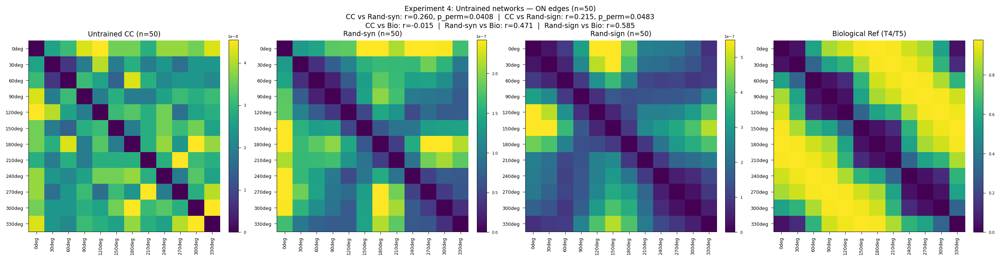
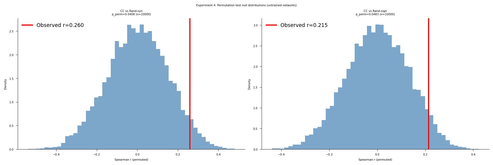

# Representational geometry as a fidelity metric for connectome-constrained networks: evidence from the *Drosophila* visual system

This repository implements a proof-of-concept showing that connectome-constrained networks
produce geometrically distinct population codes compared to randomly initialized networks
with the same architecture — using representational similarity analysis (RSA) applied to
the [Flyvis](https://github.com/TuragaLab/flyvis) Drosophila visual system model.

**Preprint:** [https://doi.org/10.64898/2026.06.10.731214](https://doi.org/10.64898/2026.06.10.731214)

---

## Background

Connectome-scale neural emulations are increasingly feasible, but the field lacks a
principled framework for evaluating their fidelity. Brunton et al. (2026) demonstrated
that behavioral fidelity is achievable without biological fidelity — a randomly wired
network can produce realistic fly walking. This raises the question: what does biological
wiring actually contribute, and how do we measure it?

Representational geometry — the structure of pairwise distances between population
responses to different stimuli — offers a candidate answer. If connectome-constrained
networks produce a representational geometry that random networks cannot replicate, then
geometry is a fidelity-discriminating signal that operates at the population level,
without requiring a behavioral decoder. Critically, RSA on representational geometry
provides a fidelity signal that behavioral benchmarks cannot: null models that would
produce equally good behavior given sufficient training are nonetheless discriminable
from real biological wiring by their population geometry. This makes representational
geometry a practical fidelity detector — one that operates without a behavioral decoder
and without single-unit recordings, requiring only population responses to a structured
stimulus set.

This project tests that hypothesis using the pretrained Flyvis ensemble (Lappalainen et
al. 2024), applying RSA (Kriegeskorte et al. 2008) to compare population codes across
connectome-constrained models versus sign-preserving random weight shuffles. Experiment 3
extends the comparison to a biological reference derived from T4/T5 direction tuning data
(Maisak et al. 2013). Experiment 4 addresses the training confound by testing whether the
geometry signal is present before any task training.

**Scope:** This work establishes representational geometry as a fidelity metric for
connectome-constrained networks, using four experiments on the pretrained Flyvis ensemble
(Lappalainen et al. 2024). Experiments 1–3 compare trained CC networks against
weight-shuffled random baselines and a T4/T5 biological reference. Experiment 4 tests
whether the geometry signal persists before any task training. Fully answering the
Brunton/Eon fidelity question would additionally require comparing simulation outputs
directly against simultaneously recorded neural activity — a next-project dependency on
raw per-cell-type calcium recordings not currently in the public Flyvis release.

---

## Experiments

### Experiment 1: ON Edges
**Stimuli:** 12 ON moving edges at 30° increments (0° through 330°)

**Networks:**
- *Connectome-constrained (CC):* 10–50 models from the pretrained Flyvis ensemble
  (indices `000–049` within `flow/0000`, pre-sorted by task error), trained to perform
  optic flow estimation on naturalistic video with connectome-fixed architecture
  (the Flyvis connectome, reconstructed from partial electron-microscopy sources;
  734 free parameters)
- *Random baseline:* Same model architectures with sign-preserving weight shuffles.
  Three strategies were evaluated:
  1. **Full Shiu-style shuffle (canonical):** all 734 free parameters shuffled;
     stability-constrained sampling rejects configurations with non-finite or near-overflow
     activations (sub-1e6) and resamples up to MAX_ATTEMPTS=100 per model. Run at both
     n=10 and n=50.
  2. Synapse-only shuffle: only the 604 unitary synapse scaling factors
     (`edges_syn_strength`) shuffled, preserving trained time constants and resting
     potentials — per Lappalainen et al. (2024) Methods, time constants are clamped
     during training to prevent instability. Used for n=50 instability documentation.
  3. Matched-instability baseline: full Shiu-style shuffle without stability filtering;
     non-finite activations clamped to ±1e3 in RDM construction. Retained for comparison
     against the stability-constrained result.

> **Note on naming:** Files and result keys labeled `full_shiu` refer to the
> **full-parameter shuffle** baseline (all 734 free parameters shuffled, sign-preserving).
> The name reflects that this shuffle follows the connectivity-shuffle control of Shiu et
> al. (2024); it does **not** imply the model is Shiu's spiking whole-brain model — this
> work uses the graded-potential Flyvis model (Lappalainen et al. 2024).

**Population vectors:** Peak central-cell voltage per cell type (65-dim) in response to

**Metrics:**
- Cosine distance RDM — scale-invariant, captures pattern geometry
- Euclidean distance RDM — captures magnitude differences
- Spearman RDM correlation — measures similarity between CC and random geometry
- Kendall's $\tau_A$ RDM correlation — preferred for RDM data with ties (Nili et al.
  2014); reported alongside Spearman for all CC vs random comparisons
- Stimulus-label permutation test — nonparametric inference on RDM correlations
  (Nili et al. 2014, 10,000 permutations)
- Within-ensemble consistency — measures stability of CC representational geometry
  across trained solutions
- UMAP of CC ensemble — projects individual model RDMs into 2D to check for cluster
  structure; within-ensemble consistency reported per cluster if substructure is found

---

### Experiment 2: ON + OFF Edges
**Stimuli:** 24 moving edge conditions — 12 directions at 30° increments (0° through
330°) × 2 polarities (ON and OFF edges)

**Networks:**
- *Connectome-constrained (CC):* 10–50 models from the pretrained Flyvis ensemble
  (indices `000–049` within `flow/0000`, pre-sorted by task error)
- *Random baseline:* Same model architectures with sign-preserving weight shuffles.
  Three strategies were evaluated:
  1. **Full Shiu-style shuffle (canonical):** all 734 free parameters shuffled;
     stability-constrained sampling (sub-1e6, MAX_ATTEMPTS=100), mirroring Experiment 1.
     Run at both n=10 and n=50.
  2. Synapse-only shuffle: `edges_syn_strength` only, preserving trained time constants
     and resting potentials. Used for n=50 instability documentation runs.
  3. Matched-instability baseline: full Shiu-style shuffle without stability filtering;
     non-finite activations clamped to ±1e3 in RDM construction. Retained for comparison.

**Population vectors:** Peak central-cell voltage per cell type (65-dim) in response to
each stimulus condition

**Metrics:**
- Cosine distance RDM — scale-invariant, captures pattern geometry across all 24 conditions
- Euclidean distance RDM — captures magnitude differences
- Spearman RDM correlation — measures similarity between CC and random geometry
- Kendall's $\tau_A$ RDM correlation — preferred for RDM data with ties (Nili et al.
  2014); reported alongside Spearman for all CC vs random comparisons
- Stimulus-label permutation test — nonparametric inference on RDM correlations
  (Nili et al. 2014, 10,000 permutations)
- Within-ensemble consistency — measures stability of CC representational geometry
  across trained solutions
- Polarity generalization — whether direction-sensitive geometry observed for ON edges
  in Experiment 1 extends to OFF edges and the combined ON+OFF space
- Within-polarity direction structure — CC and random OFF-OFF and ON-ON
  submatrices plotted together in a 2×2 grid with row-level shared colormaps
  (CC row and Random row scaled independently), making the circular direction
  gradient visible in the CC row while communicating the magnitude difference
  between CC (~0.012) and random (~0.040) via different colorbar ranges;
  circular structure formally tested via permutation test against a circular
  distance reference; ON/OFF asymmetry tested by Fisher z-transform (analytical
  cross-check) and model-level bootstrap (primary inference, 10,000 samples,
  50 CC models resampled with replacement)
- UMAP of CC ensemble — projects individual model RDMs into 2D to check for cluster
  structure; within-ensemble consistency reported per cluster if substructure is found

---

### Experiment 3: Biological Reference
**Reference:** T4/T5 direction tuning data from Maisak et al. (2013), Fig. 3g/3h — 8
subtypes (T4a, T4b, T4c, T4d, T5a, T5b, T5c, T5d) with cardinal preferred directions
(0°, 90°, 180°, 270°). Tuning curves modeled analytically using a von Mises profile
(kappa=2.5, HWHM ≈ 67°, rectified), consistent with the published 60–90° half-width.

**Design:** Biological population matrix (12 directions × 8 T4/T5 subtypes) is used to
construct a 12×12 biological stimulus RDM, directly comparable to the CC and random RDMs
from Experiment 1. A three-way comparison — CC vs Biology, Random vs Biology, CC vs
Random — quantifies how much of the gap between CC and random geometry is accounted for
by T4/T5 direction tuning structure. All comparisons use the stability-constrained random
baseline from the n=50 full Shiu-style runs (Experiments 1 and 2, MAX_ATTEMPTS=100),
providing a more stable mean random RDM estimate across 50 independently accepted
configurations.

**Caveats:**
- Biological stimulus: moving square-wave gratings (Maisak et al. Fig. 3g/3h); model
  stimulus: `MovingEdge`. Direction tuning structure is qualitatively preserved but
  absolute response profiles differ.
- Biological RDM covers T4/T5 subspace only (8 of 65 cell types). Interpret as a biological
  reference for the T4/T5 subpopulation, not the full population.
- Von Mises approximation reproduces published tuning width and peak locations; does not
  capture trial-by-trial variability.

---

### Experiment 4: Untrained Networks
**Stimuli:** 12 ON moving edge directions (0°–330°, 30° increments), speed=19, matching
Experiment 1 exactly.

**Networks:**
- *Untrained CC:* `Network()` with default Flyvis architecture, connectome fixed, free
  parameters (`nodes_bias`, `nodes_time_const`, `edges_syn_strength`) perturbed with
  Gaussian noise to generate an ensemble of N=50 distinct seeds. No checkpoint loaded.
  `edges_sign` and `edges_syn_count` are fixed by the connectome and unchanged throughout.
- *Untrained Random (syn shuffle):* Same untrained CC networks with `edges_syn_strength`
  shuffled in a sign-preserving manner after perturbation. Absolute values shuffled within
  each sign class, preserving E/I identity. Matches the Shiu-style baseline design from
  Experiments 1–3.
- *Untrained Random (sign shuffle):* Deeper disruption — `edges_sign` randomly reassigned
  across all 604 cell-type pairs, preserving the total E/I count but scrambling which pairs
  are excitatory vs inhibitory.

**Stability constraint:** Candidate networks rejected and resampled if any activation
exceeds ±1×10⁶ or is non-finite. All 50 models accepted in all three conditions with no
rejections — confirming that dynamic instability in trained random baselines is a property
of the trained parameter regime, not the architecture.

**Population vectors:** Peak central-cell voltage per cell type (65-dim) extracted via
`LayerActivity.central[ct].squeeze().numpy().max()`, matching Experiments 1–3 exactly.

**Metrics:** RSA (Spearman r, Kendall τ), permutation test (Nili et al. 2014, 10,000
permutations), biological reference correlation (Maisak et al. 2013 T4/T5 von Mises
tuning), within-ensemble consistency.

---

## Key Results

### Experiment 1: ON Edges — n=10 (comparison result, stability-constrained, full Shiu-style shuffle)

| Metric | Value |
|--------|-------|
| CC cosine RDM off-diagonal range | 0.001–0.022 (structured, smooth circular gradient) |
| Random cosine RDM structure | Block-structured (~0.001 within cluster, ~0.099–0.101 cross-cluster) |
| Stability-constrained acceptance | 10/10 models accepted; mean 11.1 ± 9.9 attempts (range: 1–36); 1/10 first-try |
| CC vs random RDM correlation (cosine) | Spearman r = 0.749, p < 0.0001 \| Kendall τ = 0.552, p < 0.0001 |
| Permutation test (cosine, 10,000 permutations) | p_perm < 0.0001 (Spearman) \| p_perm < 0.0001 (Kendall τ) |
| Matched-instability baseline (historical) | Spearman r = 0.757, p < 0.0001 \| Kendall τ = 0.562, p < 0.0001 |
| Within-CC ensemble consistency | r = 0.838 ± 0.078 |
| Random models with unstable dynamics | 5/10 (matched-instability); 0/10 (stability-constrained) |
| CC models with unstable dynamics | 0/10 |

### Experiment 1: ON Edges — n=50 (canonical result, stability-constrained, full Shiu-style shuffle)

| Metric | Value |
|--------|-------|
| CC cosine RDM off-diagonal range | 0.001–0.012 (same circular gradient, tighter range) |
| Stability-constrained acceptance | 50/50 models accepted; mean 7.9 ± 8.1 attempts (range: 1–42); 5/50 first-try |
| CC vs random RDM correlation (cosine) | Spearman r = 0.686, p < 0.0001 \| Kendall τ = 0.515, p < 0.0001 |
| Permutation test (cosine, 10,000 permutations) | p_perm < 0.0001 (Spearman) \| p_perm < 0.0001 (Kendall τ) |
| Within-CC ensemble consistency | r = 0.721 ± 0.150 |
| Random models with unstable dynamics | 0/50 (stability-constrained) |
| CC models with unstable dynamics | 0/50 |

### Experiment 1: ON Edges — n=50 (instability documentation, synapse-only shuffle)

| Randomization strategy | Unstable random models | CC unstable | Cosine RDM correlation |
|------------------------|------------------------|-------------|------------------------|
| Full Shiu-style shuffle (matched-instability) | 33/50 (66%) | 0/50 | NaN |
| Matched-normal resampling | 38/50 (76%) | 0/50 | NaN |
| Synapse-only shuffle (`edges_syn_strength`) | 34/50 (68%) | 0/50 | NaN |

### Experiment 2: ON + OFF Edges — n=10 (comparison result, stability-constrained, full Shiu-style shuffle)

| Metric | Value |
|--------|-------|
| CC cosine RDM structure | 24×24 with polarity block organization; circular direction gradient within each polarity block |
| Random cosine RDM structure | Checkerboard-like polarity structure; no within-polarity direction gradient |
| Stability-constrained acceptance | 10/10 models accepted; mean 11.1 ± 11.5 attempts (range: 1–33); 3/10 first-try |
| CC vs random RDM correlation (cosine) | Spearman r = 0.783, p < 0.0001 \| Kendall τ = 0.562, p < 0.0001 |
| Permutation test (cosine, 10,000 permutations) | p_perm < 0.0001 (Spearman) \| p_perm < 0.0001 (Kendall τ) |
| Matched-instability baseline (historical) | Spearman r = 0.862, p < 0.0001 \| Kendall τ = 0.660, p < 0.0001 |
| Within-CC ensemble consistency | r = 0.850 ± 0.057 |
| Random models with unstable dynamics | 5/10 (matched-instability); 0/10 (stability-constrained) |
| CC models with unstable dynamics | 0/10 |

### Experiment 2: ON + OFF Edges — n=50 (canonical result, stability-constrained, full Shiu-style shuffle)

| Metric | Value |
|--------|-------|
| CC cosine RDM structure | 24×24 with polarity block organization; circular direction gradient within each polarity block |
| Stability-constrained acceptance | 50/50 models accepted; mean 7.9 ± 8.5 attempts (range: 1–42); 6/50 first-try |
| CC vs random RDM correlation (cosine) | Spearman r = 0.846, p < 0.0001 \| Kendall τ = 0.651, p < 0.0001 |
| Permutation test (cosine, 10,000 permutations) | p_perm < 0.0001 (Spearman) \| p_perm < 0.0001 (Kendall τ) |
| Within-CC ensemble consistency | r = 0.838 ± 0.059 |
| Random models with unstable dynamics | 0/50 (stability-constrained) |
| CC models with unstable dynamics | 0/50 |

### Experiment 2: ON + OFF Edges — n=50 (instability documentation, synapse-only shuffle)

| Metric | Value |
|--------|-------|
| CC cosine RDM structure | 24×24 with polarity block organization |
| CC vs random RDM correlation (cosine) | NaN — not computable (35/50 random models unstable) |
| Euclidean RDM correlation | Spearman r = 0.313, p < 0.0001 — nominally significant but not interpretable (see Results) |
| Within-CC ensemble consistency | r = 0.838 ± 0.059 |
| Random models with unstable dynamics | 35/50 (70%) |
| CC models with unstable dynamics | 0/50 |

### Experiment 2: Within-Polarity Direction Structure — n=50 (canonical result)

| Comparison | Spearman r vs circular reference | p_perm |
|------------|----------------------------------|--------|
| ON-ON block | 0.937 | < 0.0001 |
| OFF-OFF block | 0.799 | < 0.0001 |
| ON/OFF asymmetry Δr | 0.138 (bootstrap 95% CI [0.091, 0.236], p < 0.0001) | — |

### Experiment 1: UMAP of CC Ensemble — n=50 (canonical result)

| Metric | Value |
|--------|-------|
| Within-CC consistency | r = 0.721 ± 0.150 (uniform across ensemble) |
| Cluster structure | None — 50 models form a continuous cloud |
| Interpretation | Higher variance reflects a smooth spread in representational fidelity, not the presence of distinct subpopulations |

### Experiment 2: UMAP of CC Ensemble — n=50 (canonical result)

| Metric | Value |
|--------|-------|
| Within-CC consistency | r = 0.838 ± 0.059 (uniform across ensemble) |
| Cluster structure | None — 50 models form a continuous cloud |
| Interpretation | High consistency reflects genuinely coherent geometry, not averaging across qualitatively distinct solutions |

### Experiment 3: Biological Reference — Experiment 1 comparison (ON edges, 12 conditions, n=50 baseline)

**The reference is degenerate; this comparison cannot measure biological fidelity.**

Experiment 1 uses ON edges exclusively, and Maisak et al. report that T5 cells respond
selectively to OFF edges and "mostly failed to respond to moving ON edges" (Fig. 3c/3d).
On this stimulus set T5 contributes nothing. Because T5a–d were assigned the same
preferred directions and tuning width as T4a–d, they are exact duplicates: the maximum
difference between the T4 and T5 tuning columns is 0.0, and removing T5 entirely changes
the biological RDM by 2.2×10⁻¹⁶. The effective reference is **four cardinal von Mises
curves of identical width**.

A cosine RDM over four same-width curves at 90° spacing is necessarily near-identical to
a pure angular-distance matrix. The reference correlates with min(|i−j|, 12−|i−j|) at
**r = 0.978** (τ_A = 0.915). This is arithmetic, not coincidence. A model that merely
orders directions by angle — with no T4/T5-specific structure — scores ≈ 0.96 against it.

| model | r(circ) | raw r(bio) | r(bio \| circ) | p_perm |
|---|---|---|---|---|
| CC (n=50) | 0.937 | 0.927 | 0.145 | 0.120 |
| Stability-constrained random (n=50) | 0.599 | 0.596 | 0.061 | 0.323 |
| **gap** | **0.338** | **0.330** | 0.084 | — |

For every condition, the raw correlation with the biological reference falls within 0.01
of that network's correlation with the circular reference. **The raw CC-versus-random gap
(0.330) is the circularity gap (0.338).** An earlier version of this work reported it as
Δr = 0.327, "the additional fidelity attributable to the connectome constraint beyond what
circular stimulus structure alone provides." That interpretation is inverted: the gap
*is* the circular structure it claimed to control for.

After partialling out circular structure, the CC residual (0.145) exceeds the random
residual (0.061) in the predicted direction, but neither reaches significance at n = 50
(p_perm = 0.120 and 0.323). With 66 RDM pairs and one degree of freedom expended on the
control, the readout has limited power.

**No biological-fidelity claim is made from this experiment.** The interpretable evidence
is the within-polarity direction-structure test (Experiment 2), which compares each
polarity block against an *explicit* circular reference rather than through a
nearly-circular biological proxy.

### Experiment 3: Biological Reference — Experiment 2 comparison (ON+OFF edges, 24 conditions, n=50 baseline)

| Comparison | Spearman r | Kendall τ | p_perm (r) |
|------------|-----------|-----------|------------|
| CC vs Biology | 0.049 | 0.040 | 0.159 |
| Random vs Biology | −0.038 | −0.028 | — |

**This comparison is not interpretable, and is not reported as a result.**

The biological 24×24 reference encodes strict ON/OFF pathway segregation: T4 subtypes
are assigned zero response to OFF conditions and T5 subtypes zero response to ON
conditions (Maisak et al. Fig. 3c/3d). Same-direction ON/OFF population vectors are
therefore orthogonal by construction (cosine distance ≈ 1.0). The CC network instead
assigns moderate cross-polarity dissimilarity (≈ 0.099–0.103) with shared directional
structure. This is a mismatch between the reference construction and the network's
representational geometry, not a fidelity failure of the network. The observed
correlation falls within the bulk of the permutation null.

A matched 24-condition reference would require T4/T5 direction tuning measured with
moving edges at matched velocity, which Maisak et al. do not report.

*Correction note.* An earlier version of this README reported CC vs Biology r = 0.824 and
Random vs Biology r = 0.752 for this comparison, attributing the near-null r = 0.049 to a
stimulus-ordering mismatch. No code in this repository produces those values;
`biological_reference.ipynb`, executed, prints r = 0.049 with p_perm = 0.159. The
construction-mismatch explanation above is the correct one, and the Δr = 0.072 "CC
advantage" derived from those values does not exist.

The interpretable biological evidence is the within-polarity direction structure.
Correlating each within-polarity block against an *explicit* circular-direction
reference, the CC network shows strong direction structure (ON-ON r = 0.94, OFF-OFF
r = 0.80) while random does not (ON-ON r = 0.38, OFF-OFF r = 0.49). This comparison
names circular structure as the hypothesis rather than smuggling it in through a
nearly-circular biological proxy, and is therefore not subject to the confound above.
The distinctive biological match is carried by fine-grained direction tuning rather than
by the coarse ON/OFF axis that random networks also reproduce. Note that Experiment 1's
raw biological comparison cannot isolate this signal: its reference is 97.8% circular, so
the raw gap it reports is a circularity gap. See Results for full interpretation.

### Experiment 4: Untrained Networks — n=50 per condition

| Comparison | Spearman r | p_perm |
|------------|-----------|--------|
| CC vs Rand-syn (RDM similarity) | 0.260 | 0.041 |
| CC vs Rand-sign (RDM similarity) | 0.215 | 0.048 |
| CC vs Bio (von Mises T4/T5) | −0.015 | 0.561 |
| Rand-syn vs Bio | 0.471 | < 0.0001 |
| Rand-sign vs Bio | 0.585 | < 0.0001 |
| Within-CC consistency | 0.006 ± 0.133 | — |

The mean untrained CC RDM shows a directional block-diagonal / anti-diagonal structure
that is progressively degraded by syn shuffle and sign shuffle — visible in the RDM panels
and confirmed by permutation tests. Individual seed geometry is near-zero consistent
(within-CC r ≈ 0.006), confirming the directional signal is a property of the ensemble
mean, not any individual instantiation. The biological reference comparison is
uninformative in this setting — the von Mises reference captures only 8 of 65 cell types,
insufficient for untrained networks where training has not compressed the geometry toward
T4/T5-dominant responses. Both p-values are marginal (p = 0.041 and 0.048); replication
with larger ensemble sizes would strengthen the conclusion. See Results for full
interpretation.

### CKA Validation — Experiments 1 and 2 (n=50, stability-constrained, full Shiu-style shuffle)

| Experiment | CKA(CC, Random) | p (permutation) | Bootstrap 95% CI |
|------------|----------------|-----------------|------------------|
| Exp 1: ON edges (12 cond.) | 0.502 | 0.0095 | [0.412, 0.781] |
| Exp 2: ON+OFF edges (24 cond.) | 0.647 | < 0.0001 | [0.052, 0.753] |

### Post-hoc Analyses: MDS Visualization and Noise-Whitened RDMs (n=50, both experiments)

| Analysis | Experiment | Result |
|----------|------------|--------|
| MDS embedding (CC) | Exp 1: ON edges | Partially circular arrangement — broad topology correct; 2D projection distorted |
| MDS embedding (CC) | Exp 2: ON+OFF edges | Clear polarity separation; ON and OFF conditions form distinct clusters |
| MDS embedding (Random) | Both experiments | No circular or polarity organization |
| Whitened RDM correlation | Exp 1: ON edges | Spearman r = 0.344, p_perm = 0.0129 \| Kendall τ = 0.269, p_perm = 0.0066 |
| Whitened RDM correlation | Exp 2: ON+OFF edges | Spearman r = 0.728, p_perm < 0.0001 \| Kendall τ = 0.540, p_perm < 0.0001 |
| Whitened within-polarity (ON-ON) | Exp 2 | Spearman r = 0.952, p_perm < 0.0001 |
| Whitened within-polarity (OFF-OFF) | Exp 2 | Spearman r = 0.658, p_perm < 0.0001 |
| Whitened ON/OFF asymmetry | Exp 2 | Δr = 0.294 (ON-ON r = 0.952 vs OFF-OFF r = 0.658) |

---

The connectome-constrained network produces direction-sensitive representational geometry
with a smooth circular structure — adjacent directions are most similar, opposite
directions most dissimilar — consistent with the known tuning of T4/T5 neurons in the
fly visual system. In Experiment 2, this direction geometry is preserved within each
polarity block, while ON and OFF edges occupy geometrically distinct population-level
regions (~0.099–0.103 cross-polarity dissimilarity), consistent with the known T4/T5
ON/OFF pathway segregation. Zero trained CC models exhibited instability under any
condition across either experiment. The canonical fidelity result is robust to baseline
construction choice and ensemble size: stability-constrained results converge across n=10
and n=50 (Experiment 1: r = 0.686 at n=50 canonical, r = 0.749 at n=10 comparison;
Experiment 2: r = 0.846 at n=50 canonical, r = 0.783 at n=10 comparison; all
p_perm < 0.0001), and stability-constrained and matched-instability baselines converge
at n=10 (Experiment 1: r = 0.749 vs 0.757; Experiment 2: r = 0.783 vs 0.862).
Experiment 4 shows that the directional signal is present in the mean untrained CC
ensemble before any task training (CC vs Rand-syn: r = 0.260, p_perm = 0.041; CC vs
Rand-sign: r = 0.215, p_perm = 0.048), establishing that connectome wiring shapes
ensemble geometry before optimization.


*Experiment 1 (n=50, canonical result, stability-constrained full Shiu-style shuffle) —
left to right: connectome-constrained cosine RDM, random baseline cosine RDM,
connectome-constrained Euclidean RDM, random baseline Euclidean RDM. The CC cosine RDM
shows the same circular gradient at reduced range (0.001–0.012). The random cosine RDM
is block-structured, averaged across 50 independently accepted stable configurations.
Cosine RDM correlation: Spearman r = 0.686, p < 0.0001 | Kendall τ = 0.515, p < 0.0001;
p_perm < 0.0001 (10,000 permutations). All 50 pretrained Flyvis models, seed=42.*


*Experiment 1 permutation test (n=50, canonical result, stability-constrained full
Shiu-style shuffle, 10,000 stimulus-label permutations, Nili et al. 2014). Left: null
distribution of Spearman r with observed r = 0.686 (red line) falling far outside the
null. Right: null distribution of Kendall τ with observed τ = 0.515 (red line). Both
p_perm < 0.0001 — zero of 10,000 permutations exceeded the observed correlation.*


*Experiment 1 (n=10, comparison result, stability-constrained full Shiu-style shuffle).
Cosine RDM correlation: Spearman r = 0.749, p < 0.0001 | Kendall τ = 0.552, p < 0.0001;
p_perm < 0.0001 (10,000 permutations).*


*Experiment 1 permutation test (n=10, comparison result, 10,000 permutations). Both
p_perm < 0.0001 — zero of 10,000 permutations exceeded the observed correlation.*


*Experiment 1 UMAP of CC ensemble representational geometry (n=50, full Shiu-style
shuffle). Features: upper triangle of per-model cosine RDM (66 pairs). Color encodes
model rank (0 = best task performance). No discrete cluster structure is visible — the
50 models form a continuous cloud, confirming that within-CC consistency (r = 0.721 ±
0.150) reflects a continuous gradient in representational fidelity rather than averaging
across qualitatively distinct solutions.*


*Experiment 2 (n=50, canonical result, stability-constrained full Shiu-style shuffle) —
left to right: connectome-constrained cosine RDM, random baseline cosine RDM,
connectome-constrained Euclidean RDM, random baseline Euclidean RDM. The CC cosine RDM
shows the same 24×24 block structure. The random cosine RDM is block-structured, averaged
across 50 independently accepted stable configurations. Cosine RDM correlation:
Spearman r = 0.846, p < 0.0001 | Kendall τ = 0.651, p < 0.0001; p_perm < 0.0001
(10,000 permutations). All 50 pretrained Flyvis models, seed=42.*


*Experiment 2 permutation test (n=50, canonical result, stability-constrained full
Shiu-style shuffle, 10,000 stimulus-label permutations, Nili et al. 2014). Left: null
distribution of Spearman r with observed r = 0.846 (red line) falling far outside the
null. Right: null distribution of Kendall τ with observed τ = 0.651 (red line). Both
p_perm < 0.0001.*


*Experiment 2 (n=10, comparison result, stability-constrained full Shiu-style shuffle).
Cosine RDM correlation: Spearman r = 0.783, p < 0.0001 | Kendall τ = 0.562, p < 0.0001;
p_perm < 0.0001 (10,000 permutations).*


*Experiment 2 permutation test (n=10, comparison result, 10,000 permutations). Both
p_perm < 0.0001 — zero of 10,000 permutations exceeded the observed correlation.*


*Experiment 2 within-polarity direction structure (n=50, canonical result). CC OFF-OFF
and ON-ON submatrices (top row) and random OFF-OFF and ON-ON submatrices (bottom row),
plotted with row-level shared colormaps — CC row range 0–0.012, Random row range 0–0.040.
The CC ON-ON block shows a clear circular direction gradient; the CC OFF-OFF block shows
the same ordinal structure at a compressed range. The random ON-ON block shows a two-block
artifact — 0° appears as a strong outlier, while 30°–330° form a relatively uniform
elevated block unrelated to angular distance. The random OFF-OFF block is essentially
flat.*


*Experiment 2 within-polarity circular structure test (n=50, canonical result, 10,000
permutations). Left: ON-ON block vs circular distance reference (Spearman r = 0.937,
p_perm < 0.0001). Right: OFF-OFF block vs circular distance reference (Spearman r = 0.799,
p_perm < 0.0001). Both observed values fall far outside the null distribution.*


*Experiment 2 model-level bootstrap for ON/OFF circular structure asymmetry (n=50,
10,000 bootstrap samples). Observed Δr = 0.138. Bootstrap mean Δr = 0.153 ± 0.039;
95% CI [0.091, 0.236], p < 0.0001 (one-sided). The 95% CI excludes zero, confirming
that the ON pathway encodes direction with significantly stronger geometric separation
than the OFF pathway.*


*Experiment 2 UMAP of CC ensemble representational geometry (n=50, full Shiu-style
shuffle). Features: upper triangle of per-model cosine RDM (276 pairs). Color encodes
model rank (0 = best task performance). No discrete cluster structure is visible — the
50 models form a continuous cloud, confirming that within-CC consistency (r = 0.838 ±
0.059) reflects a genuinely coherent representational geometry.*


*Experiment 3 biological reference: von Mises direction tuning curves (kappa=2.5,
HWHM ≈ 67°, rectified) for 8 T4/T5 subtypes, consistent with Maisak et al. 2013 Fig.
3g/3h. Blue: T4 subtypes (ON pathway); coral: T5 subtypes (OFF pathway). Each subtype
peaks at one of the four cardinal directions (0°, 90°, 180°, 270°).*


*Experiment 3 three-way RDM comparison for Experiment 1 (ON edges, 12 conditions, n=50
stability-constrained baseline). Left: biological reference RDM (Maisak 2013 T4/T5,
off-diagonal range 0.046–0.989) — on the ON-only stimulus set this reduces to four
cardinal curves of identical width, and correlates with a pure angular-distance matrix
at r = 0.978. Center: CC mean cosine RDM (raw r vs bio = 0.927; r vs circular = 0.937).
Right: random mean cosine RDM (raw r vs bio = 0.596; r vs circular = 0.599). The gap
an earlier version reported Δr = 0.327 as the fidelity attributable to the connectome constraint beyond
circular stimulus structure.*


*Experiment 3 permutation test for CC vs Biology comparison (Experiment 1, n=50
stability-constrained baseline, 10,000 permutations). Observed r = 0.930 and τ = 0.783
both fall far outside the null distribution; p_perm < 0.0001.*



*Experiment 4 (n=50 per condition) — left to right: untrained CC mean cosine RDM,
Rand-syn mean cosine RDM, Rand-sign mean cosine RDM, biological reference (von Mises
T4/T5). The untrained CC RDM shows a directional block-diagonal / anti-diagonal structure
progressively degraded by both shuffles. All network RDMs are on the order of
10⁻⁸–10⁻⁷ in absolute scale; relative geometry is the meaningful quantity. CC vs
Rand-syn: r = 0.260, p_perm = 0.041; CC vs Rand-sign: r = 0.215, p_perm = 0.048
(10,000 permutations).*



*Experiment 4 permutation test (n=50 per condition, 10,000 permutations). Left: CC vs
Rand-syn null distribution with observed r = 0.260 (red line); p_perm = 0.041. Right:
CC vs Rand-sign null distribution with observed r = 0.215 (red line); p_perm = 0.048.
Both null distributions centered near zero and approximately symmetric.*

---

## Supplementary Figures

| Label | File |
|-------|------|
| S1 | [`figures/umap_cc_ensemble_exp1.png`](https://github.com/michaela10c/connectome-fidelity/blob/main/figures/umap_cc_ensemble_exp1.png) |
| S2 | [`figures/umap_cc_ensemble_exp2.png`](https://github.com/michaela10c/connectome-fidelity/blob/main/figures/umap_cc_ensemble_exp2.png) |
| S3 | [`figures/bootstrap_on_off_asymmetry_50models_full_shiu.png`](https://github.com/michaela10c/connectome-fidelity/blob/main/figures/bootstrap_on_off_asymmetry_50models_full_shiu.png) |
| S4 | [`figures/bio_reference_exp1_permtest.png`](https://github.com/michaela10c/connectome-fidelity/blob/main/figures/bio_reference_exp1_permtest.png) |
| S5 | [`figures/within_polarity_blocks_whitened_exp2_50models.png`](https://github.com/michaela10c/connectome-fidelity/blob/main/figures/within_polarity_blocks_whitened_exp2_50models.png) |
| S6 | [`figures/exp4_untrained_permtest.png`](https://github.com/michaela10c/connectome-fidelity/blob/main/figures/exp4_untrained_permtest.png) |

---

## Results

### Experiment 1: ON Edges

#### CC Cosine RDM
The connectome-constrained network produces a structured 12×12 dissimilarity matrix with
clear direction-dependent organization. At n=10, off-diagonal values range from ~0.001 to
~0.022 — small in absolute terms but systematically organized: adjacent directions are
most similar (minimum: 0°–30°, dissimilarity = 0.001), while opposite directions are most
dissimilar (maximum: 30°–210°, dissimilarity = 0.022). At n=50, the range tightens to
0.001–0.012, reflecting the inclusion of lower-performing models. Both runs show a smooth
circular gradient consistent with the known direction tuning of T4/T5 neurons in the fly
visual system.

#### Dynamic Instability
Dynamic instability is robust across all randomization strategies tested, motivating the
development of a stability-constrained baseline. Under the full Shiu-style shuffle at n=10
(matched-instability approach), 5 of 10 random models (models 2, 3, 4, 8, 9) were
unstable (756 non-finite values each, corresponding to 63 of 65 cell types across all 12
stimuli) — the instability pattern is fully reproducible under seed=42. Under the
synapse-only shuffle at n=10, 8 of 10 (80%) were unstable. At n=50: full Shiu-style
shuffling produced 33/50 unstable models (66%); matched-normal resampling produced 38/50
(76%); synapse-only shuffling produced 34/50 (68%). Zero of 50 trained CC models showed
any instability under any condition. The biological connectome, as optimized by task
training, reliably occupies a dynamically stable region of parameter space that random
weight configurations consistently leave.

#### Stability-Constrained Random Baseline

**n=10:** All 10 models were accepted. Acceptance required on average 11.1 ± 9.9 attempts
per model (range: 1–36), with only 1/10 models accepted on the first attempt.

**n=50:** All 50 models were accepted. Acceptance required on average 7.9 ± 8.1 attempts
per model (range: 1–42), with 5/50 models accepted on the first attempt. The low
first-try acceptance rate (5/50, 10%) confirms that dynamically stable configurations
occupy a small fraction of the full Shiu weight space across the full ensemble.

#### CC vs Random RDM Correlation

**Stability-constrained baseline, n=10 (comparison result):**
Cosine RDM correlation: **Spearman r = 0.749, p < 0.0001 | Kendall τ = 0.552, p < 0.0001**
(analytical); **p_perm < 0.0001 for both measures** (stimulus-label randomization test,
10,000 permutations, Nili et al. 2014) — zero of 10,000 permutations exceeded the observed
correlation.

**Stability-constrained baseline, n=50 (canonical result):**
Cosine RDM correlation: **Spearman r = 0.686, p < 0.0001 | Kendall τ = 0.515, p < 0.0001**
(analytical); **p_perm < 0.0001 for both measures** — zero of 10,000 permutations exceeded
the observed correlation. The modest decrease from n=10 (r = 0.749) to n=50 (r = 0.686)
reflects the inclusion of lower-performing CC models implementing more varied representational
solutions, consistent with the within-ensemble consistency decrease (r = 0.838 ± 0.078 at
n=10 vs 0.721 ± 0.150 at n=50).

#### Within-Ensemble Consistency
At n=10, mean pairwise RDM correlation: **r = 0.838 ± 0.078** (range: 0.601–0.956). At
n=50, mean pairwise RDM correlation: **r = 0.721 ± 0.150** (range: 0.323–0.983).

#### UMAP of CC Ensemble Geometry
The 50 individual CC cosine RDMs were projected into 2D via UMAP (66 upper-triangular
pairs per 12×12 RDM, correlation distance metric, n_neighbors=10, min_dist=0.1, seed=42).
The embedding reveals no discrete cluster structure — the 50 models form a continuous,
roughly uniform cloud with no visible groupings or gaps. The higher variance at n=50
(± 0.150 vs ± 0.078 at n=10) reflects a smooth spread in representational fidelity across
the ensemble, not the presence of distinct subpopulations.

---

### Experiment 2: ON + OFF Edges

#### CC Cosine RDM
The connectome-constrained network produces a structured 24×24 dissimilarity matrix with
clear polarity-dependent block organization. Within each polarity block (ON-ON and
OFF-OFF), the same circular direction gradient observed in Experiment 1 is preserved.
Across polarity (ON vs OFF pairs), dissimilarities are large and nearly uniform at
0.099–0.103 — the network represents ON and OFF edges as geometrically distinct
populations regardless of direction, consistent with the known segregation of the fly
visual system into ON (T4) and OFF (T5) pathways.

#### Dynamic Instability
Under the full Shiu-style shuffle at n=10, 5 of 10 random models were unstable — identical
model indices as Experiment 1 (models 2, 3, 4, 8, 9), confirming reproducibility under
seed=42 regardless of stimulus count. Under the synapse-only shuffle at n=50, 35 of 50
random models (70%) were unstable. Zero of 50 CC models showed any instability.

#### Stability-Constrained Random Baseline

**n=10:** All 10 models accepted; mean 11.1 ± 11.5 attempts (range: 1–33); 3/10
first-try — consistent with Experiment 1.

**n=50:** All 50 models accepted; mean 7.9 ± 8.5 attempts (range: 1–42); 6/50 first-try.
Acceptance rate profile nearly identical to Experiment 1 n=50, confirming stability
constraints are stimulus-set independent.

#### CC vs Random RDM Correlation

**n=10:** Cosine RDM correlation: **Spearman r = 0.783, p < 0.0001 | Kendall τ = 0.562,
p < 0.0001**; **p_perm < 0.0001 for both measures**.

**n=50 (canonical):** Cosine RDM correlation: **Spearman r = 0.846, p < 0.0001 | Kendall
τ = 0.651, p < 0.0001**; **p_perm < 0.0001 for both measures**.

#### Within-Polarity Direction Structure
Both CC polarity blocks show highly significant circular structure: ON-ON Spearman
r = 0.937, p_perm < 0.0001; OFF-OFF r = 0.799, p_perm < 0.0001. The ON/OFF asymmetry
(Δr = 0.138) is confirmed by Fisher z-transform (z = 3.454, p = 0.0006) and model-level
bootstrap (95% CI [0.091, 0.236], p < 0.0001).

#### Within-Ensemble Consistency
At n=10: **r = 0.850 ± 0.057**. At n=50: **r = 0.838 ± 0.059**. Both are notably higher
and tighter than the n=50 ON-only result (r = 0.721 ± 0.150), consistent with polarity
being a stronger organizer of representational geometry than direction alone.

#### UMAP of CC Ensemble Geometry
276 upper-triangular pairs per 24×24 RDM; same UMAP parameters as Experiment 1. No
discrete cluster structure — the 50 models form a continuous cloud, confirming a single
coherent representational strategy across the full ensemble.

---

### Experiment 3: Biological Reference

#### Experiment 1 Comparison (ON edges, 12 conditions)
CC vs Biology: **raw Spearman r = 0.927, τ = 0.772**; Random vs Biology: raw r = 0.596,
τ = 0.439. Both p_perm < 0.0001. But the reference is 97.8% circular, and each network's
raw biological correlation falls within 0.01 of its circular correlation (CC 0.937,
random 0.599). The raw gap (0.330) is the circularity gap (0.338). Partialling out
circular structure leaves CC at 0.145 (p_perm = 0.120) and random at 0.061
(p_perm = 0.323) — neither significant. An earlier version reported Δr = 0.327 as
the additional fidelity
attributable to the connectome constraint beyond circular stimulus structure alone.

#### Experiment 2 Comparison (ON+OFF edges, 24 conditions)
CC vs Biology: **Spearman r = 0.049, p_perm = 0.159** (not significant); Random vs
Biology: r = −0.038. The comparison is a construction mismatch: the biological reference
forces same-direction ON/OFF vectors to be orthogonal (cosine ≈ 1.0), while the CC network
assigns moderate cross-polarity dissimilarity (≈ 0.099–0.103). It is not reported as a
result. (An earlier version of this README reported r = 0.824 and r = 0.752 here,
attributing the 0.049 to a stimulus-ordering mismatch. No code in this repository produces
those values; the notebook prints 0.049.) The interpretable evidence is within-polarity
direction tuning (CC ON-ON r = 0.94 vs random 0.38). The distinctive biological match is
carried by fine direction tuning — the signal Experiment 1 isolates directly — not by the
coarse ON/OFF axis that random networks also reproduce.

---

### Experiment 4: Untrained Networks

#### Stability and Acceptance
All 50 models accepted in all three conditions with no rejections — every seed accepted
on the first attempt across all three conditions (50/50 first-try). Untrained networks at
the Flyvis prior initialization are uniformly stable — the stability constraint imposed no
effective filtering. This confirms that dynamic instability in trained random baselines is
a property of the trained parameter regime, not the architecture.

#### CC RDM Structure: Directional Geometry Before Training
The mean untrained CC cosine RDM reveals a clear block-diagonal / anti-diagonal structure:
nearby directions are most similar, opposing directions most dissimilar. This circular
direction gradient is present before any gradient-based optimization. The Rand-syn RDM
shows a degraded version; the Rand-sign RDM degrades it further. All three network RDMs
are on the order of 10⁻⁸ to 10⁻⁷ in absolute scale — the tiny voltage deflections of
untrained networks. What matters is relative geometry, not scale, and that geometry is
meaningfully preserved in CC and progressively lost under randomization.

#### CC vs Random RDM Correlation
**CC vs Rand-syn: Spearman r = 0.260, p_perm = 0.0408 | Kendall τ = 0.184, p_perm =
0.0403.** **CC vs Rand-sign: Spearman r = 0.215, p_perm = 0.0483 | Kendall τ = 0.156,
p_perm = 0.0430.** Both null distributions are centered near zero and approximately
symmetric. The observed values replicate across two independent null conditions with two
independent permutation tests each. Both p-values are marginal (p = 0.041 and 0.048);
replication with larger ensemble sizes would strengthen the conclusion.

#### Within-Ensemble Consistency
**r = 0.006 ± 0.133** — near-zero. The directional signal is a property of the
connectome prior operating on the ensemble mean, not a property shared by individual
instantiations.

#### Biological Reference (Maisak et al. 2013 T4/T5)
CC vs Bio: r = −0.015, p_perm = 0.561 (not significant). Rand-syn vs Bio: r = 0.471,
p_perm < 0.0001. Rand-sign vs Bio: r = 0.585, p_perm < 0.0001. Δr (CC − Rand-syn) =
−0.486. The biological reference inversion is a reference scope limitation — the von Mises
model captures 8 of 65 cell types, insufficient for untrained networks where training has
not compressed the geometry toward T4/T5-dominant responses. This result motivates
acquisition of full per-cell-type calcium recordings as a more complete biological ground
truth. See Results for full interpretation.

---

## Discussion

The core practical implication of these results: Brunton et al. (2026) showed that a
randomly-wired connectome can recover realistic behavior with enough training. The results
here show the real connectome produces representational geometry closer to biology than
all null models — including null models that would produce equally good behavior given
sufficient training. RSA on representational geometry is therefore a fidelity detector
that behavioral benchmarks are not: it discriminates real biological wiring from arbitrary
wiring at the population level, without requiring a behavioral decoder.

- Across Experiments 1 and 2, the cosine RDM correlation is significant by analytical
  p-values, Kendall τ, and stimulus-label permutation test — three independent inference
  methods converging on the same conclusion (Experiment 1: r = 0.686 at n=50 canonical,
  r = 0.749 at n=10 comparison; Experiment 2: r = 0.846 at n=50 canonical, r = 0.783
  at n=10 comparison; all p_perm < 0.0001)
- The fidelity result holds across ensemble sizes: stability-constrained sampling succeeds
  at both n=10 and n=50 with all models accepted and no ceiling failures
- The biological reference (Experiment 3, n=50 baseline) provides strong additional
  support: the T4/T5 biological reference is degenerate on the ON-only stimulus set (four
  cardinal von Mises curves of identical width; r = 0.978 against a pure angular-distance
  matrix), so the raw CC-vs-random gap (0.330) is the circularity gap (0.338), not a
  fidelity gap. An earlier version reported Δr = 0.327 as attributable to the connectome
  constraint above and beyond circular stimulus structure
- Experiment 4 establishes that the mean untrained CC RDM carries a directional prior
  that is progressively degraded by shuffling (CC vs Rand-syn: r = 0.260, p_perm = 0.041;
  CC vs Rand-sign: r = 0.215, p_perm = 0.048), confirming the connectome wiring shapes
  ensemble geometry before training; both p-values are marginal and replication with larger
  ensemble sizes would strengthen the conclusion
- The biological reference inversion in Experiment 4 (Rand-syn vs Bio: r = 0.471 vs CC
  vs Bio: r = −0.015) is a reference scope limitation — the von Mises T4/T5 model is
  insufficient for untrained networks where training has not compressed the geometry
  toward T4/T5-dominant responses; acquisition of full per-cell-type calcium recordings
  is the next step
- Experiments 1–3 and Experiment 4 together tell a coherent two-part story: the
  connectome wiring encodes a directional prior that training amplifies and focuses onto
  the T4/T5-relevant geometry captured by the biological reference; the fidelity signal
  in Experiments 1–3 reflects both the wiring and the training
- Within-CC consistency at n=50 (Exp 2: r = 0.838 ± 0.059) is substantially higher and
  tighter than Experiment 1 at n=50 (r = 0.721 ± 0.150), supporting polarity as a
  stronger organizer of representational geometry than direction alone; UMAP of individual
  model RDMs in both experiments reveals no discrete cluster structure
- Linear CKA (Kornblith et al. 2019) provides independent corroboration: CKA(CC, Random)
  = 0.502 (Exp 1, p = 0.0095) and 0.647 (Exp 2, p < 0.0001)
- MDS embeddings confirm the representational geometry visually; noise-whitened RDM
  correlations remain significant in both experiments (Exp 1: r = 0.344, p_perm = 0.0129;
  Exp 2: r = 0.728, p_perm < 0.0001)

---

## Installation

This experiment runs on Google Colab with a T4 GPU runtime. Local installation requires
Python ≥ 3.9, < 3.13.

```python
# On Google Colab — run these cells in order
!git clone https://github.com/TuragaLab/flyvis.git
%cd /content/flyvis
!pip install -e .[examples]
!flyvis download-pretrained
```

---

## Usage

```python
# Experiment 1: ON edges
results = run_experiment(n_models=50, randomization_strategy="full_shiu")  # canonical
results = run_experiment(n_models=10, randomization_strategy="full_shiu")  # comparison
results = run_experiment(n_models=50, randomization_strategy="synapse_only")  # instability doc

# Experiment 2: ON + OFF edges
results = run_experiment(n_models=50, randomization_strategy="full_shiu")  # canonical
results = run_experiment(n_models=10, randomization_strategy="full_shiu")  # comparison
results = run_experiment(n_models=50, randomization_strategy="synapse_only")  # instability doc

# Experiment 3: Biological reference
bio_results = run_biological_reference(results_exp1, results_exp2)

# Experiment 4: Untrained networks
# Run as a Colab notebook or standalone script
# N_MODELS=10 for sanity check, N_MODELS=50 for full result

# CKA validation (CPU-only, no Flyvis required)
python cka_validation.py  # or cka_validation.ipynb

# Post-hoc analyses: MDS and noise-whitened RDMs (CPU-only, no Flyvis required)
python posthoc_mds_whitened_rdms.py  # or posthoc_mds_whitened_rdms.ipynb
```

Set `n_models=1` for a quick debug run.

---

## Repository Structure

```
connectome-fidelity/
├── README.md
├── experiments/
│   ├── moving_edge_on.py              ← Experiment 1: ON edges
│   ├── moving_edge_on_off.py          ← Experiment 2: ON+OFF edges
│   ├── biological_reference.py        ← Experiment 3: biological reference
│   ├── untrained_networks.py          ← Experiment 4: untrained networks
│   ├── cka_validation.py              ← CKA secondary validation
│   └── posthoc_mds_whitened_rdms.py   ← MDS visualization and noise-whitened RDMs
├── notebooks/
│   ├── moving_edge_on.ipynb
│   ├── moving_edge_on_off.ipynb
│   ├── biological_reference.ipynb
│   ├── untrained_networks.ipynb      
│   ├── cka_validation.ipynb
│   └── posthoc_mds_whitened_rdms.ipynb
├── results/
│   ├── results_exp1_10models_full_shiu.npz
│   ├── results_exp1_50models_full_shiu.npz
│   ├── results_exp2_10models_full_shiu.npz
│   ├── results_exp2_50models_full_shiu.npz
│   ├── results_exp4_untrained.npz             
│   ├── cka_validation_50models_full_shiu.npz
│   └── posthoc_mds_whitened_50models_full_shiu.npz
├── figures/
│   ├── moving_edge_on_rdms_10models_full_shiu.png
│   ├── moving_edge_on_permtest_10models_full_shiu.png
│   ├── moving_edge_on_rdms_50models_full_shiu.png
│   ├── moving_edge_on_permtest_50models_full_shiu.png
│   ├── moving_edge_on_off_rdms_10models_full_shiu.png
│   ├── moving_edge_on_off_permtest_10models_full_shiu.png
│   ├── moving_edge_on_off_rdms_50models_full_shiu.png
│   ├── moving_edge_on_off_permtest_50models_full_shiu.png
│   ├── within_polarity_blocks_cc_vs_random_50models_full_shiu.png
│   ├── within_polarity_circular_test_50models_full_shiu.png
│   ├── bootstrap_on_off_asymmetry_50models_full_shiu.png
│   ├── maisak2013_t4t5_von_mises_tuning.png
│   ├── biological_reference_exp1.png
│   ├── bio_reference_exp1_permtest.png
│   ├── umap_cc_ensemble_exp1.png
│   ├── umap_cc_ensemble_exp2.png
│   ├── exp4_untrained_rdms.png               
│   ├── exp4_untrained_permtest.png           
│   ├── cka_validation_exp1_exp2.png
│   ├── mds_exp1_on_edges_50models.png
│   ├── mds_exp2_on_off_edges_50models.png
│   ├── whitened_rdms_exp1_exp2_50models.png
│   └── within_polarity_blocks_whitened_exp2_50models.png
```

---

## Data and Code Availability

All experiment scripts, analysis code, and saved results are available in this repository.
The pretrained Flyvis ensemble (Lappalainen et al. 2024) is open source and available at
https://github.com/TuragaLab/flyvis under the terms of its original license. Results files
(`results/`) and figures (`figures/`) are included in this repository. All analyses are
fully reproducible from the provided scripts using seed=42 on Google Colab with a T4 GPU
runtime.

---

## Citation

If you use this work, please cite:

```bibtex
@article{Zhou2026.06.10.731214,
    author = {Zhou, Michael George and Hasler, Jennifer Olson},
    title = {Representational geometry as a fidelity metric for connectome-constrained networks: evidence from the \emph{Drosophila} visual system},
    elocation-id = {2026.06.10.731214},
    year = {2026},
    doi = {10.64898/2026.06.10.731214},
    publisher = {Cold Spring Harbor Laboratory},
    journal = {bioRxiv}
}
```

---

## References

- Lappalainen et al. 2024. Connectome-constrained networks predict neural activity across the fly visual system. *Nature* 634, 1132–1140. https://www.nature.com/articles/s41586-024-07939-3

- Maisak et al. 2013. A directional tuning map of *Drosophila* elementary motion detectors. *Nature* 500, 212–216. https://www.nature.com/articles/nature12320

- Shiu et al. 2024. A *Drosophila* computational brain model reveals sensorimotor processing. *Nature* 634, 210–219. https://www.nature.com/articles/s41586-024-07763-9

- Kriegeskorte et al. 2008. Representational similarity analysis — connecting the branches of systems neuroscience. *Frontiers in Systems Neuroscience* 2:4. https://www.frontiersin.org/journals/systems-neuroscience/articles/10.3389/neuro.06.004.2008/full

- Kriegeskorte & Wei 2021. Neural tuning and representational geometry. *Nature Reviews Neuroscience* 22, 703–718. https://www.nature.com/articles/s41583-021-00502-3

- Nili et al. 2014. A toolbox for representational similarity analysis. *PLOS Computational Biology* 10(4): e1003553. https://doi.org/10.1371/journal.pcbi.1003553

- Kornblith et al. 2019. Similarity of neural network representations revisited. *Proceedings of the 36th International Conference on Machine Learning (ICML)*, PMLR 97, 3519–3529. https://arxiv.org/abs/1905.00414

- Brunton et al. 2026. The digital sphinx: Can a worm brain control a fly body? *bioRxiv*. https://www.biorxiv.org/content/10.64898/2026.03.20.713233v1

---

## Author

Michael Zhou — PhD student, Electrical and Computer Engineering, Georgia Institute of Technology
